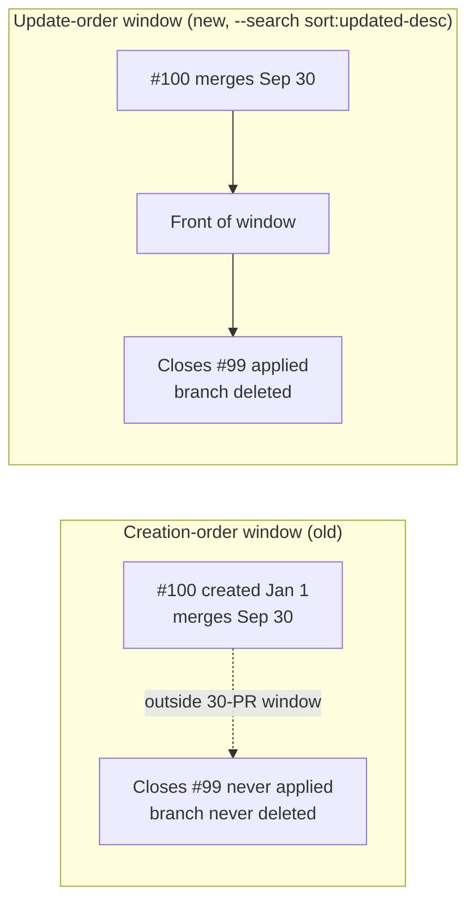

## Summary

Closes #2901

Without `--search`, `gh pr list` orders results by creation date, not update
recency. A long-lived PR (e.g. a milestone child) that merges or closes after
30 newer-numbered PRs have already merged never enters the merged-PR sweeps'
30-PR window (`fetchMergedPRsAnyAuthor` → `closeIssuesForMergedPrs`;
`fetchMergedPRsByUser` → `cleanupMergedPrBranches` and the issue lifecycle) or
the 100-PR closed window (`fetchClosedPRsByUser` →
`fetchRecentlyClosedPRsForFleet` → `sweepMergedPrIssues`). Its `Closes #N` is
never honoured and its branch is never cleaned up.

Fix: a new exported constant `RECENCY_ORDER_SEARCH = "sort:updated-desc"` in
`worker/deno/lib/issue_query.ts`, passed as `--search` by those three
fetchers, alongside the existing `--state`/`--author` flags (`gh` folds them
all into the search query). A merge or close updates the PR, so it lands at
the front of the window regardless of when it was created. The processed-set
store's `pruneToWindow` already tolerates a PR leaving and re-entering the
window. `fetchRecentMergedPRs` (prompt context) is deliberately unchanged.



- [x] Red test: `merged_pr_window_order_2901_test.ts` against pre-fix
      fetchers — 3 failed
- [x] Fix: `RECENCY_ORDER_SEARCH` added and passed by the three fetchers
- [x] Docs updated: `docs/INTERNALS.md`, `docs/GH-API-OPTIMISATION.md`
- [x] Quality gate run

## Evidence

Backend-only change; no web interface to screenshot. Evidence is the test
suite.

New `worker/deno/tests/merged_pr_window_order_2901_test.ts`:

- "fetchMergedPRsAnyAuthor: PR #100 stays in the window (Issue #2901)"
- "fetchMergedPRsByUser: PR #100 stays in the window (Issue #2901)"
- "fetchRecentlyClosedPRsForFleet: PR #100 stays in the window (Issue #2901)"

Its mock `gh` emulates gh's real ordering semantics: creation-date-desc by
default, update-recency-desc when `--search sort:updated-desc` is passed, then
truncated to `--limit`. The fixture gives low-numbered PR #100 the latest
`mergedAt` of the set.

RED (before the fix):

```
FAILED | 0 passed | 3 failed
AssertionError: Values are not equal: expected true, actual false
```

GREEN (after the fix): 3 passed | 0 failed.

`worker/deno/tests/stuck_recovery_closed_pr_cache_test.ts` and
`worker/deno/tests/stuck_recovery_cache_test.ts` previously told the repo-wide
closed listing apart from the per-issue title search by the mere presence of
`--search`; now that both calls carry `--search`, each uses an
`isTitleSearchCall` helper (checks for `in:title`) to tell them apart.

Targeted run: 274 passed, 0 failed across the new test plus `issue_query`,
`settled_pr_listing_2409`, `pr_issue_linking`, `branch_cleanup`,
`stuck_issue_detector`, `iteration_call_budget` and
`stuck_recovery_closed_pr_cache` tests.

Docs updated: `docs/INTERNALS.md` (merged-pr-issue-sweep section) and
`docs/GH-API-OPTIMISATION.md` (closed-PR listing).

### Security self-check

- No new external input — the fetchers' existing gh output is parsed as before.
- No secrets touched.
- The new `--search` argument is a fixed constant, never built from
  interpolated or untrusted input.
- No new dependencies.

## Test Plan

- [x] `cd worker/deno && deno task test:unit tests/merged_pr_window_order_2901_test.ts < /dev/null`
- [x] `./quality.sh < /dev/null`
