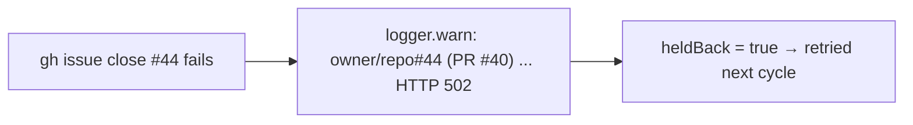

# PR Summary — Issue #2902

## Summary

Closes #2902

When a per-issue `gh issue view` / `gh issue close` failed inside
`closeIssuesForMergedPrs`, the error was swallowed by a bare `catch` (the PR was
correctly held back). A failure that kept happening was retried every cycle and
never logged. The catch now emits one `logger.warn` naming the repo, the issue,
the PR and the redacted error. The line follows the style of the #2831
merged-PR fetch-failure warning.

- [x] Regression test (red before the fix, green after)
- [x] Warn line in the per-issue catch, error passed through `redactSecrets`
- [x] Quality gate

## Evidence

This is a backend-only change with no visual surface.

- `worker/deno/lib/pr_issue_linking.ts`: the per-issue `catch` now binds `err`
  and calls
  `logger.warn("[close-merged-pr] <repo>#<issue> (PR #<pr>): view/close failed; held back for retry: <redacted message>")`
  before `heldBack = true`.
- New test
  `pr_issue_linking - a failed per-issue close is logged once naming the repo, issue and PR (Issue #2902)`.
  Before the fix it failed with `warnings.length` = 0 (expected 1). After the
  fix it passes.

## Test Plan

- `deno task test:unit tests/pr_issue_linking_test.ts`: 67 passed, 0 failed.
- `./quality.sh`: PASSED. The only skip is config integration, which is
  skipped by design.
