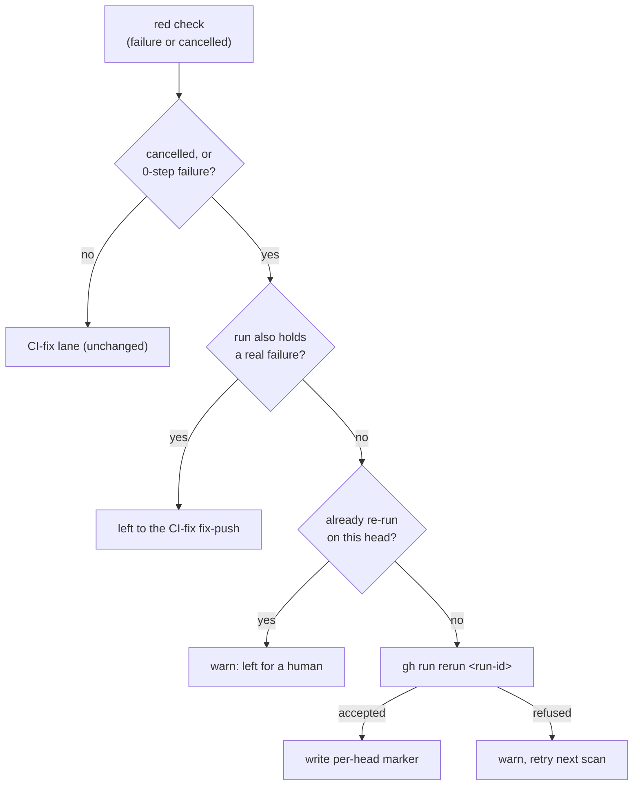

## Summary

A PR whose only red checks were `cancelled` was invisible to the CI-fix scan: `findFailedCiChecks` read only `conclusion == "failure"`, so nothing ever re-ran the checks. A job GitHub never started (the Actions-budget case: `failure` with zero steps) went the other way and was handed to the CI-fix agent, which had no log to work from.

The scan now reads `failure` **and** `cancelled`. A new module, `worker/deno/lib/ci_infrastructure_rerun.ts`, sorts each red check into one of two kinds:

- **Infrastructure:** `cancelled`, `failure` whose Actions job has zero steps, or (added on review) an `if: always()` aggregator whose own redness traces only to one of those infrastructure jobs. The scan runs `gh run rerun <run-id>` at most once per PR head commit **per host**, recorded by a marker in the CI check state directory. It never hands these checks to the agent, and it logs `skipReason` `ci-cancelled`.
- **Code:** everything else. These go to the CI-fix lane exactly as before.

A run that also holds a real failure is not re-run, because the CI-fix fix-push restarts it — except an aggregator whose own failure is explained entirely by an infrastructure job on the same run: it is now reclassified as infrastructure too (`reason: "aggregator"`) and re-run alongside it, so it is neither silently dropped by the Issue #1878 aggregator filter nor left stranded with no CI-fix agent to reach it. If GitHub refuses a rerun, the scan logs a warning and tries again on the next scan. If a head was already re-run **on this host** and is still red, the scan logs a warning and leaves it for a human.

**Known limitation, accepted rather than fixed here:** the once-per-head bound is enforced by a local marker file, so with `fleet_pr_authors` configured each host scanning the same PR keeps its own marker — a fleet of N hosts can each re-run the same head once before every host's own escalation fires. A fleet-wide bound would need the same PR-comment marker approach `ci_fix_attempt_markers.ts` uses for the CI-fix attempt cap; that is left as follow-up work rather than folded into this PR, and `docs/workflows/ci-fix.md` states the limitation plainly.

The review-gate label (`ci-cancelled` in `review-fleet-prs`) is **not** in this PR. That gate lives under `.claude/skills/`, a hidden path the worker's pre-commit safety gate refuses to commit. That refusal is what killed this issue's first attempt. The change is written up in stSoftwareAU/VibeCoder#2916 (needs-human) so a human can land it.

Closes #2914

## Evidence

This is a backend change with no UI. It is covered by tests that drive the real `findFailedCiChecks` against an injected `gh` stub.

- The full gate `./quality.sh < /dev/null` passed after the final code change: `Result: PASSED (with skipped checks)`. The only skip was `config integration`, which was also skipped before this change.
- Targeted run: 196 tests passed across `ci_infrastructure_rerun_2914_test.ts`, `check_runs_batch_test.ts`, `pr_maintenance_test.ts`, `pr_maintenance_aggregator_check_test.ts`, `pr_maintenance_ci_deferral_test.ts`, `pr_maintenance_bot_prs_test.ts`, `ci_check_state_dir_test.ts`, `pr_uninvited_action_test.ts` and `pr_uninvited_action_drift_test.ts`.
- Review follow-up: 191 tests passed re-running `check_runs_batch_test.ts` (21), `ci_infrastructure_rerun_2914_test.ts` (11), `pr_ci_processor_aggregator_check_test.ts`, `pr_maintenance_aggregator_check_test.ts`, `pr_maintenance_bot_prs_test.ts`, `pr_maintenance_ci_deferral_test.ts`, `pr_maintenance_command_test.ts`, `pr_maintenance_issue_state_cache_test.ts`, `pr_maintenance_pr_list_cache_test.ts`, `pr_maintenance_review_head_moved_test.ts` and `pr_maintenance_test.ts` (72) after the aggregator-stranding fix and the fetch-filter test fixes below.

## Reproduction

- **symptom** — when every red check on a PR was `cancelled`, the CI-fix scan returned nothing and never re-ran it, so the PR stayed stuck; a never-started (0-step) failure was handed to the CI-fix agent.
- **status** — `verified` — I ran the six scan-level tests against unfixed `main` in a throwaway worktree. Five failed (all-cancelled, never-started, mixed run, per-head bound, refused rerun). The real-failure test passed, as it should, because that path does not change. All six pass after the fix.
- **regression test** — `worker/deno/tests/ci_infrastructure_rerun_2914_test.ts::findFailedCiChecks - all cancelled checks are re-run, not handed to CI-fix, bounded once per head`

## Acceptance Criteria

<!-- vibe-spec-review inputs="diff+issue-body" -->

- **met** — Treat `cancelled` (or never-started) checks as infrastructure; re-run with `gh run rerun`, cancelled runs only, once per head commit, before any CI-fix agent — evidence: `worker/deno/lib/ci_infrastructure_rerun.ts`, `worker/deno/tests/ci_infrastructure_rerun_2914_test.ts::findFailedCiChecks - all cancelled checks are re-run, not handed to CI-fix, bounded once per head` and `::a new head sha re-runs again (bound is per head)` — reviewer: met
- **met** — The CI-fix lane excludes cancelled checks from what it hands the agent — evidence: `worker/deno/lib/pr_maintenance.ts` (`failedChecks = classified.code`), `worker/deno/tests/ci_infrastructure_rerun_2914_test.ts::findFailedCiChecks - a real failure's run is not re-run even when a cancelled check shares it; a cancelled check in another run is` — reviewer: met
- **missing** — The review gate says `ci-cancelled` rather than `ci-failed` — reviewer: missing — reason: `.claude/skills/review-fleet-prs/gate.ts` is a hidden path the worker's pre-commit safety gate refuses to commit (the cause of the first attempt's failure), so this is written up for a human in stSoftwareAU/VibeCoder#2916
- **met** — The same path covers the Actions-budget case (failure with 0 steps) — evidence: `worker/deno/tests/ci_infrastructure_rerun_2914_test.ts::findFailedCiChecks - a never-started failure (zero steps) is re-run, not handed to CI-fix` — reviewer: met
- **met** — Tests cover both directions: all cancelled or never started gets one re-run and no agent; a real failing step still goes to CI-fix — evidence: `worker/deno/tests/ci_infrastructure_rerun_2914_test.ts::findFailedCiChecks - a real failure is returned to the CI-fix lane and never re-run` plus the two tests above — reviewer: met
- **unrequested** — Sweep-ledger slice `top-up-2914` in `docs/audits/lib-sweep-coverage.json` and the record `docs/audits/security-sweep-2914-ci-infrastructure-rerun.md` — reviewer: unrequested — reason: `lib_sweep_coverage_test.ts` and `check:manifests` fail the quality gate for any new `lib/` module without a slice
- **unrequested** — Optional `conclusions` parameter on `rollupToFailedCheckRuns` / `fetchFailedCheckRunsBatch` in `check_runs_batch.ts` — reviewer: unrequested — reason: needed so the batched GraphQL path reads `cancelled` checks; the reviewer called it "arguably in-scope infrastructure"

## Standards Review

<!-- vibe-standards-review inputs="diff+CODING-STANDARDS.md" -->

- **clean** — `gh` calls pass arguments as an array, never through a shell; every catch logs with context (fail loud); marker path inputs are validated (40-hex head sha, positive-integer PR number); tests drive real functions through an injected `gh` fake; docs are updated for the changed behaviour; commits reference the issue. Optional notes not acted on: warn vs info level for an unresolvable cancelled job, and some prose overlap between the sweep record and code comments.

## Test Plan

- Added `worker/deno/tests/ci_infrastructure_rerun_2914_test.ts` with 9 tests:
  - all cancelled: re-run once per run and no agent, with a second scan making no further rerun
  - never-started (0-step) failure: re-run
  - real failure: goes to CI-fix, no rerun
  - mixed run: a run with a real failure is not re-run; a cancelled check in another run is
  - a new head allows another rerun
  - a refused rerun is retried on the next scan
  - `classifyRedChecks` lookup-failure paths (two tests)
  - `rerunInfrastructureChecks` invalid-sha guard
- Existing CI-scan suites still pass unchanged (listed under Evidence).
- **Review follow-up (PR #2918):**
  - `classifyRedChecks` reclassifies an `if: always()` aggregator as infrastructure when its redness traces only to an already-infrastructure job, so it is re-run with that job instead of being dropped by both lanes; new regression test `findFailedCiChecks - a cancelled job plus its same-run aggregator is re-run once, not stranded`.
  - Every existing scan-level test forced the batched GraphQL fetch to fail so only the REST fallback ran, and the REST stub ignored its own `--jq` conclusion filter — so neither fetch path actually exercised `RED_CHECK_CONCLUSIONS`. Added `findFailedCiChecks - a cancelled check is re-run via the batched GraphQL path, not only the REST fallback` (drives a real GraphQL rollup with an uppercase `CANCELLED` enum) and made the REST stub honour the `--jq` clause it is given, so reverting either conclusions pass-through now fails these tests.
  - Added `check_runs_batch_test.ts::RED_CHECK_CONCLUSIONS keeps cancelled runs too, lowercased off the wire`, pinning `convertBatch`'s lowercasing and `rollupToFailedCheckRuns`'s filter together on the same path `buildFailedCheckRunsLookup` uses.
  - `docs/workflows/ci-fix.md` corrected: the "run that also holds a genuinely failing job is left alone" claim did not hold for the aggregator shape above, and the "at most once per PR head commit" bound is host-local, not fleet-wide, when `fleet_pr_authors` is configured — a fleet-wide bound is left as follow-up work rather than built into this PR.
  - **Review follow-up round 2 (PR #2918):** the aggregator pass in `classifyRedChecks` deleted a reclassified aggregator's run id from `codeRunIds` unconditionally. `codeRunIds` is shared by every check on a run, so when a genuine non-aggregator failure (e.g. `Lint`) that the aggregator does not `need` shares the same run as a cancelled job and the aggregator, deleting the run id stripped that failure's protection too — `rerunInfrastructureChecks` then re-ran the run against the very "left alone" contract the docs and tests state, while `Lint` was simultaneously handed to the CI-fix lane. Fixed by rebuilding `codeRunIds` from what remains in `code` once the pass finishes, rather than deleting per-reclassification. New regression test `findFailedCiChecks - a same-run real failure the aggregator does not need is never re-run alongside it`.

🤖 Generated with [Claude Code](https://claude.com/claude-code)
