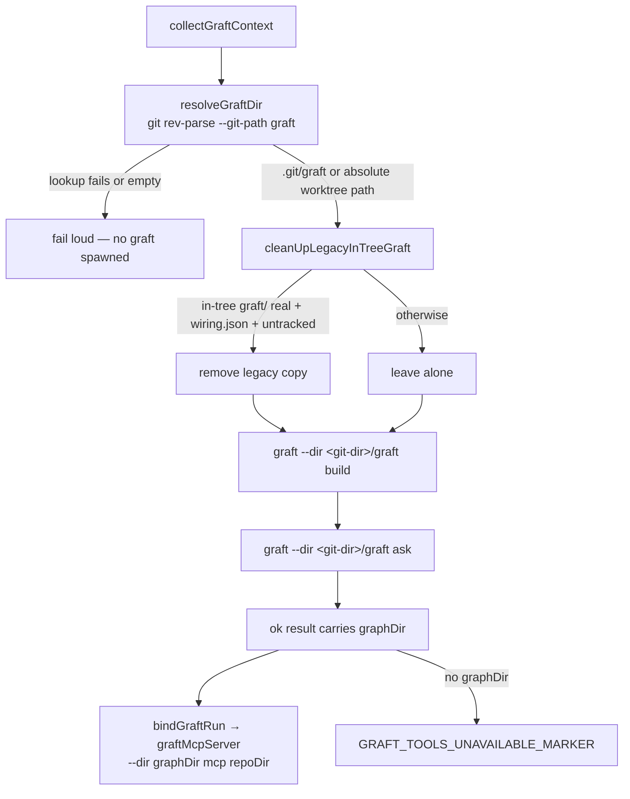

# PR Summary — Issue #2915

## Summary

Closes #2915

Fleet PRs had started committing a markdownlint ignore for `graft/`, the
worker's own Graft index, into target repositories. The index lived in the
working tree, so each repo's `markdownlint-cli2` globbed its `.md` cards and
failed the gate. The agent then "fixed" the repo's lint config.

- **Environment fix:** the Graft graph now lives in `<git-dir>/graft`. The
  path is resolved with `git rev-parse --git-path graft`, so linked worktrees
  are handled correctly. `build`, `ask` and the MCP server all pass Graft's
  global `--dir` flag. Linters and globbers never enter the git dir, nothing
  there can be staged, and the graph survives `git reset --hard` and
  `git clean -fd`.
- **Legacy cleanup:** `cleanUpLegacyInTreeGraft` removes a stale in-tree
  `graft/` left by an older worker build. It acts only when the directory is
  real (not a symlink), carries Graft's `wiring.json` and is untracked.
- **Fail loud:** a failed git-path lookup fails the collection rather than
  writing into the repo root. `graftMcpServer` refuses an empty graph
  directory, and `bindGraftRun` withholds the tools with
  `GRAFT_TOOLS_UNAVAILABLE_MARKER` when an ok result carries no `graphDir`.
- **Guidance:** `CODING-STANDARDS.md` and the `issue`, `pr_feedback` and
  `ci_fix` prompts now say: never add worker-local paths to a target repo's
  lint, format or ignore config — report the problem instead.
- **Docs:** `docs/CONFIGURATION.md` ("Where the graph lives") and the
  `gitignore_enforcer.ts` doc comment describe the new location. `/graft/`
  stays in `REQUIRED_GITIGNORE_PATTERNS` as belt and braces for legacy copies.

## Evidence

Backend/CLI change, so the evidence is tests plus the gate.

Tests in `worker/deno/tests/graft_context_test.ts`:

- line 749 — a real git repo never leaves an `.md` file in the working tree;
  `git status --porcelain --ignored` is empty. This is the issue's "graft index
  present, lint does not see it" check.
- line 428 — an empty git-path answer fails rather than writing to the repo root.
- line 688 — a failed git-path lookup fails loud and spawns no graft.
- line 714 — a linked worktree's absolute git-path answer is used verbatim.
- lines 859, 898, 933 and 969 — legacy cleanup: removes a stale untracked
  copy; leaves a tracked, symlinked, or `wiring.json`-less copy alone.
- lines 1368, 1386 and 1397 — `graftMcpServer` roots at the checkout and graph
  directory, and refuses empty values.

Also `worker/deno/tests/graft_run_test.ts:164` (an ok collection with no graph
directory withholds the tools loudly), plus updated fixtures in
`graft_always_load_2435_test.ts`, `execute_claude_phase_graft_2314_test.ts`,
`phase_accelerators_test.ts`, `grill_me_processor_graft_codegraph_2561_test.ts`
and `tests/support/phase_accelerator_asserts.ts`.

`./quality.sh < /dev/null`: **PASSED** (exit 0; config integration skipped as
usual).

## Acceptance Criteria

<!-- vibe-spec-review inputs="diff+issue-body" -->

- [x] Keep the Graft index out of repo tooling's reach (preferred option:
  outside the working tree) — reviewer: met
- [x] Add the never-add-worker-local-paths rule to the `issue`, `pr_feedback`
  and `ci_fix` prompts and `CODING-STANDARDS.md` — reviewer: met
- [x] A test: with a graft index present, the repo's lint does not see it
  (`graft_context_test.ts:749`) — reviewer: met
- [ ] No new fleet PR adds `graft` to markdownlint config — reviewer: partial —
  reason: an operational fleet outcome that a diff cannot prove; this PR ships
  the mechanism (graph outside the working tree, plus the guidance rule)
- [x] Legacy in-tree `graft/` cleanup — reviewer: unrequested — reason: repos
  already carrying an in-tree `graft/` from an older build would keep failing
  lint after the fix ships; the cleanup is conservative and test-covered

## Standards Review

<!-- vibe-standards-review inputs="diff+CODING-STANDARDS.md" -->

- reviewer: met — no violations found against `CODING-STANDARDS.md`.
- Optional nit (not a violation): a long comment line in
  `worker/deno/lib/phases/execute_phase.ts` — outcome: left as is.
- Optional nit (not a violation): the new rule's mention of `.git/info/exclude`
  in `CODING-STANDARDS.md` — outcome: kept, because the rule covers any
  worker-local path a checkout excludes, not only the graph.

## Test Plan

- [x] `deno task test:unit` on the touched graft tests
- [x] `./quality.sh < /dev/null` — PASSED
- [x] `markdownlint-cli2` on the changed docs and prompts
