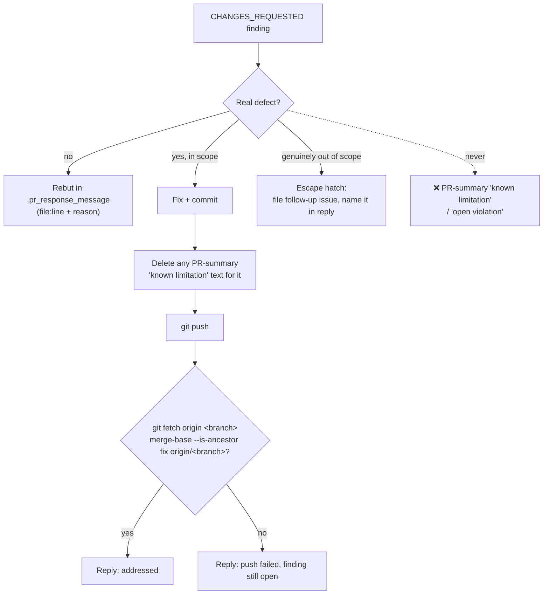

## Summary

PR-feedback runs left request-changes findings unresolved. Some were recorded
in the committed PR summary as a "known limitation" or "open violation"
(GRQ-AutoTrader#1820, #1875). Others were fixed in the local worktree, never
pushed, and still reported to the reviewer as "addressed" (VibeCoder#2866).
Each time, the next review raised the same item again ("Earlier review item not
fixed").

This change tightens the `pr_feedback` template. Closes #2917.

- `prompts/pr_feedback/prompt.md`, **Making Changes**: a new rule, _Every
  change-request finding ends fixed or rebutted_:
  - Each `CHANGES_REQUESTED` finding ends either fixed in a commit pushed to the
    PR branch, or rebutted as a false positive with the reason given in
    `.pr_response_message`.
  - A PR-summary "known limitation", "follow-up" or "open violation" does not
    resolve a finding. The escape hatch, which names a filed follow-up issue,
    stays the only other exit.
  - Fixing a finding deletes the summary text that recorded it as a limitation,
    in the same push. This builds on "Keep the PR summary true to the head".
- `prompts/pr_feedback/prompt.md`, **Response Message**: a new rule, _Confirm
  the fix is on the remote before you claim it_:
  - Push, then run `git fetch origin <branch>` and check each cited fix commit
    with `git merge-base --is-ancestor <sha> origin/<branch>`.
  - A fix that exists only in the local worktree is never reported as
    addressed. If the push fails, the reply names the finding as still open.
- `docs/workflows/pr-feedback.md`: documents both rules next to the worker's
  existing final-mile push verification.
- `worker/deno/tests/pr_feedback_finding_resolution_2917_test.ts`: loads the
  `pr_feedback` template through the real `loadPrompt`. The test fails if a
  later edit removes either rule.

## Evidence

## Test Plan

- [x] `deno task test:unit tests/pr_feedback_finding_resolution_2917_test.ts tests/pr_summary_final_state_2879_test.ts`
- [x] `./quality.sh < /dev/null`
- [ ] After merge, watch `review-fleet-prs/log.jsonl` for fewer findings that
      start with "Earlier review item not fixed", "Earlier-review fix not
      applied" or "Unfixed from the earlier review".

## Checklist

- [x] Fixed-or-rebutted rule added to the `pr_feedback` template
- [x] Push-then-verify-on-origin rule added before `.pr_response_message`
- [x] Stale limitation text is deleted when a finding is fixed
- [x] `docs/workflows/pr-feedback.md` updated
- [x] Behavioural template test added

## Security self-check

- [x] Input validation: no new code path accepts external input (the change is
      prompt text and a test)
- [x] Secrets: none staged
- [x] Injection surface: none added
- [x] Output encoding: not applicable
- [x] Authentication and authorisation: unchanged
- [x] Error handling: unchanged
- [x] Dependencies: none added
- [x] Path confinement: not applicable

## Final branch state

The head commit contains both template rules, the workflow doc section and the
test. No interim notes remain.
