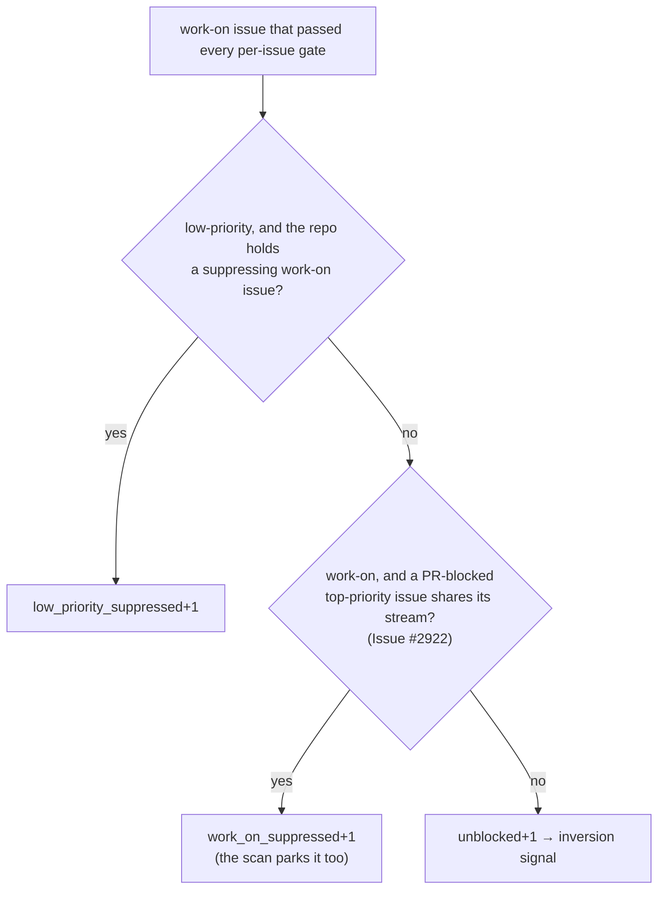

## Summary

The idle-decision census logged a false idle inversion on
`stSoftwareAU/GRQ-AutoTrader` for three cycles:
`work_on=14 top_priority=0 pr_blocked=2 inversion_signal=true`.

The scan was right to skip those 14 issues:

- `selectHighestPriority` drops every `work-on` candidate that shares a
  repo+milestone stream with a PR-blocked `top-priority` issue ("Priority 2").
- On GRQ-AutoTrader, the 2 PR-blocked `top-priority` issues and all 14
  `work-on` issues had no milestone, so they shared the no-milestone stream.
  Every `work-on` issue was parked on purpose.
- The census never modelled this rule, so it counted the parked issues as
  claimable.

Closes #2922.

- `worker/deno/lib/idle_decision_census.ts`: a new gate after the tier-3
  suppression. A `work-on` issue that does not also carry `top-priority` is
  counted as `work_on_suppressed` when a PR-blocked `top-priority` issue shares
  its stream. It no longer feeds the inversion signal. The count is carried on
  `RepoCensusEntry.workOnSuppressed` and in the `[idle-census]` line.
- `worker/deno/lib/fleet_telemetry.ts`: a new `work_on_suppressed` fleet idle
  reason, so the fleet idle reason names the stream-level suppression instead
  of reporting an unexplained idle cycle.
- Docs: the census gate flowchart and its prose (`docs/IDLE-TASK-FRAMEWORK.md`),
  `docs/INTERNALS.md` and `docs/workflows/issue-processing.md`.

## Evidence

The regression tests in `worker/deno/tests/idle_decision_census_test.ts`
rebuild the GRQ-AutoTrader shape: a PR-blocked `top-priority` issue plus
`work-on` siblings with no milestone. They failed before the fix: `work_on`
was counted and `inversion_signal=true`. With the fix they pass: `work_on=0`,
`work_on_suppressed=n`, and no inversion. Negative cases cover:

- a `work-on` issue in another milestone, which stays claimable;
- a `top-priority` issue exempted by `ignore-open-prs`, which does not
  suppress its stream;
- an issue that carries both labels, which is not suppressed.

## Test Plan

- [x] `deno task test:unit tests/idle_decision_census_test.ts tests/claim_path_differential_test.ts tests/fleet_telemetry_test.ts`
- [x] `./quality.sh < /dev/null`
- [ ] After merge, the GRQ-AutoTrader `[idle-census]` line reports
      `work_on_suppressed=14 inversion_signal=false` while its `top-priority`
      issues are PR-blocked.

## Checklist

- [x] Failing regression test first, then the fix
- [x] Census gate mirrors the scan's same-stream `work-on` suppression
- [x] New counter threaded into the census entry, log line and fleet telemetry
- [x] Docs updated, including the census gate flowchart

## Security self-check

- [x] Input validation: no new external input; the gate reads the census's
      existing issue and PR data
- [x] Secrets: none staged
- [x] Injection surface: none added
- [x] Output encoding: a new integer field in an existing log line
- [x] Authentication and authorisation: unchanged
- [x] Error handling: unchanged
- [x] Dependencies: none added
- [x] Path confinement: not applicable

## Final branch state

The head commit contains the census gate, the telemetry reason, the docs and
the regression tests. No interim notes remain.
