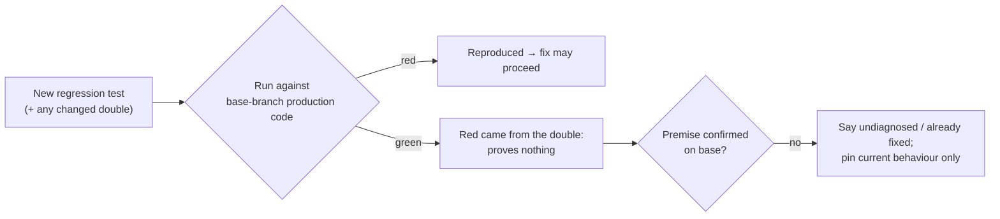

# PR Summary — Issue #2924: a red run counts only against the base branch

Closes #2924

## Summary

Fleet PRs claimed bug fixes whose "regression test" passed on the base branch.
The red run came only from a test double the same PR had changed, and one PR
then changed a durable format on an unverified premise. This PR adds the
guardrail from the issue to the issue prompt and the coding standards:

1. A red run counts only against the unfixed base-branch production code with
   the base branch's own test doubles. If the PR edits a fake or fixture, the
   new test with the new double must still fail on base production code.
2. When the fault is not reproduced, make no production or durable-format
   change on an unverified diagnosis. Confirm the premise on base, or say the
   fault is undiagnosed or already fixed and only pin current behaviour.
3. When the issue cites a logged error line (`store`/`scope`/`code`), start
   the test from that input and quote the line in the PR.

- [x] `prompts/issue/prompt.md`: TDD bullet, plus a new **What a red run proves** block in Reproduction Status
- [x] `CODING-STANDARDS.md` › Test coverage expectations, and its drift-tested twin `prompts/coding_guidelines/prompt.md`
- [x] `docs/workflows/issue-processing.md`: operator manual note (docs-change rule)
- [x] Documentation-drift tests scoped with `readRepoDoc`/`section`
- [x] Quality gate, spec review, standards review

## Spec

### Intent and Rationale

- Stop "fixes" whose red run proves only that the PR changed its own fake.
- Stop speculative production or durable-format changes when reproduction is `partial` or `not-run`.

### Essential Design Decisions

- The rules apply to every defect fix, not only `bug`-labelled issues, because neither cited PR came through the `bug` path.
- The existing gate wording "against the unfixed code and passing after the fix" is left intact, because `reproduction_status_gate.ts` parses it. A test pins it.
- The prompt names the concrete reviewer check: `git checkout origin/<base> -- <production paths>`, keeping the new test and double. The run must go red.

### Undiscoverable Facts

- `CODING-STANDARDS.md` and `prompts/coding_guidelines/prompt.md` are drift-tested twins, so the paragraph has to land in both, word for word.

## Evidence

- `deno task test:unit tests/coding_guidelines_base_branch_red_2924_test.ts tests/issue_prompt_base_branch_red_2924_test.ts`: 5 passed.
- `./quality.sh`: every check passed except semgrep. Semgrep flagged `detect-non-literal-regexp` in the first draft's hand-rolled heading scoper. The standards-review refactor to `readRepoDoc`/`section` removed that code, and semgrep (`p/default`) now exits 0 on both files. The deno tests (11m31s), lint, type check, fmt, markdownlint and mermaid all passed.

## Acceptance Criteria

<!-- vibe-spec-review inputs="diff+issue-body" -->

- spec-reviewer — Guardrail 1, base-branch red with base doubles: met
  - reason: "What a red run proves" bullet plus the twin standards paragraph; pinned by tests.
- spec-reviewer — Guardrail 2, no speculative fix for an unreproduced fault: met
  - reason: "No speculative fix for an unreproduced fault" bullet; pinned by tests.
- spec-reviewer — Guardrail 3, start from the logged error line: met
  - reason: "Start from the logged error" bullet; pinned by tests.
- spec-reviewer — Placement at the issue prompt TDD step, Reproduction Status and Test coverage expectations: met
  - reason: all three locations edited.
- spec-reviewer — How to verify (reviewer runs the new test against base): partial
  - reason: the prompt gives the `git checkout origin/<base>` check, but the fleet PR reviewer prompt is unchanged. The issue asked for guidance only, so a reviewer-side check would be separate follow-up work.
- spec-reviewer — `prompts/coding_guidelines/prompt.md` and `docs/workflows/issue-processing.md` edits: unrequested
  - reason: the first is the drift-tested twin of `CODING-STANDARDS.md`, so it must match; the second is required by the docs-change rule.

## Standards Review

<!-- vibe-standards-review inputs="diff+CODING-STANDARDS.md" -->

- standards-reviewer — Australian English: met
  - reason: new prose uses Australian spelling throughout.
- standards-reviewer — KISS/DRY: met
  - reason: the twin paragraph is the documented twin-surface requirement.
- standards-reviewer — Documentation-drift tests: partial → fixed
  - reason: the first draft hand-rolled section scoping. Both tests now use `readRepoDoc`/`section`/`flat` from `tests/support/markdown_docs.ts`.
- standards-reviewer — Docs-change rule: met
  - reason: the operator manual is updated in the same change.
- standards-reviewer — Twin-surface consistency: met
  - reason: a test asserts the paragraph is identical on both surfaces.

## Test Plan

- [x] `cd worker/deno && deno task test:unit tests/coding_guidelines_base_branch_red_2924_test.ts tests/issue_prompt_base_branch_red_2924_test.ts < /dev/null`
- [x] `semgrep --config p/default --error` on both new test files
- [x] `./quality.sh < /dev/null` (all checks except semgrep passed; semgrep re-verified after the fix)
