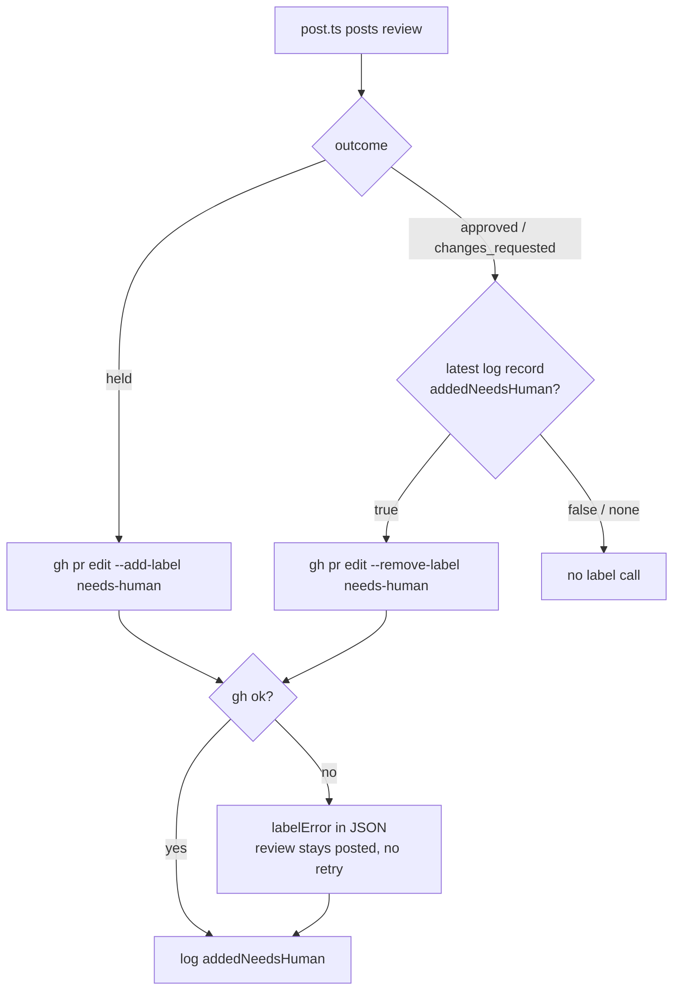

# PR Summary — Issue #2927

## Summary

Closes #2927

`/review-fleet-prs` now labels a PR it holds for the owner `needs-human`, and
removes that label on a later approve or send-back only when its own
`log.jsonl` record shows it added it.

- [x] Held outcome: `post.ts` runs `gh pr edit --add-label needs-human` after
      the held review posts; approved and sent-back outcomes add nothing.
- [x] Held review body ends with "Approve to merge or request changes; then
      remove `needs-human`."
- [x] `LogRecord.addedNeedsHuman` records whether the skill's label is on the
      PR after this review.
- [x] Approve / send-back runs `--remove-label needs-human` only when the PR's
      latest log record has `addedNeedsHuman: true`.
- [x] A failed add or remove leaves the review posted, is not retried, keeps
      the exit code, and is reported as `labelError: { action, error }` in the
      JSON line; step 4 names the PR and the failure.
- [x] `SKILL.md` rule 4, step 2 and step 4 updated.
- [x] No back-fill of PRs held before this change.

The label logic lives in a new `needs_human.ts` (`needsHumanAction`,
`syncNeedsHumanLabel`) with an injected `gh` runner so it is unit-testable.

## Evidence

Backend-only change; no visual surface.

## Acceptance Criteria

<!-- vibe-spec-review inputs="diff+issue-body" -->

reviewer: spec-reviewer

| Criterion | Verdict |
| --- | --- |
| Held outcome adds `needs-human`; approved/sent-back do not | Met |
| Held review body gains the next-step line | Met |
| `LogRecord` gains a boolean; removal only when the log shows the skill added it | Met |
| Failed add/remove: review stays posted, no retry, `labelError` in JSON, exit code unchanged, step 4 names it | Met |
| No back-fill | Met |
| `SKILL.md` step 2 and rule 4 updated | Met |
| Tests fail on each listed regression | Met |

The reviewer noted one deliberate edge: a failed add keeps a previously
recorded `addedNeedsHuman: true`, so a later approve still removes the label.

## Standards Review

<!-- vibe-standards-review inputs="diff+CODING-STANDARDS.md" -->

reviewer: standards-reviewer — no material departures. The caught `gh` error is
surfaced via `labelError` and `console.error`, not swallowed; tests call real
functions; docs updated alongside the code.

## Test Plan

- `worker/deno/tests/review_fleet_prs_needs_human_2927_test.ts` — held adds
  once; approved/sent-back make no call without the log flag; remove only with
  the flag; failed add/remove report `labelError` with a single call;
  `postedResult` includes `labelError` only when given; only the held body
  mentions `needs-human`.
- `deno test tests/review_fleet_prs_*_test.ts` — 50 passed.
- `./quality.sh` — PASSED (config integration skipped).

🤖 Generated with [Claude Code](https://claude.com/claude-code)
