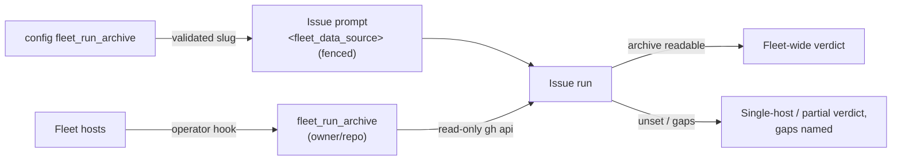

# PR Summary — Issue #2930: fleet-wide data source for measurement runs

## Summary

Closes #2930

A measurement run sees only the host that claimed it, so its verdict could
only ever be partial. This PR adds an operator-configured `fleet_run_archive`
key (an `owner/repo` slug). When set, the issue prompt carries a
`<fleet_data_source>` block naming the archive, with read-only `gh api`
guidance; the slug is fenced inside the run's untrusted boundary and the
archive's contents are declared untrusted data. When unset, the issue prompt
tells the run to label its verdict **single-host** and name the gaps.

- [x] Config key: types, validation (canonical slug check, fail loud), loader,
  known-keys list
- [x] Prompt block + wiring through both execute paths
- [x] Issue template guidance for the no-archive case
- [x] Docs: CONFIGURATION (section + Mermaid), THREAT-MODEL, SECURITY,
  INTERNALS
- [x] Tests

## Spec

### Intent and Rationale

- The verdict of a measurement issue must not depend on which host claimed it.
- VibeCoder is generic, so the archive is operator configuration, not a
  hardcoded private repo name.
- Without an archive, an honest single-host verdict beats an implied
  fleet-wide one.

### Essential Design Decisions

- The slug is validated with the canonical `isValidRepoSlug`; an invalid value
  fails config load loudly, echoed via `renderInertRepoSlug`.
- The prompt builder re-checks the slug and omits the block if it is invalid
  (defence in depth).
- The block rides the per-run user turn, is fenced with `fenceUntrustedValue`
  and is named in `untrustedBlocks` for the boundary-integrity instruction.
- Access is read-only by instruction, and the existing `gh` guard already
  refuses writes outside the claim repo.

### Undiscoverable Facts

- Each host's `fleet_telemetry_*.json` and `.credit_log_*.json` describe only
  that host's runs.
- The archive's layout is owned by the operator hook that writes it, so the
  run is told to read its README first rather than VibeCoder hardcoding paths.

## Evidence

- `tests/config_fleet_run_archive_2930_test.ts` covers: a valid slug
  accepted; non-string and path-traversal values rejected; a hostile value
  never echoed raw; the loader mapping and absent key; and the key being
  known.
- `tests/prompt_builder_fleet_run_archive_2930_test.ts` covers:
  - the slug fenced inside the untrusted boundary;
  - read-only and untrusted framing;
  - the boundary-integrity naming;
  - no block when unset or hostile;
  - the cached system prompt unchanged;
  - `config.fleetRunArchive` reaching the prompt via `execute_phase`;
  - the issue template guidance.
- `tests/coding_guidelines_layers_2574_test.ts`: the new issue-template
  heading has been added to the allowlist.

## Test Plan

- `deno task test:unit` on the touched tests.
- `./quality.sh < /dev/null`.

## Pre-PR Security Self-Check

- [x] Input validation: the slug is validated with an allowlist at config
  load and again in the builder.
- [x] Secrets: no hidden or credential files are staged.
- [x] Injection surface: the slug is fenced and delimiter-sanitised; archive
  contents are declared untrusted data.
- [x] Authorisation: read-only by instruction, and the `gh` guard limits
  writes to the claim repo.
- [x] Error handling: an invalid value is rendered inert in the error.
- [x] Dependencies: none added.
- [x] Path confinement: not applicable (no new path guards).
