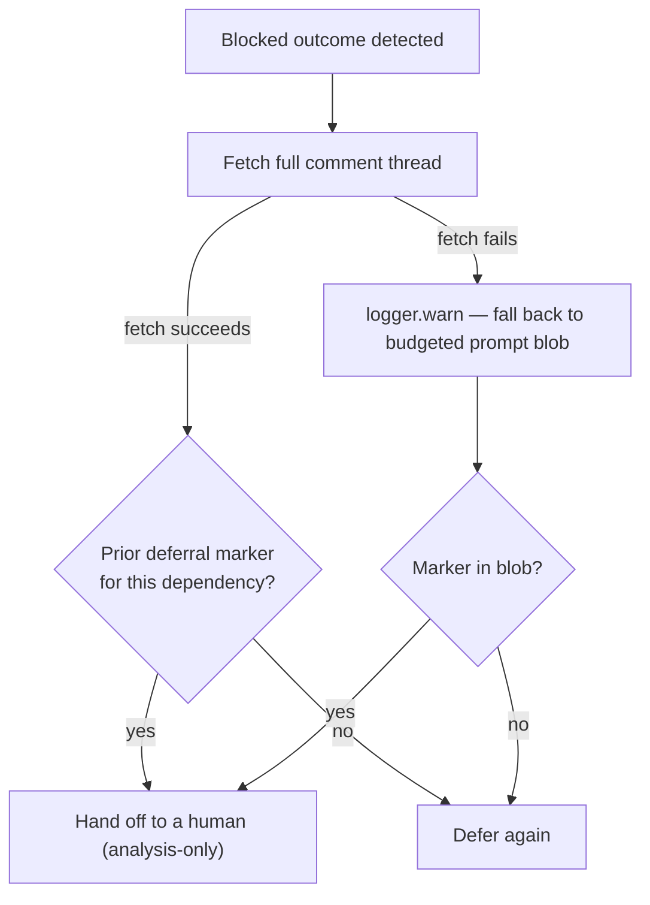

# PR Summary — Issue #2936: Blocked-deferral loop guard reads the full comment thread

## Summary

Closes #2936.

`workOnIssueHandleNoChanges`
(`worker/deno/lib/phases/handle_no_changes_phase.ts`) checked
`hasPriorDeferral(ctx.issueComments, ref)` to decide whether a blocked issue
had already been deferred on the same dependency. `ctx.issueComments` is the
budgeted implementation-prompt blob (`IMPLEMENTATION_COMMENT_LIMITS`: 20
comments / 12,000 characters). On a busy issue the earlier
`<!-- vibe-blocked-deferral:owner/repo#N -->` marker falls outside that
budget, so the loop guard never fired and the worker re-deferred the same
dependency on every scan.

The fix is a new `hasPriorDeferralOnThread` in
`worker/deno/lib/blocked_deferral.ts`, which fetches the issue's full comment
thread via `GitHubClient.getIssueComments`. The phase now calls this instead
of reading the blob directly, and reuses the same client for
`deferBlockedIssue`.

Design notes:

- The scan checks every comment author, not only the worker's own login. A
  fleet runs several worker accounts, and a forged marker can only escalate
  an issue to a human early — it can never suppress a genuine escalation.
- If the thread fetch fails, the guard logs a `logger.warn` and falls back to
  the old budgeted-blob check. That failure is loud, not silent.

## Changes

- `worker/deno/lib/blocked_deferral.ts` — new `hasPriorDeferralOnThread`,
  fetching and scanning the full comment thread.
- `worker/deno/lib/phases/handle_no_changes_phase.ts` — wired the new check
  in, reusing the same GitHub client for `deferBlockedIssue`.
- `worker/deno/tests/handle_no_changes_blocked_deferral_test.ts` — regression
  and fetch-failure tests.
- `DESIGN-PRINCIPLES.md` — updated the "A deferral is never repeated
  silently" paragraph.
- `docs/workflows/issue-processing.md` — updated the deferral loop-guard
  description.

## Checklist

- [x] Implement full-thread lookup (`hasPriorDeferralOnThread`)
- [x] Wire the lookup into the no-changes phase
- [x] Regression test for the budget-drop scenario
- [x] Fetch-failure fallback tests
- [x] Docs updated (`DESIGN-PRINCIPLES.md`, `docs/workflows/issue-processing.md`)
- [x] Quality gate

## Test Plan

The regression test builds a comment thread with an old deferral marker
followed by `maxComments + 5` human comments. It asserts that the prompt
blob built by `buildImplementationCommentContext` no longer carries the
marker, yet the phase still hands off — no `editIssue`, no "## Deferred"
comment, no close. This test fails against the unfixed code, because the old
code read only the budgeted blob.

Fetch-failure tests cover the fallback: with the marker present in the blob,
the phase hands off; with an empty blob, it defers.

- [x] `cd worker/deno && deno task test:unit tests/handle_no_changes_blocked_deferral_test.ts tests/handle_no_changes_phase_test.ts tests/handle_no_changes_planning_handoff_test.ts < /dev/null`
- [x] `./quality.sh < /dev/null`

## Evidence

39 tests passed across `handle_no_changes_blocked_deferral_test.ts`,
`handle_no_changes_phase_test.ts` and
`handle_no_changes_planning_handoff_test.ts`. This is a backend-only change,
so no screenshots apply.

## Follow-up note

`hasPriorPlanningHandoff(ctx.issueComments)` (#2688) reads the same budgeted
blob and may share this weakness. Fixing it is out of scope here.

## Security self-check

- [x] Input validation: no new external input surface; comment bodies are
      only substring-matched
- [x] Secrets: none staged
- [x] Error handling: fetch failures are logged, not surfaced to users
