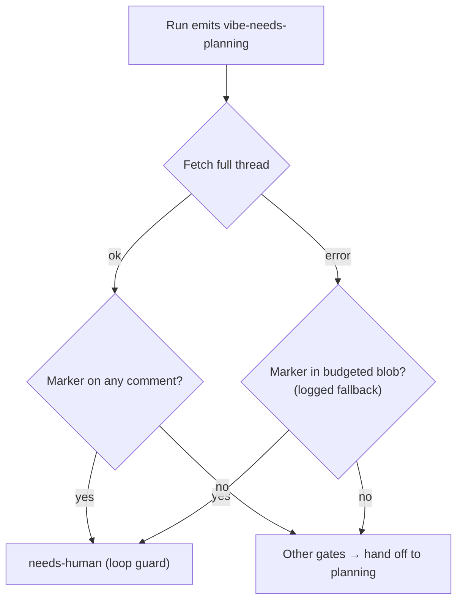

# PR Summary — Issue #2942

Closes #2942

## Summary

Both no-change loop guards now read their fleet markers from the issue's full
comment thread instead of the prompt-budgeted blob (`ctx.issueComments`, capped
at 20 comments / 12,000 characters, with worker comments admitted last).

- **Repeat-deferral guard:** already fixed on `main` by #2936
  (`hasPriorDeferralOnThread`). No change here.
- **Repeat-planning guard (this PR):** new `hasPriorPlanningHandoffOnThread` in
  `planning_handoff.ts` fetches the full thread with `getIssueComments` and
  scans every author for `<!-- vibe-planning-handoff -->`. A forged marker can
  only force the safe `needs-human` fallback. If the fetch fails, it logs a
  warning and falls back to the budgeted blob.
- `handle_no_changes_phase.ts` creates a single client for the planning path
  and uses it for both the guard and `handOffToPlanning`.
- Updated the "Once per issue" bullet in `SECURITY.md`.

## Evidence

- New regression test in `handle_no_changes_planning_handoff_test.ts`. The
  hand-off marker is on the thread, followed by 25 human comments, and the
  budgeted blob has no marker. The repeat request escalates to `needs-human`
  and `planning` is not re-applied. Against the old blob-only check this
  request would have been handed off to planning again.
- Two fallback tests: when the fetch fails, a marker in the blob escalates, and
  an empty blob still hands off to planning.
- `./quality.sh` passed. The config-integration check was skipped because it
  needs live config.

## Test Plan

- [x] `deno task test:unit` on the planning hand-off, phase and
      blocked-deferral test files: 55 passed.
- [x] `./quality.sh < /dev/null`: PASSED.
