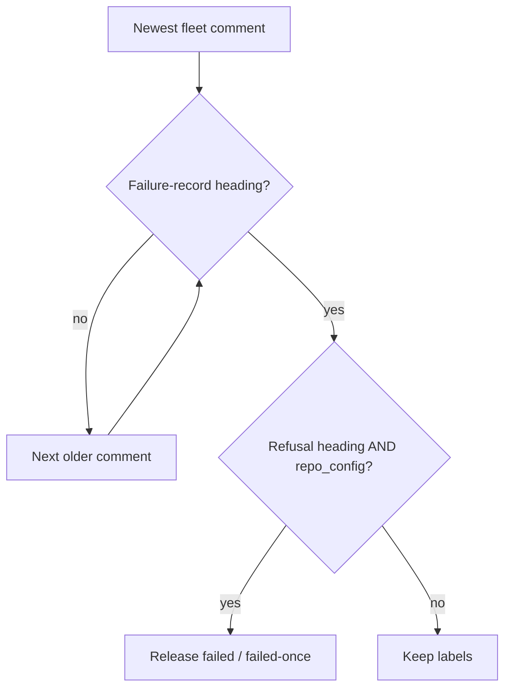

# PR Summary — Issue #2943

## Summary

Closes #2943

The milestone-branch refusal sweep (`releaseMilestoneBranchRefusalLabels`)
decides by reading each issue's most recent failure record. It only recognised
`Automated Processing Failed/Paused` and `Milestone branch unavailable`, so it
skipped over newer records from other paths that also apply the labels (Claim
Churn Detected, Question Answering Failed, Automatic Escalation to Planning
Mode). It then reached an older refusal and released labels that the newer path
had applied.

- `issue_sweep_parse.ts`: one shared `FAILURE_RECORD_HEADING_PATTERN` lists
  every fleet failure-record heading. Both sweeps use it: host-fault
  (behaviour unchanged) and milestone-refusal.
- `milestone_branch_refusal_release.ts`: any of those headings stops the
  newest-first scan. Labels are released only when that record is an
  Automated Processing or Milestone-branch-unavailable record **and**
  `detectFailureCategory` returns `repo_config`.
- `docs/INTERNALS.md`: the refusal-sweep description now names the shared
  heading list.

- [x] Shared heading pattern with churn, question-failure and planning escalation
- [x] Newer non-refusal record stops the scan and keeps the labels
- [x] Regression tests (unit and end-to-end)
- [x] Docs updated

## Evidence

- Red then green: the new tests failed against the unfixed sweep, which
  released `failed` when a churn record followed a refusal. All 42 tests in
  `milestone_branch_refusal_release_test.ts` and `host_fault_release_test.ts`
  pass after the fix.
- `./quality.sh < /dev/null`: `Result: PASSED (with skipped checks)`. Config
  integration was skipped.
- Spec reviewer: both acceptance criteria met. Standards reviewer: no
  violations. Its one optional note: `REFUSAL_CANDIDATE_RE` is a
  deliberately narrower subset of the shared pattern.

## Test Plan

- `cd worker/deno && deno task test:unit tests/milestone_branch_refusal_release_test.ts tests/host_fault_release_test.ts < /dev/null`
- New cases:
  - refusal then churn keeps `failed` (unit and end-to-end, issue 220 retained, no `gh issue edit`);
  - churn then refusal still releases;
  - both question-failure variants and planning escalation keep the labels;
  - a churn record quoting GH013 keeps the labels.
