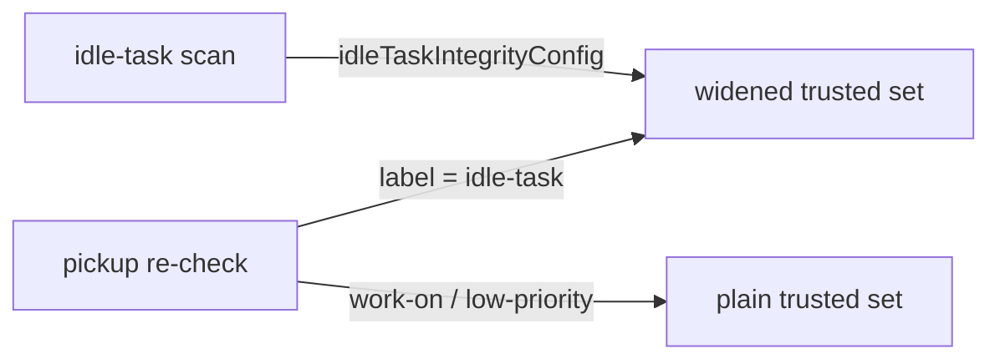

# PR Summary — Issue #2944

## Summary

Pickup content integrity now treats `idle-task` as an approval label. It also
trusts the same logins that the idle-task scan trusts.

- **Approval label:** `resolveApprovalLabel()` now resolves `idle-task` as the
  lowest tier, after `work-on` and `low-priority`. `work-on` is still the
  fallback.
- **Trusted logins:** when the resolved label is `idle-task`,
  `verifyPickupContentIntegrity()` widens the trusted set exactly as the
  collector does. It uses the configured trusted authors, plus the worker
  login, plus `fleetPrAuthors`.
- **Shared helper:** one helper, `idleTaskIntegrityConfig()`, builds that
  widened config for both paths.

Closes #2944

## Spec

### Intent and Rationale

Before this change, the idle-task scan and the pickup re-check disagreed:

- The scan approved an idle-task issue using a widened trusted set (worker plus
  fleet logins).
- The pickup re-check resolved the approval label as `work-on` and used the
  plain trusted set.

The disagreement had two effects:

- An idle-task-only issue that an untrusted editor had changed got an
  escalation comment naming `work-on`, a label the issue never had.
- When a fleet login re-approved by re-adding `idle-task`, pickup did not
  recognise it, so the issue stayed blocked.

### Essential Design Decisions

- **One helper, one source of truth.** `idleTaskIntegrityConfig()`
  (`worker/deno/lib/idle_task_trust.ts`) sets `allowedAuthors` to
  `resolveFleetAuthors(githubUser, trustedAuthorsFor(config, repo), config.fleetPrAuthors)`
  and clears `allowedAuthorsByRepo`. Clearing it means `trustedAuthorsFor`
  returns the widened list. The collector and the pickup path both call this
  helper.
- **A new module, to avoid an import cycle.** `trust_snapshot.ts` already
  imports `fleet_authors.ts`. Putting the helper in `fleet_authors.ts` would
  therefore create a cycle, so it lives in its own module.
- **Widening applies only to the idle-task tier.** A fleet login re-adding
  `work-on` still does not count as re-approval.
- **`githubUser` is a required input** on `PickupContentIntegrityInput`.
  Making it optional could silently drop the worker login from the trusted
  set.

### Undiscoverable Facts

- **The approval label is never stripped.** The issue text says a blocked
  idle-task issue "has idle-task stripped". Since #3964, a content-integrity
  block never removes the approval label: it adds `needs-human` and leaves the
  label in place (`work_on_content_integrity.ts`, around line 837). What this
  fix actually changes is which label the escalation comment and the
  re-approval lookup name: now `idle-task` instead of `work-on`.
- **The widened set covers more than re-approval.** It also applies to the
  editor-trust and issue-author trust checks, which matches what the scan does.
  The exclusion of fleet logins when removing `needs-human` is unchanged.
- **Tests must record an editor.** With no editor recorded, a hash mismatch
  takes the self-heal path (`SNAPSHOT_SELF_MISMATCH`). The new tests therefore
  set `editedBy` so they exercise the real block and re-approval path.

## Evidence

- **Quality gate:** `./quality.sh < /dev/null` gave **Result: PASSED (with
  skipped checks)**. The only skipped check is config integration, because
  `.config.json` is absent in this sandbox. Deno tests passed, both parallel
  and serial.
- **Targeted tests:** the pickup, collector and persist-failure suites ran
  77 tests: 77 passed, 0 failed.
- **Base red run:** the new test file was run against the base-branch
  production code (61810c45). The result was `14 passed | 3 failed`; details
  are under Reproduction.

## Reproduction

- **Symptom:** an idle-task-only issue blocked at pickup names `work-on` in its
  escalation comment. A fleet login re-adding `idle-task` does not unblock it.
- **Status:** `verified`.
- **Regression tests:** these three failed against the base-branch production
  code and pass with the fix, all in
  `worker/deno/tests/pickup_content_integrity_test.ts`:
  - "blocks an idle-task-only issue on an untrusted edit, naming idle-task not work-on". At base, the comment named `work-on`.
  - "a fleet-only login re-adding idle-task after the edit counts as re-approval". At base, the issue was blocked.
  - "resolveApprovalLabel resolves idle-task as the lowest tier (Issue #2944)". At base, it returned `work-on`.

  Two guard tests passed at base and still pass, as expected: "the same
  fleet-only login re-adding work-on does NOT count" and "an untrusted login
  re-adding idle-task … is still blocked".

## Acceptance Criteria

<!-- vibe-spec-review inputs="diff+issue-body" -->

- **met** — `resolveApprovalLabel()` adds `IDLE_TASK_LABEL` as the last candidate, keeps the `workOnLabel` fallback, docstring updated — evidence: worker/deno/lib/pickup_content_integrity.ts:89, worker/deno/tests/pickup_content_integrity_test.ts::pickup_content_integrity - resolveApprovalLabel resolves idle-task as the lowest tier (Issue #2944) — reviewer: met
- **met** — idle-task label uses the widened config (fleet authors, `allowedAuthorsByRepo: undefined`); other labels use the plain config — evidence: worker/deno/lib/pickup_content_integrity.ts:113, worker/deno/lib/idle_task_trust.ts:36 — reviewer: met
- **met** — one shared exported helper used by both the collector and the pickup path — evidence: worker/deno/lib/collect_idle_task_candidates.ts:182, worker/deno/lib/pickup_content_integrity.ts:114 — reviewer: met
- **met** — `PickupContentIntegrityInput` has a required `githubUser`, passed from production deps; test call sites updated — evidence: worker/deno/lib/pickup_content_integrity.ts:48, worker/deno/lib/run_core_production_deps.ts:4225 — reviewer: met
- **met** — idle-task-only issue with an untrusted edit is blocked, and the comment names idle-task, never work-on — evidence: worker/deno/tests/pickup_content_integrity_test.ts::pickup_content_integrity - blocks an idle-task-only issue on an untrusted edit, naming idle-task not work-on — reviewer: met
- **met** — a fleet-only login re-adding idle-task lets pickup proceed — evidence: worker/deno/tests/pickup_content_integrity_test.ts::pickup_content_integrity - a fleet-only login re-adding idle-task after the edit counts as re-approval — reviewer: met
- **met** — a fleet-only login re-adding work-on is still blocked; an untrusted idle-task re-add is blocked — evidence: worker/deno/tests/pickup_content_integrity_test.ts::pickup_content_integrity - the same fleet-only login re-adding work-on does NOT count as re-approval, worker/deno/tests/pickup_content_integrity_test.ts::pickup_content_integrity - an untrusted login re-adding idle-task on an idle-task issue is still blocked — reviewer: met
- **met** — the collector's existing tests pass unchanged and `./quality.sh` passes — evidence: worker/deno/tests/collect_idle_task_candidates_test.ts (unmodified), quality gate Result: PASSED — reviewer: met

## Standards Review

<!-- vibe-standards-review inputs="diff+CODING-STANDARDS.md" -->

- **violation** — the PR summary file was missing — evidence:
  docs/archive/pr-summaries/pr-summary-2944.md — reason: resolved by adding
  this file. No other departures: DRY is respected (one helper), the tests are
  behavioural, the language is Australian English, and the reason for the
  helper's placement is documented.

## Test Plan

- [x] Implement the approval-label tier, the shared helper and the `githubUser`
      input.
- [x] Add regression tests and confirm they are red against the base
      production code.
- [x] Add the new module to `docs/audits/lib-sweep-coverage.json`.
- [x] `deno task test:unit` on the pickup, collector and persist-failure suites.
- [x] Full `./quality.sh < /dev/null` passes.
