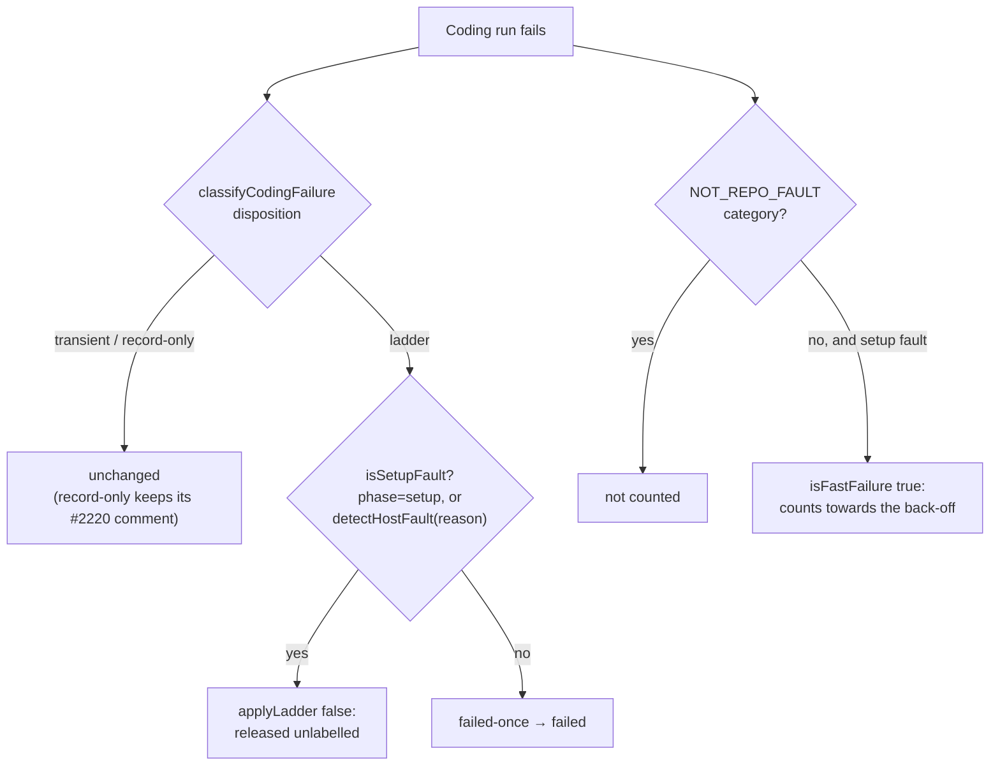

## Summary

A run that dies in setup is the host's or the repository's fault, not the issue's. Until now such a run could step the issue onto the `failed-once` → `failed` ladder, and it counted towards the #1950 back-off only if `isFastFailure` happened to class it as fast. Closes #2954.

- `worker/deno/lib/coding_failure_ladder.ts`: new `isSetupFault({ phase, reason })` is true when `phase === "setup"` or `detectHostFault(reason)` recognises the reason. `CodingRunOutcomeSummary` gains an optional `phase`. For a failure that would otherwise step the ladder, `planCodingFailure` returns `applyLadder: false` with no `cooldownKind`: no `failed-once`, no `failed`, no escalating cooldown. The issue is released unlabelled and the release comment carries the diagnosis.
- `worker/deno/lib/repo_fast_failure_tracker.ts`: `FastFailureCandidate` gains an optional `setupFault`. When it is set, `isFastFailure` counts the run whatever its category or elapsed time. A `NOT_REPO_FAULT` (host-wide) category is checked first, so it still never counts.
- `worker/deno/lib/run_core_production_deps.ts`: the ladder call site passes `result.phase` to `planCodingFailure`. The fast-failure release site sets `setupFault` from the same `isSetupFault` rule.
- Docs: `README.md` (`failed-once` row), `docs/CONFIGURATION.md` (back-off flowchart and prose), `docs/INTERNALS.md` and `docs/TROUBLESHOOTING.md` describe the setup-fault exemption.

## Spec

### Intent and Rationale

- A setup failure says nothing about the issue, so labelling the issue penalises the wrong party. The repository back-off is the right place to absorb a broken host or repository.
- Both call sites use one predicate, `isSetupFault`, so the ladder exemption and the back-off count cannot drift apart.

### Essential Design Decisions

- The short-circuit applies only to a `ladder` disposition. A `record-only` decision (a `repo_config` refusal such as #2220's milestone-branch refusal, which also fails in `setup`) still takes `applyLadder: true`, because that is its only route to its one "Paused (Repository Configuration)" comment, and it never labels anyway. `transient` decisions were already label-free and are unchanged.
- In `isFastFailure` the `NOT_REPO_FAULT` check runs before the `setupFault` check, so a host-wide cause keeps winning.

### Undiscoverable Facts

- Two earlier attempts at this issue died in the `completion` phase on a push-recovery merge. This run merged the advanced milestone branch, resolved the two conflicts (a comment beside #2958's repeat-corruption guard, and the #2955 back-off flowchart, now relabelled to name setup faults), and pushed.

## Evidence

This is a backend-only change, so there is nothing to screenshot. The tests are listed under Test Plan.

**Docs sweep**: grep for `failed-once`, "Transient infrastructure", `isFastFailure`, `fast_failure_seconds`, "releases itself" and `planCodingFailure`. Updated `README.md`, `docs/CONFIGURATION.md`, `docs/INTERNALS.md` and `docs/TROUBLESHOOTING.md`.

## Reproduction

- **symptom**: a run that failed in the `setup` phase, or on a recognised host fault such as `fatal: bad object refs/heads/main`, stepped the issue onto `failed-once`. A slow setup fault of an `unknown` category did not count towards the repository back-off.
- **status**: `partial`. The #2220 regression test (`a record-only milestone-branch refusal in setup keeps its comment`) was observed failing against this branch's earlier setup-fault code and passing after the `ladder`-only guard.
  - reason: the original #2954 tests were written by an earlier run. This run did not re-observe them failing against the milestone base's `planCodingFailure` and `isFastFailure`.
- **regression test**: `worker/deno/tests/coding_failure_ladder_test.ts::planCodingFailure - a setup-phase failure is released unlabelled, no attempt consumed (Issue #2954)`, and `worker/deno/tests/repo_fast_failure_tracker_test.ts::isFastFailure - a setup fault counts whatever the category or clock (Issue #2954)`.

## Acceptance Criteria

<!-- vibe-spec-review inputs="diff+issue-body" -->

- **met** — `planCodingFailure` returns `applyLadder: false` for a run whose phase is `setup`, and for a run whose reason contains `fatal: bad object refs/heads/main` — evidence: `worker/deno/tests/coding_failure_ladder_test.ts::planCodingFailure - a setup-phase failure is released unlabelled, no attempt consumed (Issue #2954)`, `::planCodingFailure - a host-fault reason is a setup fault even at the execute phase (Issue #2954)` — reviewer: met
- **met** — `planCodingFailure` still returns `applyLadder: true` for an ordinary non-transient failure after the agent started — evidence: `worker/deno/tests/coding_failure_ladder_test.ts::planCodingFailure - the same reason without a setup phase steps the ladder` (its `phase: "execute"` case) — reviewer: met
- **met** — `isFastFailure({ category: "unknown", elapsedSeconds: 3600, setupFault: true }, policy)` is `true`, and the same candidate without `setupFault` is `false` — evidence: `worker/deno/tests/repo_fast_failure_tracker_test.ts::isFastFailure - a setup fault counts whatever the category or clock (Issue #2954)` — reviewer: met
- **met** — `isFastFailure` stays `false` for a `NOT_REPO_FAULT` category even when `setupFault` is `true` — evidence: `worker/deno/tests/repo_fast_failure_tracker_test.ts::isFastFailure - a setup fault never overrides a host-wide cause (Issue #2954)` — reviewer: met
- **met** — No existing test in `coding_failure_ladder_test.ts` or `repo_fast_failure_tracker_test.ts` changes its expected value — evidence: against the milestone base, both files only gain new `Deno.test` blocks — reviewer: met
- **unrequested** — the #2220 regression test `planCodingFailure - a record-only milestone-branch refusal in setup keeps its comment (Issue #2220)` — reviewer: unrequested — reason: it pins the `ladder`-only guard that stops this change from silently dropping #2220's Paused comment.
- **unrequested** — the doc updates in `README.md`, `docs/CONFIGURATION.md`, `docs/INTERNALS.md` and `docs/TROUBLESHOOTING.md` — reviewer: unrequested — reason: required by "A Code Change Owes a Docs Change", because the ladder and back-off behaviour these surfaces describe changed.

## Standards Review

<!-- vibe-standards-review inputs="diff+CODING-STANDARDS.md" -->

- **clean** — Checked docs-with-code across all four doc surfaces, behavioural tests that call the real functions (no source grepping), the `record-only` carve-out, `detectHostFault` safety on an empty reason, and the typed export of `isSetupFault`; all compliant. Optional notes: the release site passes `outcome.message` as `reason`, and the #2954 rationale is restated in the code comment and two operator docs for different audiences.

## Test Plan

- `worker/deno/tests/coding_failure_ladder_test.ts` gains these tests:
  - a setup-phase run is released unlabelled;
  - the same reason without a setup phase still steps the ladder;
  - a `fatal: bad object refs/heads/main` reason at the execute phase is a setup fault;
  - a #2220 `record-only` refusal in setup keeps `applyLadder: true`;
  - three `isSetupFault` cases.
- `worker/deno/tests/repo_fast_failure_tracker_test.ts` gains these tests:
  - a setup fault counts whatever the category or clock;
  - a host-wide category is never overridden;
  - a setup fault with no elapsed time still counts.
- `deno task test:unit tests/coding_failure_ladder_test.ts tests/milestone_branch_refusal_release_test.ts tests/repo_fast_failure_tracker_test.ts tests/run_core_production_deps_fast_failure_test.ts` passed with 110 tests and 0 failures.

🤖 Generated with [Claude Code](https://claude.com/claude-code)
