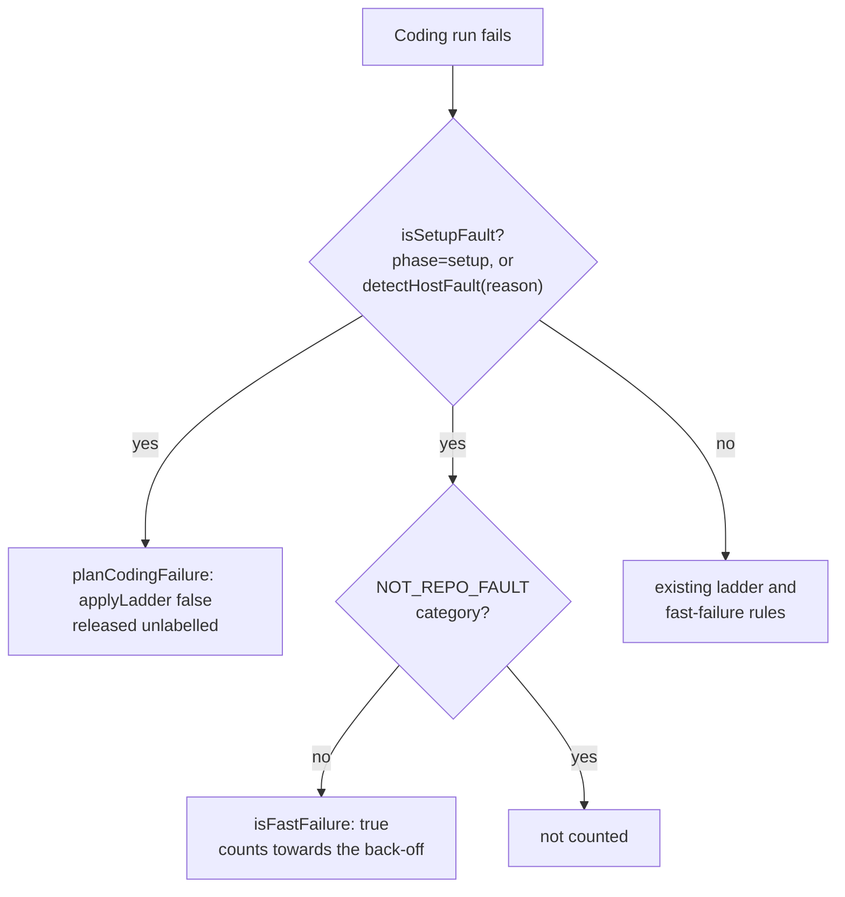

## Summary

A run that dies in setup is the host's or the repository's fault, not the issue's. Until now it could step the issue onto the `failed-once` → `failed` ladder, and it counted towards the #1950 back-off only if `isFastFailure` happened to class it as fast. Closes #2954.

- `worker/deno/lib/coding_failure_ladder.ts`: new `isSetupFault({ phase, reason })` returns true when `phase === "setup"` or when `detectHostFault(reason)` recognises the reason. `CodingRunOutcomeSummary` gains an optional `phase`. `planCodingFailure` returns `applyLadder: false` with no `cooldownKind` for a setup fault, so the issue gets no `failed-once`, no `failed` and no escalating cooldown, and is released unlabelled.
- `worker/deno/lib/repo_fast_failure_tracker.ts`: `FastFailureCandidate` gains an optional `setupFault`. When it is set, `isFastFailure` counts the run whatever its category or elapsed time. A `NOT_REPO_FAULT` (host-wide) category still never counts.
- `worker/deno/lib/run_core_production_deps.ts`: the ladder call site passes `result.phase` to `planCodingFailure`. The fast-failure release site sets `setupFault` from `isSetupFault`, so both sites use the same rule.
- `docs/CONFIGURATION.md` (threshold row, back-off flowchart and prose) and `docs/INTERNALS.md` describe the new behaviour.

## Evidence

Backend-only change, so there is no UI to screenshot. The tests are listed under Test Plan.

## Acceptance Criteria

<!-- vibe-spec-review inputs="diff+issue-body" -->

- **met** — `planCodingFailure` returns `applyLadder: false` for a run whose phase is `setup`, and for a run whose reason contains `fatal: bad object refs/heads/main` — evidence: `worker/deno/tests/coding_failure_ladder_test.ts::planCodingFailure - a setup-phase failure is released unlabelled, no attempt consumed (Issue #2954)`, `::planCodingFailure - a host-fault reason is a setup fault even at the execute phase (Issue #2954)` — reviewer: met
- **met** — `planCodingFailure` still returns `applyLadder: true` for an ordinary non-transient failure after the agent started — evidence: `worker/deno/tests/coding_failure_ladder_test.ts::planCodingFailure - an ordinary execute-phase failure still steps the ladder (Issue #2954)`, `::planCodingFailure - the same reason without a setup phase steps the ladder` — reviewer: met
- **met** — `isFastFailure({ category: "unknown", elapsedSeconds: 3600, setupFault: true }, policy)` is `true`, and the same candidate without `setupFault` is `false` — evidence: `worker/deno/tests/repo_fast_failure_tracker_test.ts::isFastFailure - a setup fault counts whatever the category or clock (Issue #2954)` — reviewer: met
- **met** — `isFastFailure` stays `false` for a `NOT_REPO_FAULT` category even when `setupFault` is `true` — evidence: `worker/deno/tests/repo_fast_failure_tracker_test.ts::isFastFailure - a setup fault never overrides a host-wide cause (Issue #2954)` — reviewer: met
- **met** — No existing test in `coding_failure_ladder_test.ts` or `repo_fast_failure_tracker_test.ts` changes its expected value — evidence: the diff of both files removes no lines; it only adds tests and the `isSetupFault` import — reviewer: met

The spec reviewer found a behaviour change that the tests don't cover, and I have confirmed it. A milestone-branch refusal (#2220) fails in the `setup` phase with a `repo_config` reason (`worker/deno/lib/issue_worker.ts:505`). Because the call site now passes the phase, `planCodingFailure` returns `applyLadder: false` for it, where it used to return `true`. A probe confirmed both results. As a result, `handleIssueFailure` no longer writes the "Automated Processing Paused (Repository Configuration)" comment for that case. The issue releases setup faults with only the release comment, so this may be intended, but it reverses #2220's "comment once" behaviour.

The existing #2220 test in `tests/milestone_branch_refusal_release_test.ts` calls `planCodingFailure` without a phase, so it still passes. The new `docs/INTERNALS.md` paragraph says a setup fault is handled "exactly as the `repo_config` case above". That is not accurate, because `repo_config` still writes the Paused comment when no phase is given. The owner should decide before merging whether `repo_config` should keep priority over the setup-fault check.

## Standards Review

<!-- vibe-standards-review inputs="diff+CODING-STANDARDS.md" -->

- **violation** — A Code Change Owes a Docs Change — evidence: `README.md:606` — reason: still open. The `failed-once` label row still lists only account state and host state as ladder exemptions; it should also name setup faults.
- **violation** — A Code Change Owes a Docs Change — evidence: `docs/TROUBLESHOOTING.md:943-978` — reason: still open. The "Transient infrastructure is deliberately exempt" paragraph does not mention setup faults. The host-fault label self-release section assumes the coding path still labels host-fault failures, which it no longer does.
- **violation** — Test coverage expectations (no duplicate tests) — evidence: `worker/deno/tests/coding_failure_ladder_test.ts` "an ordinary execute-phase failure still steps the ladder (Issue #2954)" — reason: still open. It repeats the `executePhase` half of the test before it.
- **clean** — Australian English; tests call the real functions and use no grep-over-source, wall clock or environment changes; `isSetupFault` reuses `detectHostFault`, and both call sites use it; only optional fields were added to the types; no failure is swallowed; the mermaid diagrams in the module header and `CONFIGURATION.md` are updated; the commit references the issue. Non-blocking notes: the new `INTERNALS.md` paragraph sits between the milestone-refusal bullets and that section's diagram. The "full disk → transient" label in the `coding_failure_ladder.ts` header is now partly unreachable, because a `detectHostFault` disk-full match takes the setup-fault branch first.

This summary-only retry was told not to change code, so the three violations above have not been fixed here and are recorded as still open.

## Test Plan

- Added to `worker/deno/tests/coding_failure_ladder_test.ts`:
  - a setup-phase run is released unlabelled;
  - the same reason without a setup phase still steps the ladder;
  - a `fatal: bad object refs/heads/main` reason at the execute phase is a setup fault;
  - an ordinary execute-phase failure steps the ladder;
  - three `isSetupFault` cases.
- Added to `worker/deno/tests/repo_fast_failure_tracker_test.ts`:
  - a setup fault counts whatever the category or clock;
  - a host-wide category is never overridden;
  - a setup fault with no elapsed time still counts.
- `deno test tests/coding_failure_ladder_test.ts tests/repo_fast_failure_tracker_test.ts tests/milestone_branch_refusal_release_test.ts` passes (107 tests).

🤖 Generated with [Claude Code](https://claude.com/claude-code)
