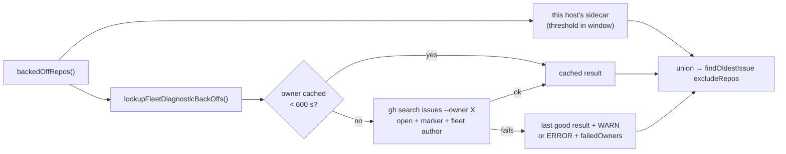

## Summary

The #1950 fast-failure back-off lived only in each host's `repo_fast_failures_{host}.json`, so a repository failing once or twice on each of many hosts never reached the threshold anywhere. Every host now also treats an **open, fleet-authored** diagnostic issue carrying `<!-- VIBE_REPO_FAST_FAILURE:<owner/repo> -->` as a back-off. Closes #2955.

- `worker/deno/lib/repo_fast_failure_tracker.ts`: new `lookupFleetDiagnosticBackOffs` runs one `gh search issues` per owner of the monitored repos, at most once per `REPO_FAST_FAILURE_DIAGNOSTIC_RECHECK_SECONDS` (600 s). The result is cached in process (`createFleetDiagnosticCache`, `ownersOfRepos`). It keeps only `state: open` rows whose marker matches an allowlisted `owner/repo`, then checks the author with `selectFleetAuthoredMatches`, the same check `fileRepoFastFailureIssue` uses. When `RepoFastFailureOptions.fleetDiagnostics` is set, `backedOffRepos` adds the repos it finds to its result.
- Failure path: if a lookup fails or returns output that can't be parsed, the last good result is kept and a WARN is logged. If there is no good result yet, an ERROR is logged and the owner is returned in `failedOwners`. The failure is never reported as a fresh empty set.
- `worker/deno/lib/run_core_production_deps.ts`: `fastFailureOptions` carries `fleetDiagnostics`, so all three existing `backedOffRepos` call sites (claim scan `excludeRepos`, idle-detect audit, idle census) pick it up. `describeRepoFastFailures` now uses `describeRepoFastFailureBackOffs`, so the `repo-fast-failures:` cycle-summary line names a fleet-only back-off as `owner/repo: backed off fleet-wide (owner/repo#N)`.
- `docs/CONFIGURATION.md`: new "Fleet-wide back-off (Issue #2955)" subsection, plus a node in the back-off flowchart.

## Evidence

Backend-only change, so there is no UI to screenshot. Tests listed under Test Plan; `./quality.sh` passed (all stages, `config integration` skipped as usual).

## Acceptance Criteria

<!-- vibe-spec-review inputs="diff+issue-body" -->

- **met** — An open marker issue authored by a fleet account puts its repository in `backedOffRepos` on a host whose local state file has zero failures for that repository — evidence: `worker/deno/tests/repo_fast_failure_tracker_test.ts::backedOffRepos - an open fleet-authored diagnostic backs off a repo with no local failures` — reviewer: met
- **met** — A marker issue authored by a non-fleet account is ignored — evidence: `worker/deno/tests/repo_fast_failure_tracker_test.ts::lookupFleetDiagnosticBackOffs - a non-fleet author's marker is ignored` — reviewer: met
- **met** — A closed marker issue does not back off the repository — evidence: `worker/deno/tests/repo_fast_failure_tracker_test.ts::lookupFleetDiagnosticBackOffs - a closed marker issue does not back off the repo` — reviewer: met
- **met** — Two `backedOffRepos` calls within 600 s make one `gh` call, not two (counting `ghCommandFn` stub) — evidence: `worker/deno/tests/repo_fast_failure_tracker_test.ts::backedOffRepos - fleet lookups are cached for 600s, then re-checked; closing lifts the back-off` — reviewer: met
- **met** — A `gh` failure after a good lookup keeps the cached set and emits a WARN; with no cached set it is reported as a lookup failure, not an empty set — evidence: `worker/deno/tests/repo_fast_failure_tracker_test.ts::lookupFleetDiagnosticBackOffs - a gh failure after a good lookup keeps the cached set and warns`, `::a gh failure with no cached set reports the owner as failed`, `::unparsable output is treated as a failure` — reviewer: met

The Spec reviewer flagged one misleading comment: it sat above `refreshRepoFastFailureBackOffs` and claimed that call honours the fleet signal. It now sits above the `backedOffRepos` call it describes.

## Standards Review

<!-- vibe-standards-review inputs="diff+CODING-STANDARDS.md" -->

- **clean** — Australian English; the `SIMPLE-ON-PURPOSE` line has a ceiling and an upgrade condition; failures are surfaced (WARN for a stale cache, ERROR when nothing is known) and never swallowed; the author check reuses `alert_dedup_authors.ts`; the docs change ships with the code; tests inject the clock and the `gh` runner, with no sleeps; the API changes are additive only; no hidden files or secrets. Optional note (not acted on): the cache branching in `lookupFleetDiagnosticBackOffs` is a little dense.

## Test Plan

- Added to `worker/deno/tests/repo_fast_failure_tracker_test.ts`: fleet-wide union with zero local failures, non-fleet author ignored, closed issue ignored, 600 s call bound plus closing lifting the back-off at the next lookup, exact `gh` args, WARN on failure with a cache, ERROR/`failedOwners` on failure without one, unparsable output, `ownersOfRepos`, summary line naming a fleet-only back-off.
- `deno test tests/repo_fast_failure_tracker_test.ts tests/run_core_production_deps_fast_failure_test.ts` passes (46 tests); `./quality.sh` passed.

🤖 Generated with [Claude Code](https://claude.com/claude-code)
