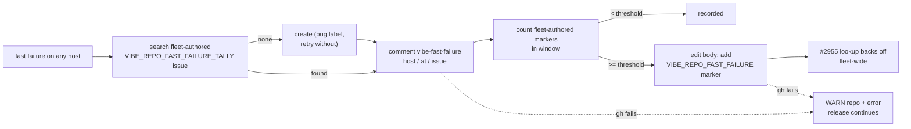

## Summary

Until now, each host counted fast failures in its own state file. A repository that failed once on each of several hosts never reached the threshold anywhere. Each fast failure is now also recorded on one shared, fleet-authored **tally issue** per repository, and the fleet backs off once that issue reaches the threshold. Closes #2956.

- `worker/deno/lib/repo_fast_failure_issue.ts`: `recordRepoFastFailureTally` handles each fast failure in four steps:
  1. **Find or create the tally issue.** It finds the lowest-numbered fleet-authored issue carrying `<!-- VIBE_REPO_FAST_FAILURE_TALLY:<repo> -->`. If there is none, it creates one with the `bug` label, and retries once without the label if that fails.
  2. **Comment.** It adds `<!-- vibe-fast-failure host="…" at="<ISO>" issue="<repo>#<n>" -->` and a one-line reason. Host and issue are sanitised, and the reason is fenced so it cannot forge a marker.
  3. **Count.** It counts the fleet-authored marker comments inside the policy window. Markers dated in the future count only within a five-minute clock-skew allowance.
  4. **Back off.** When the count reaches the threshold, it edits the issue body to add the #2955 back-off marker `<!-- VIBE_REPO_FAST_FAILURE:<repo> -->` and a "backed off" line.

  If a `gh` call fails, it logs a WARN with the repo, the issue and the error, records a self-diagnostic fault, and does not throw (this runs on the claim-release path, see #2648). The old `fileRepoFastFailureIssue` and `formatRepoFastFailureBody` are removed.
- `worker/deno/lib/run_core_production_deps.ts`: every fast failure now records a tally. The per-host state file and diagnostic link are unchanged.
- `worker/deno/lib/vibe_env_registry.ts`: registers `VIBE_REPO_FAST_FAILURE_TALLY` as a marker.
- `docs/CONFIGURATION.md`: documents the tally issue, the comment marker and the fleet-wide threshold. The back-off lasts until the issue is closed; the window only gates when the threshold is reached.

## Evidence

This is a backend-only change, so there is no UI to screenshot. The tests are listed under Test Plan. `./quality.sh` passed every stage; `config integration` was skipped as usual because there is no `.config.json` in the container.

## Acceptance Criteria

<!-- vibe-spec-review inputs="diff+issue-body" -->

- **met** — Three fast failures from three hosts within 24 h give one issue, three comments, and a back-off after the third — evidence: `worker/deno/tests/repo_fast_failure_issue_test.ts::recordRepoFastFailureTally - three fast failures from three hosts within 24h backs off on the third` — reviewer: met
- **met** — Two failures in the window plus one older failure give no back-off — evidence: `worker/deno/tests/repo_fast_failure_issue_test.ts::recordRepoFastFailureTally - a comment older than the window does not count towards back-off` — reviewer: met
- **met** — A tally-only issue is not in #2955's back-off set — evidence: `worker/deno/tests/repo_fast_failure_issue_test.ts::a tally-only body does not back the repo off fleet-wide; the back-off marker does` — reviewer: met
- **met** — A non-fleet tally issue is ignored and a new one is created — evidence: `worker/deno/tests/repo_fast_failure_issue_test.ts::recordRepoFastFailureTally - a non-fleet-authored tally issue is ignored and a fresh one is created` (plus `::a non-fleet comment carrying the marker is not counted`) — reviewer: met
- **met** — A `gh` failure on the comment or the edit gives a WARN with the repo and the error, and the release completes — evidence: `worker/deno/tests/repo_fast_failure_issue_test.ts::recordRepoFastFailureTally - a gh failure on the comment is reported and suppressed, never thrown`, `::a gh failure on the back-off edit is reported, never thrown` — reviewer: met
- **met** — The docs describe the tally and the fleet-wide threshold — evidence: `docs/CONFIGURATION.md` fast-failure section — reviewer: met

The Spec reviewer noted that the window check accepted markers dated up to a whole window in the future. That bound is now a five-minute clock-skew allowance, covered by `::a marker dated more than an hour in the future is not counted`.

## Standards Review

<!-- vibe-standards-review inputs="diff+CODING-STANDARDS.md" -->

- **clean** — reviewer: met. The change follows the standards in these respects:
  - Australian English.
  - Every `gh` failure is surfaced as a WARN plus a self-diagnostic fault and is never thrown on the release path.
  - The author checks reuse `alert_dedup_authors.ts`.
  - Comment attributes are sanitised and the reason is fenced.
  - The docs change ships with the code.
  - Tests inject the clock and the `gh` runner, with no sleeps.
  - The new `VIBE_` name is registered.
  - There are no hidden files or secrets.

  The reviewer raised three optional notes:
  - **Forward window tolerance.** Acted on: it is now a five-minute allowance.
  - **Many injected seams.** Not acted on.
  - **Two similar attribute sanitisers.** Not acted on.

## Test Plan

- `worker/deno/tests/repo_fast_failure_issue_test.ts`, 15 tests:
  - Marker round trips and the tally body.
  - Comment-marker sanitising.
  - Three hosts back off on the third failure.
  - The window, both too old and too far in the future.
  - A non-fleet issue or comment is ignored.
  - A comment or edit failure is warned about and not thrown.
  - The label retry.
  - Reason forgery.
  - A tally-only body is not backed off by `lookupFleetDiagnosticBackOffs`.
- `deno task check:manifests` and `tests/vibe_env_registry_test.ts` pass.
- `./quality.sh` passed.

🤖 Generated with [Claude Code](https://claude.com/claude-code)
