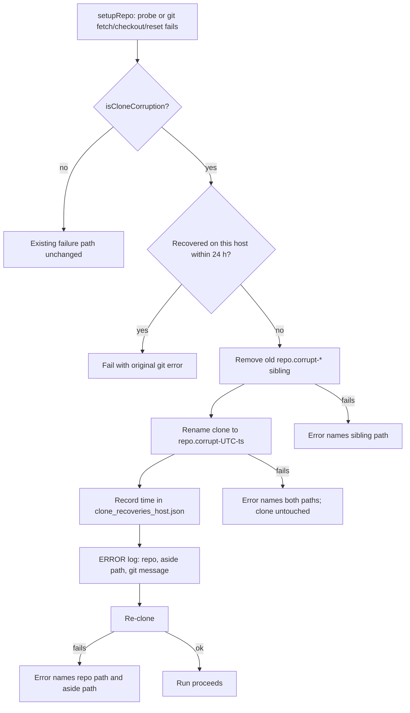

# PR Summary — Issue #2957: move a corrupt clone aside and re-clone it

Closes #2957

## Summary

`setupRepo` can now recover a clone that is a repository but a corrupt one
(`detectHostFault` → `clone-corrupt`) instead of failing every run on that
host. The clone is renamed to `<repoPath>.corrupt-<UTC ts>`, re-cloned, and
one ERROR line names the repo, the aside path and the git message. Recovery is
capped at one re-clone per repo per 24 h per host, recorded in
`clone_recoveries_<host>.json` beside `repo_fast_failures_<host>.json`; once
the cap is used, setup fails with the original git error. The #2848
`discardBrokenClone` path is unchanged.

- `lib/corrupt_clone_recovery.ts` (new) — `isCloneCorruption`,
  `cloneRecoveryStatePath`, `recoverCorruptClone` (state lock + `atomicWrite`;
  an unreadable state file fails loud rather than resetting the cap).
- `lib/broken_clone.ts` — `probeCorruptClone` (`rev-parse --git-dir`).
- `commands/git_operations.ts` — probe before reuse; classify failed
  reset/checkout/fetch/reset output; recover and fall through to the clone
  path; a re-clone failure names the repo path and the aside path.
- Docs: `CONFIGURATION.md`, `IDLE-TASK-FRAMEWORK.md`, `TROUBLESHOOTING.md`;
  lib sweep ledger entry.

## Evidence

Tests use real corrupt git repositories, not mocked output:

- `worker/deno/tests/broken_clone_test.ts` — 10 new tests (lines 121–352).
  The original 5 #2848 tests are unchanged.
- `worker/deno/tests/regression_git_operations_test.ts` — 5 new `setupRepo`
  tests (lines 287–423).
- Targeted run: `deno task test:unit tests/broken_clone_test.ts
  tests/regression_git_operations_test.ts` — all pass.

## Reproduction

- **Symptom:** a clone with a garbage `.git/config` line made `setupRepo`
  return `success: false` (`SECURITY (Issue #1443): could not erase ignored
  executable paths … fatal: bad config line 1 in file .git/config`) and left
  the clone in place, so every later run on the host failed the same way.
- **Status:** `verified` on the unfixed code with an equivalent script. The new
  tests import modules that do not exist before the fix, so they cannot run
  there unmodified.
- **Regression test:** `regression_git_operations_test.ts:287` (AC1). It fails
  without the fix (clone not recovered) and passes with it.

## Acceptance Criteria

<!-- vibe-spec-review inputs="diff+issue-body" -->

1. **Garbage `.git/config` line → move aside, re-clone, run proceeds.**
   reviewer: met. Evidence: `regression_git_operations_test.ts:287`,
   `broken_clone_test.ts:121`.
2. **Corrupt ref (bogus SHA in `refs/heads/main`) → move aside, re-clone.**
   reviewer: met. The probe passes on this repo; the failure surfaces at
   fetch/reset and is classified there. Evidence:
   `regression_git_operations_test.ts:323`.
3. **Second corruption within 24 h is not re-cloned; error carries the git
   message.** reviewer: met. Evidence: `regression_git_operations_test.ts:359`,
   `broken_clone_test.ts:225`.
4. **Two recoveries over 24 h apart leave one `*.corrupt-*` directory.**
   reviewer: met. Evidence: `broken_clone_test.ts:264`. An unrelated sibling
   is left alone: `broken_clone_test.ts:302`.
5. **A healthy clone is never moved; #2848 tests pass unchanged.**
   reviewer: met. Evidence: `regression_git_operations_test.ts:423`,
   `broken_clone_test.ts:142`; `broken_clone_test.ts:30–107` are untouched.
6. **A move or re-clone failure names the path; setup never continues on a
   half-moved clone.** reviewer: met. A single `Deno.rename` is the only
   boundary between "not moved" and "moved", so no half-moved state exists.
   Evidence: `broken_clone_test.ts:330` (rename), `broken_clone_test.ts:352`
   (unreadable state), `regression_git_operations_test.ts:389` (re-clone).

The reviewer raised two minor notes. Neither is a departure from the issue:

- The per-host cap has no two-host test. The per-host file name follows the
  existing `repo_fast_failures_<host>.json` pattern.
- The ERROR line logs only the first line of the git message, to keep it to a
  single line. The full message is still carried in the returned error.

## Standards Review

<!-- vibe-standards-review inputs="diff+CODING-STANDARDS.md" -->

No material departures from `CODING-STANDARDS.md`. The reviewer made two
optional style notes, which were not acted on: the explicit `fetchResult` type
annotation in `git_operations.ts`, and the `{code, stdout, stderr}` parameter
shape of `classifyGitCorruption`. Failures are loud: every filesystem or state
fault returns an error naming the path, and an unreadable state file is never
treated as empty.

## Test Plan

- [x] Targeted unit tests for the touched files pass.
- [x] `./quality.sh < /dev/null` → `Result: PASSED (with skipped checks)`
      (`config integration` is skipped: there is no `.config.json` in this
      container).
- [x] Healthy clone and #2848 behaviour unchanged.

🤖 Generated with [Claude Code](https://claude.com/claude-code)
