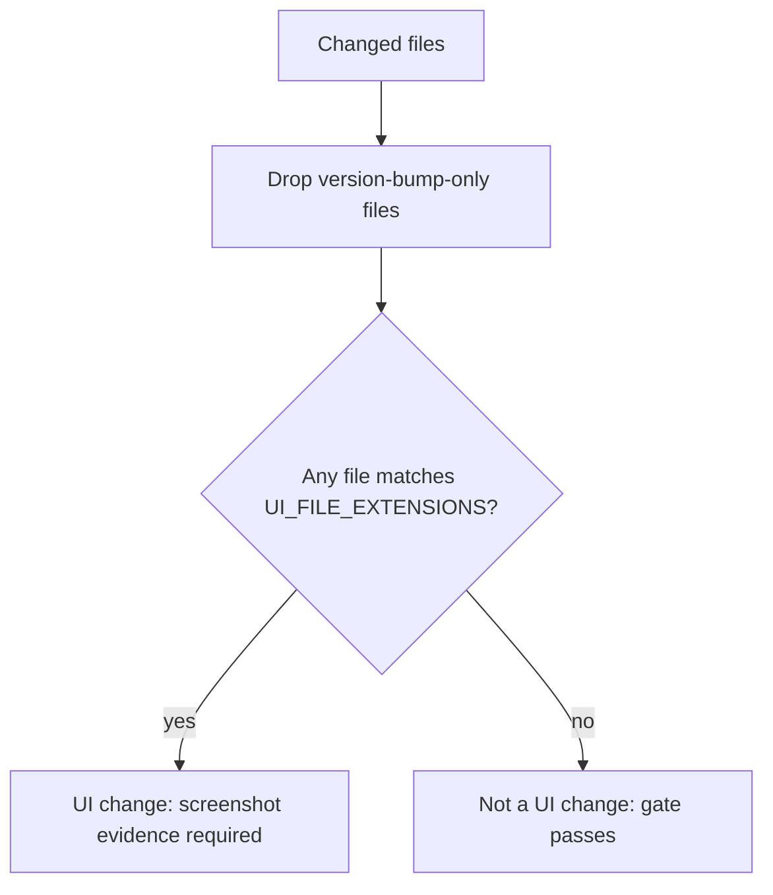

# PR Summary — Issue #2959

## Summary

Closes #2959

The completion-phase screenshot gate asked for screenshot evidence on changes
that had no UI. `detectUiChanges` counted a change as UI in three wrong cases:
the issue had a label that matched `UI_LABEL_PATTERN` (including `lang:design`),
the changed-file list was empty, or the summary contained UI words. It now
decides from the changed files alone.

- `worker/deno/lib/screenshot_validation.ts`: a change counts as UI only when at
  least one substantive changed file matches `UI_FILE_EXTENSIONS`.
  Version-bump-only files (#2300) are still set aside. Removed:
  `UI_LABEL_PATTERN`, the `issueLabels` parameter and option, the `UI_KEYWORDS`
  summary fallback, `keywordFallbackApplies` and `NON_UI_FILE_EXTENSIONS`. The
  header comment describes the new rule.
- `worker/deno/lib/phases/completion_phase.ts`: the call site no longer passes
  `issueLabels`.
- Tests: the cases that asserted label- or keyword-driven detection now assert
  the file-only rule. New cases cover `lang:design`, an empty list, and a
  summary full of UI words. The branch-evidence and prompt-precision fixtures
  use a real UI file (`.html`), because their `.js` file only counted as UI
  through the removed signals.
- `docs/INTERNALS.md` and `docs/CONFIGURATION.md` describe the file-only rule.
  `skip_screenshot_check` no longer mentions keyword detection.

- [x] File-only UI detection
- [x] Label, keyword and empty-list signals removed
- [x] Call site and tests updated
- [x] Docs updated

## Evidence

- Spec reviewer: all five acceptance criteria met, with no unrequested changes.
  It ran the three test files: 31 passed, 0 failed. `deno check` on the changed
  files exits 0.
- Standards reviewer: no blocking violations. The minor test-hygiene points are
  listed under Standards Review.
- `./quality.sh < /dev/null`: every check passed. Config integration was
  skipped.

## Reproduction

- **symptom** — the completion-phase screenshot gate demanded screenshot
  evidence for changes with no UI: a keyword-laden summary
  (`button colour visual modal`) or an empty changed-file list made a `.ts` /
  `.rs` / `.md` change a UI change, and a `lang:design` label did the same
  whatever the files were
- **status** — `verified` — the regression tests were observed failing against
  the unfixed `screenshot_validation.ts` (base-branch copy, run with
  `--no-check`: 5 of the 6 `#2959` cases failed, the two below with
  `isUiChange: true`) and passing after the fix (31 passed, 0 failed across the
  three test files). The label case is now enforced at type level: `issueLabels`
  is no longer an input, so `deno check` rejects any caller passing it
- **regression test** —
  `worker/deno/tests/screenshot_validation_test.ts::screenshot_validation #2959 - non-UI file extensions are not a UI change despite a keyword-laden summary`,
  `worker/deno/tests/screenshot_validation_test.ts::screenshot_validation #2959 - summary keywords alone, with no UI file changed, are not a UI change`

## Acceptance Criteria

<!-- vibe-spec-review inputs="diff+issue-body" -->

- **met** — `detectUiChanges` returns `false` for `["worker/deno/lib/foo.ts"]`
  on a `lang:design` issue, for an empty changed-files list whatever the summary
  says, and for a summary of UI words with only `.ts` / `.rs` / `.md` files —
  evidence:
  `worker/deno/tests/screenshot_validation_test.ts::#2959 - detectUiChanges returns false for a non-UI file regardless of label (issue labelled lang:design)`,
  `::#2959 - detectUiChanges returns false for an empty changed-file list regardless of summary wording`,
  `::#2959 - non-UI file extensions are not a UI change despite a keyword-laden summary`
  — reviewer: met
- **met** — `detectUiChanges` still returns `true` for any changed `.css`,
  `.scss`, `.html`, `.tsx`, `.jsx`, `.vue` or `.svelte` file — evidence:
  `worker/deno/tests/screenshot_validation_test.ts::returns true for various UI file extensions`
  — reviewer: met
- **met** — A file whose patch only bumps versions (#2300) still does not count
  — evidence: `worker/deno/lib/screenshot_validation.ts:132-133`,
  `worker/deno/tests/screenshot_validation_test.ts::#2300 - a real UI edit beside a bump is still a UI change`
  — reviewer: met
- **met** — `validateScreenshotEvidence`'s summary-reference and branch-evidence
  (#4355) paths behave as today for a real UI change — evidence:
  `worker/deno/tests/screenshot_validation_test.ts::passes for UI change with screenshot in summary`,
  `worker/deno/tests/completion_phase_branch_evidence_test.ts` (fixtures moved
  from `.js` to `.html`, gate logic untouched) — reviewer: met
- **met** —
  `grep -n "UI_LABEL_PATTERN\|UI_KEYWORDS\|issueLabels" worker/deno/lib/screenshot_validation.ts`
  finds nothing — evidence: grep exits 1; the call site at
  `worker/deno/lib/phases/completion_phase.ts:1687` no longer passes
  `issueLabels` — reviewer: met

## Standards Review

<!-- vibe-standards-review inputs="diff+CODING-STANDARDS.md" -->

- **violation** — Test-name accuracy — evidence:
  `worker/deno/tests/screenshot_validation_test.ts:276` — reason: minor. The
  name says "a web source file is a UI change", but the first assertion checks
  that `src/toolbar.ts` is not. It stands: behaviour is covered, and renaming is
  a follow-up tidy.
- **violation** — Test-name accuracy — evidence:
  `worker/deno/tests/screenshot_validation_test.ts:419` — reason: minor. "not
  made a UI change by its summary" no longer passes a summary, so the test
  overlaps the case at line 369. It stands for the same reason.
- **violation** — No duplicate tests (TDD rule 4) — evidence:
  `worker/deno/tests/screenshot_validation_test.ts:204-224` — reason: minor.
  `detectUiChanges(["src/engine.ts"])` is asserted twice, with messages about
  summary wording that is no longer passed. It stands for the same reason.
- **violation** — Tests must be able to fail for the reason they name —
  evidence: `worker/deno/tests/screenshot_validation_test.ts:78`, `:114` —
  reason: minor. The "label is ignored" cases pass no label, because labels are
  no longer an input. The removed parameter enforces the rule at type level, so
  they repeat the non-UI cases. It stands for the same reason.
- **violation** — DRY — evidence:
  `worker/deno/tests/screenshot_validation_test.ts:40-56` — reason: minor. The
  extension loop repeats the earlier css/html/tsx/scss cases and leaves `.htm`
  untested. It stands for the same reason.
- **violation** — Reuse what the codebase has — evidence:
  `worker/deno/lib/screenshot_validation.ts:133` — reason: minor and older than
  this change. `UI_FILE_EXTENSIONS.test(f)` is called directly although the
  module exports `isUiSourceFile` for the same check.
- **violation** — Fail loud (judgement call) — evidence:
  `worker/deno/lib/phases/completion_phase.ts:1547-1553` — reason: minor. If
  `git diff --name-only` fails, the file list is empty and the gate passes with
  a WARNING. It stands: the issue requires "an empty changed-files list" to be
  non-UI, and `docs/INTERNALS.md` documents this.
- **clean** — Australian English spelling; dead-code removal (no callers left);
  the one production caller is updated; the header and doc comments match the
  behaviour; docs are updated with nothing stale elsewhere; removed tests are
  explained; no grep-style tests; KISS; `deno fmt --check`, `deno lint` and the
  targeted tests pass.

## Test Plan

- `cd worker/deno && deno test --allow-all tests/screenshot_validation_test.ts tests/screenshot_prompt_precision_test.ts tests/completion_phase_branch_evidence_test.ts < /dev/null`
- `grep -n "UI_LABEL_PATTERN\|UI_KEYWORDS\|issueLabels" worker/deno/lib/screenshot_validation.ts`
  finds nothing.
