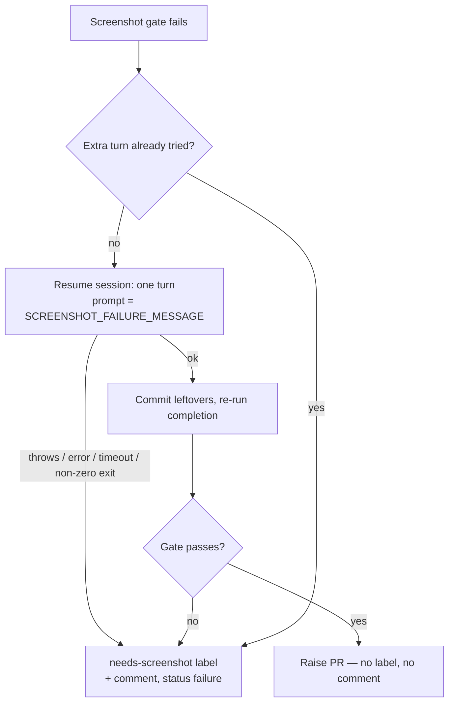

## Summary

When the screenshot gate finds a UI change with no evidence, the agent now gets one extra turn to add a screenshot. Only if that fails does the run fail. Closes #2960.

- `completionBody` records the first screenshot block in `state.screenshotGateBlock` and returns without adding a label or comment.
- `runCompletionAttempt` hands that block to `recoverFromScreenshotGateBlock` (new `worker/deno/lib/screenshot_gate_retry.ts`). It sets `screenshotRetryAttempted` before doing anything else, then resumes the agent session once through `runClaudeWithRetry`:
  - the prompt is `SCREENSHOT_FAILURE_MESSAGE`;
  - the browser MCP is on;
  - the session is the run's `sessionResumeState`;
  - the timeout is `screenshot_retry_timeout_seconds`, default 600.
- **The turn succeeds:** anything it left uncommitted is committed through the guarded `commitAndPushPending` path. Completion then runs again, re-reading the changed files and the PR summary and re-checking the gate.
- **The gate passes:** the PR is raised with no `needs-screenshot` label and no comment.
- **The gate still fails, or the turn throws, returns an error, times out or exits non-zero:** the old path runs unchanged (`applyScreenshotGateFailure`: label, comment, `failure`). An ERROR log line says the extra turn was tried and why it did not help.
- There is at most one extra turn per run. `skip_screenshot_check` repos never reach this path.

## Evidence

This is a backend change with no web interface to screenshot. `worker/deno/tests/completion_phase_screenshot_retry_test.ts` drives the real `workOnIssueCompletion` with a stub agent and checks the agent call count in every case. `./quality.sh` passed after the final edit (config integration was skipped because the host has no `.config.json`).

## Acceptance Criteria

<!-- vibe-spec-review inputs="diff+issue-body" -->

- **met** — If the stub commits `docs/evidence/after.png` on the extra turn, the PR is created with no `needs-screenshot` label and no failure comment — evidence: `worker/deno/tests/completion_phase_screenshot_retry_test.ts::extra turn captures the evidence and the run proceeds` — reviewer: met
- **met** — If the stub does nothing, the agent is invoked exactly once more, then `needs-screenshot` is added, `SCREENSHOT_FAILURE_MESSAGE` is posted and the phase returns `status: "failure"` — evidence: `worker/deno/tests/completion_phase_screenshot_retry_test.ts::extra turn does nothing, run fails as before` — reviewer: met
- **met** — If the stub throws or times out, the phase takes the same failure path, logs the error and does not retry — evidence: `worker/deno/tests/completion_phase_screenshot_retry_test.ts` throw / `ok:false` / timed-out cases (one agent call, no completion re-run); the error is logged in `worker/deno/lib/screenshot_gate_retry.ts::recoverFromScreenshotGateBlock` — reviewer: met
- **met** — A non-UI change, or a UI change that already has evidence, never invokes the extra turn — evidence: `worker/deno/tests/completion_phase_screenshot_retry_test.ts` not-needed cases (non-UI, evidence on the branch, `skip_screenshot_check`) — reviewer: met
- **unrequested** — Anything the extra turn left uncommitted is committed and pushed (`commitScreenshotEvidence`) before completion re-runs — reviewer: unrequested — reason: the gate only reads the branch diff, so a screenshot saved but not committed would be invisible to it; this uses the same guarded commit path as the PR-summary recovery
- **unrequested** — `mcpConfig: true` grants the browser on the extra turn — reviewer: unrequested — reason: the turn's only job is to take a screenshot, which needs the browser; it is the same grant the execute run already had
- **unrequested** — Documentation: an `INTERNALS.md` bullet and diagram, a `CONFIGURATION.md` row, and the security-sweep ledger slice with its record — reviewer: unrequested — reason: the repo standard says a code change owes a docs change, and the sweep-coverage test requires every new lib module to belong to a slice

## Standards Review

<!-- vibe-standards-review inputs="diff+CODING-STANDARDS.md" -->

- **violation** — Log levels: lines that end the run were logged at WARNING — evidence: `worker/deno/lib/screenshot_gate_retry.ts` (throw, `!ok`, timeout, non-zero exit and no-block branches), `worker/deno/lib/phases/completion_phase.ts` ("still fails after the one extra agent turn") — reason: fixed here; they are now `logger.error`, and the "resuming for one extra turn" line stays WARNING because a retry is being taken
- **clean** — tests call real code with injected fakes; the default lives once in `OPERATIONAL_DEFAULTS`; `config.ts` rejects a non-positive timeout loudly; the new key is registered in `KNOWN_CONFIG_KEYS`; docs are updated with a Mermaid diagram; commit failures are logged at error level, never swallowed; no new path, secret or hidden-file handling. Optional nit (repeated timeout fallback) was also fixed.

## Test Plan

- Added `worker/deno/tests/completion_phase_screenshot_retry_test.ts`. It covers the saved attempt (including prompt, `mcpConfig`, `sessionResumeState` and the 600 s default), a configured timeout, the unchanged failure, a throw, `ok:false`, a timeout, a non-UI change, evidence already on the branch, and `skip_screenshot_check`. Every case asserts the agent call count.
- Existing completion-phase suites still pass, including `completion_phase_version_bump_2300_test.ts`, whose UI-change failure now goes through the extra turn first.
- `lib_sweep_coverage_test.ts` passes with the new `top-up-2960` slice.
- Full `./quality.sh`: PASSED (config integration skipped).
