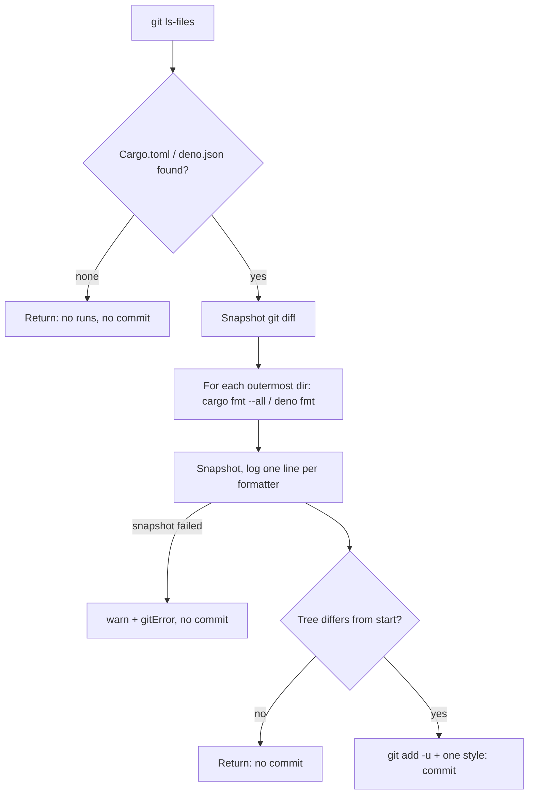

## Summary

Adds `runRepoFormatters(repoPath, deps)`, which runs the repository's own formatters and commits their output as a single commit. Closes #2967 (part of #2932; it covers the formatter part of #2945).

- New `worker/deno/lib/repo_formatters.ts`:
  - **Detection:** `git ls-files -z` finds tracked `Cargo.toml` and `deno.json`/`deno.jsonc` files. Only the outermost directory of each kind is kept (`outermostConfigDirs`), so nested configs are found but never formatted twice.
  - **Running:** `cargo fmt --all` runs in each Cargo directory and `deno fmt` in each Deno directory. Both go through `createDefaultDeps().runCommand` with `cwd` and `stdin: "null"`.
  - **Change detection:** a `git diff --no-ext-diff --binary` snapshot is taken before and after each formatter.
  - **Committing:** if the tree changed, `git add -u` is followed by exactly one `style: apply repository formatters` commit, which carries the run-id trailer. If nothing changed, there is no commit.
  - **Logging:** one line per formatter, giving the tool, directory, exit code and whether files changed.
  - **Failures:** a non-zero exit or a missing binary (the runner maps a spawn error to exit 1) is logged at `warn` with a redacted excerpt and returned in `failures`. A failed git step, including a snapshot that fails mid-loop, stops the run and is reported in `gitError`. The function never throws.
- It is not wired into the quality gate, as the issue asks.
- `docs/audits/lib-sweep-coverage.json` gains a `top-up-2967` slice, with its record in `docs/audits/security-sweep-2967-repo-formatters.md`. Every new `lib/` module must have one.

## Spec

**Intent and Rationale:** formatter drift should land as one predictable `style:` commit made by the worker, not as review noise or a failed gate.

**Essential Design Decisions:**

- "Changed" is decided by comparing `git diff` snapshots, not formatter output, because neither tool reliably reports what it rewrote.
- Only the outermost config directory runs: `cargo fmt --all` covers the workspace beneath it, and `deno fmt` covers the subtree.
- A mid-loop snapshot failure aborts rather than being read as "no change", so a commit is never built on an unknown tree state.

**Undiscoverable Facts:** the issue accepts that `git add -u` may sweep in uncommitted tracked agent edits, and it assumes the default branch is already formatted.

## Evidence

This is a backend-only change with no visual surface. The behaviour is covered by `worker/deno/tests/repo_formatters_test.ts`, which has 12 tests using injected command and git fakes.

## Acceptance Criteria

<!-- vibe-spec-review inputs="diff+issue-body" -->

- **met** — Only a root `Cargo.toml`: `cargo fmt --all` runs once and `deno fmt` does not run — evidence: `worker/deno/tests/repo_formatters_test.ts::repo formatters - only root Cargo.toml runs cargo fmt at root` — reviewer: met
- **met** — Only `web/deno.json`: `deno fmt` runs with cwd `web/` — evidence: `worker/deno/tests/repo_formatters_test.ts::repo formatters - only web/deno.json runs deno fmt at web` — reviewer: met
- **met** — A Deno config at the root and in `web/`: `deno fmt` runs once, at the root — evidence: `worker/deno/tests/repo_formatters_test.ts::repo formatters - deno.json and web/deno.jsonc runs deno fmt once at root` — reviewer: met
- **met** — Neither config: nothing runs and there is no commit — evidence: `worker/deno/tests/repo_formatters_test.ts::repo formatters - neither config present runs nothing and does not commit` — reviewer: met
- **met** — A change makes exactly one `style: apply repository formatters` commit, and no change makes no commit — evidence: `worker/deno/tests/repo_formatters_test.ts` tests "formatter that changes files commits once" and "changes nothing does not commit" — reviewer: met
- **met** — A non-zero exit or missing binary is returned in the result and logged at `warn`, with no throw — evidence: `worker/deno/tests/repo_formatters_test.ts::repo formatters - non-zero exit is recorded, redacted, logged, and never throws` — reviewer: met
- **met** — `./quality.sh` passes — evidence: full gate run after the final edit — reviewer: partial — reason: the reviewer only saw the diff and could not observe the gate; it was run after the final edit and passed (see Test Plan)
- **unrequested** — The sweep-ledger slice `top-up-2967` and `docs/audits/security-sweep-2967-repo-formatters.md` — reviewer: unrequested — reason: `lib_sweep_coverage_test.ts` fails for any `lib/` module with no slice, so criterion 7 needs it

## Standards Review

<!-- vibe-standards-review inputs="diff+CODING-STANDARDS.md" -->

- **clean** — Outbound text is redacted with `redactedTail`. Every failure is reported in the result and logged at `warn`, with no throw and nothing swallowed. Commands use fixed argv. The tests call the real functions with injected fakes. The run-id trailer is on the commit. The new module is recorded in the sweep ledger.

## Test Plan

- Added `worker/deno/tests/repo_formatters_test.ts`. Its 12 tests cover:
  - Cargo only
  - nested Deno config only
  - two Deno roots collapsing to one
  - both tools
  - neither tool
  - a change that commits exactly once with the trailer
  - no change, so no commit
  - a non-zero exit with a secret redacted
  - an `ls-files` failure
  - a snapshot failure after a formatter, which makes no add or commit
  - two `outermostConfigDirs` cases
- `lib_sweep_coverage_test.ts` passes with the new slice.
- Full `./quality.sh`: QUALITY_RESULT_PLACEHOLDER
