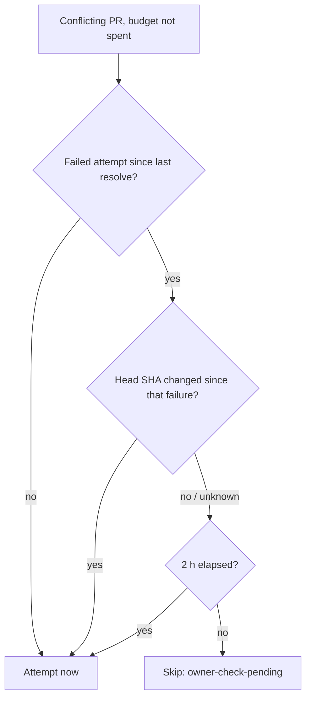

## Summary

Replaced the ladder's private `DEFAULT_MAX_CONFLICT_ATTEMPTS = 2` with one budget of
3 merge-conflict resolution attempts per PR. That budget is shared by the ladder,
milestone sync and takeover passes, and is tallied only from trusted markers on the
PR. After a failed attempt the next one waits 2 hours, unless the PR head moves.
Closes #2996.

- [x] `CONFLICT_RESOLUTION_BUDGET = 3` and `CONFLICT_OWNER_CHECK_HOURS = 2` in `merge_conflict_markers.ts`
- [x] `pass="…"` and `head="…"` on the attempt, failed and resolved markers; pure reader `readResolutionAttempts`
- [x] Scan: constant deleted; `hasExhaustedConflictAttempts` and `isConflictAttemptDue` rebuilt on the reader; 2 h owner-check spacing; parked comment uses the new constant
- [x] Processor writes `pass="ladder"` plus the head on every marker and defaults to the new budget
- [x] `MILESTONE_CONFLICT_ATTEMPT_BUDGET` derived from `CONFLICT_RESOLUTION_BUDGET`
- [x] Docs updated

## Spec

### Intent and Rationale

- Each pass used to have room to keep its own count. One tally on the PR, read back by `readResolutionAttempts`, means routing a PR through several passes cannot multiply its budget.
- The tally stays on the PR, never in a host-local file (#2919), so the bound holds across hosts and restarts.
- The 2 h spacing gives the PR owner a window to act after a failure. A moved head is new work, so it ends the wait at once.

### Essential Design Decisions

- `CONFLICT_RESOLVED_MARKER` is now a **prefix** (`<!-- vibe-coder:merge-conflict-resolved`), like the attempt and failed markers already were. Every existing `includes()` still matches legacy `… -->` bodies as well as the new attributed marker.
- On the failed marker, `n="…"` stays first, because `conflict_abandon_restart.ts` reads it with `/merge-conflict-failed\s+n="(\d+)"/`.
- If the head move cannot be proven, the spacing still applies: a legacy failure with no `head=`, or an unknown current head, waits the 2 h. A failure with no readable timestamp is due at once; the budget still bounds it.
- A PR waiting out the window is skipped with a new closed-taxonomy reason, `owner-check-pending` (`dueAt`, `attemptsSpent`). It counts as queued, so the PR keeps its label.

### Undiscoverable Facts

- Only the ladder writes markers today. The sync and takeover passes start writing `pass="sync"` and `pass="takeover"` in later sub-issues of #2965, and the reader already counts them.
- The milestone branch ledger takes the new budget value (3) but keeps its own host-local, no-wait pacing. The 2 h spacing applies to the PR scan only, as the issue scopes it.

## Evidence

Backend-only change, so there is nothing to screenshot. The tests below prove the behaviour, and `./quality.sh` passed after the final edit (deno tests, lint, type check, fmt, semgrep, mermaid and markdownlint; config integration skipped).

**Docs sweep** — grep: `DEFAULT_MAX_CONFLICT_ATTEMPTS`, "two-attempt", "two concluded", "two-run budget", "no wait between", "of 2". Updated: `docs/workflows/merge-conflicts.md`, `docs/MERGE.md`, `docs/INTERNALS.md`, `docs/workflows/milestones.md`, `README.md`.

## Acceptance Criteria

<!-- vibe-spec-review inputs="diff+issue-body" -->

- **met** — `grep -rn DEFAULT_MAX_CONFLICT_ATTEMPTS worker/` returns nothing — evidence: the grep exits 1 with no matches; the constant is removed from `worker/deno/lib/pr_merge_conflict_scan.ts` — reviewer: met
- **met** — one failed `ladder`, one failed `sync` and one failed `takeover` marker exhaust the budget; two failures do not — evidence: `worker/deno/tests/pr_merge_conflict_scan_test.ts::spentConflictAttempts/hasExhaustedConflictAttempts - every pass spends the same budget (Issue #2996)` — reviewer: met
- **met** — a failure marker posted by an untrusted author is not counted — evidence: `worker/deno/tests/pr_merge_conflict_scan_test.ts::readResolutionAttempts/hasExhaustedConflictAttempts - an untrusted failure is not counted (Issue #2996)` — reviewer: met
- **met** — a legacy attempt marker without `pass=` counts as `ladder` — evidence: `worker/deno/tests/pr_merge_conflict_scan_test.ts::readResolutionAttempts - a legacy marker pair with no pass= counts as ladder (Issue #2996)` — reviewer: met
- **met** — not due at 1 h 59 m with the same head, due at 2 h, due at once when the head changed — evidence: `worker/deno/tests/pr_merge_conflict_scan_test.ts::isConflictAttemptDue - a failure at T is not due at T+1h59m, due at T+2h (Issue #2996)`, `::isConflictAttemptDue - due at once when the current head differs (Issue #2996)`, plus three `findConflictingPr` owner-check tests — reviewer: met
- **met** — tests and quality checks pass — evidence: `./quality.sh < /dev/null` gave `Result: PASSED` (deno tests, lint, type check, fmt, semgrep) after the final edit — reviewer: partial — reason: the reviewer saw only the diff and could not run the suite; the gate was run here and passed
- **unrequested** — `README.md`, `docs/MERGE.md`, `docs/INTERNALS.md` and `docs/workflows/milestones.md` updated beyond the named `merge-conflicts.md` — reviewer: unrequested — reason: each stated the old 2-attempt, no-wait budget, and the docs-change standard requires every stale surface to be fixed
- **unrequested** — tests beyond `pr_merge_conflict_scan_test.ts` updated, plus a new `merge_conflict_markers_test.ts` — reviewer: unrequested — reason: the deleted constant and the changed builder and predicate signatures broke them, and the new writers and reader need their own direct tests
- **unrequested** — `pr_merge_conflict_scan.ts` re-exports `CONFLICT_RESOLUTION_BUDGET` and `CONFLICT_OWNER_CHECK_HOURS` — reviewer: unrequested — reason: this follows the module's existing re-export of the marker vocabulary; the values are defined once, in `merge_conflict_markers.ts`

## Standards Review

<!-- vibe-standards-review inputs="diff+CODING-STANDARDS.md" -->

- **violation** — PR summary artefact missing (PR Summary and Evidence) — evidence: `docs/archive/pr-summaries/pr-summary-2996.md` was absent when the reviewer ran — reason: fixed; this file is that summary, written after review as the run order requires
- **clean** — Deno/TypeScript conventions; tests call real functions with no grep-style checks; fail-loud marker writers (bad sha or bad attempt number throws); the docs-change sweep; no hidden paths staged; Australian English; a single source of truth for the budget. Optional: the trust predicate spreads `trustedAuthors` on each call, which is harmless.

## Test Plan

- New `worker/deno/tests/merge_conflict_markers_test.ts`: marker writers, the prefix-compatible resolved marker, and the reader (trusted vs untrusted authors, legacy markers read as `ladder`, how a conclusion closes an open attempt).
- `worker/deno/tests/pr_merge_conflict_scan_test.ts`: shared budget across passes, untrusted and legacy markers, reset on resolve, the spacing boundaries, and `findConflictingPr` skipping or attempting by spacing and head.
- Updated for the new budget and signatures: `pr_merge_conflict_processor_test.ts` (asserts `pass="ladder"` and the head on posted markers), `merge_conflict_intent_processor_test.ts`, `merge_conflict_drain_fairness_test.ts` (now runs the real reader over the drain's thread), `merge_conflict_decision_taxonomy_test.ts` (adds `owner-check-pending`), `conflict_abandon_restart_test.ts`, `milestone_sync_streak_test.ts`, `milestone_branch_sync_test.ts`.

🤖 Generated with [Claude Code](https://claude.com/claude-code)
