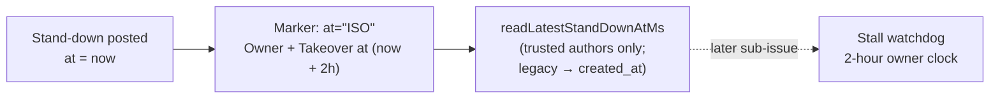

## Summary

Every conflict stand-down comment now names the pass that owns the conflict
and the UTC time at which the merge-conflict pass takes it back if the PR head
has not moved. The gated-head stand-down (owner `conflict takeover`), the
milestone-head stand-down (owner `milestone sync`) and the park comment (owner
`conflict takeover`) each carry an `**Owner:**` line and a
`**Takeover at <ISO-8601 UTC>**` line. That time is the stand-down time plus
`CONFLICT_OWNER_CHECK_HOURS` (2 h). Each stand-down marker now carries
`at="<ISO>"`, and a new pure reader, `readLatestStandDownAtMs`, reads the
newest trusted stand-down time back. Closes #2997.

## Spec

### Intent and Rationale

- GRQ-AutoTrader#1957 sat idle for 8 h 47 min because its stand-down named no next step. Each stand-down now names the owner and a deadline.
- One helper, `standDownNextStepLines` in `gated_head_guard.ts`, builds both lines for all three builders, so the wording and the arithmetic stay identical across them.

### Essential Design Decisions

- Once-per-branch dedup now matches the marker **prefix** (`<!-- vibe-gated-head branch="…"`). The full marker carries a timestamp that changes on every call, and the prefix still matches legacy markers that have no `at=`.
- The comment body is built **before** `recordStandDownOnce` and before the park's `try/catch`. A non-finite clock therefore throws to the caller instead of being logged as a warning, and nothing is posted.
- `readLatestStandDownAtMs` recognises all three stand-down markers: gated-head, milestone-head and park. It ignores a comment with no author or an untrusted one, because a forged stand-down would move the owner clock.
- `standDownAtAttribute` lives in the marker module (`merge_conflict_markers.ts`), so the `at=` grammar has one writer.

### Undiscoverable Facts

- Nothing in production calls `readLatestStandDownAtMs` yet. The stall-watchdog sub-issue of #2965 will use it to start its 2-hour clock.
- The park comment still says nothing is attempted until the base moves. The watchdog sub-issue will reconcile that wording with the takeover behaviour.

## Evidence

Backend-only change with no UI. It is covered by unit tests, and the full
`./quality.sh` gate passed (`Result: PASSED`; `config integration` was skipped
as usual).

**Docs sweep** — grep: `vibe-gated-head`, `vibe-milestone-head`,
`vibe-merge-conflict-parked`, `buildParkedPrComment`, "Parked on"; updated:
`docs/MERGE.md`, `docs/workflows/merge-conflicts.md`

## Acceptance Criteria

<!-- vibe-spec-review inputs="diff+issue-body" -->

- **met** — Every stand-down builder's output contains an owner line and a `Takeover at` line with a valid ISO-8601 UTC time; each builder has one test — evidence: `worker/deno/tests/gated_head_guard_test.ts::buildGatedHeadComment - names owner \`conflict takeover\` and the exact UTC takeover time`, `::buildMilestoneHeadComment - names owner \`milestone sync\` and the exact UTC takeover time`, `worker/deno/tests/pr_merge_conflict_scan_test.ts::buildParkedPrComment - names the owner and the UTC takeover time (Issue #2997)` — reviewer: met
- **met** — `readLatestStandDownAtMs` returns the newest trusted marker's `at=` value, falls back to `created_at` for a legacy marker, and ignores an untrusted marker — evidence: `worker/deno/tests/gated_head_guard_test.ts::readLatestStandDownAtMs - …` (newest `at=`, legacy fallback, untrusted ignored, parked recognised) — reviewer: met
- **met** — Passing `NaN` as the time makes the builder throw — evidence: `gated_head_guard_test.ts::buildGatedHeadComment - throws on a non-finite stand-down time`, `::buildMilestoneHeadComment - throws on a non-finite stand-down time`, `::standDownMilestoneHead - a non-finite nowMs rejects and posts nothing`, `pr_merge_conflict_scan_test.ts::buildParkedPrComment - throws on a non-finite stand-down time` — reviewer: met
- **met** — Tests and quality checks pass — evidence: `./quality.sh` run after the final edit returned `Result: PASSED (with skipped checks)` (deno tests, lint, type check, fmt, markdownlint and semgrep all PASSED) — reviewer: partial — reason: the reviewer saw only the diff and could not run the suite; the gate was run here and passed
- **unrequested** — docs updates to `docs/MERGE.md` and `docs/workflows/merge-conflicts.md` — reviewer: unrequested — reason: required by "A Code Change Owes a Docs Change", because the marker format and the comment content changed
- **unrequested** — `recordStandDownOnce` dedups on the marker prefix, via new `gatedHeadMarkerPrefix` / `milestoneHeadMarkerPrefix` — reviewer: unrequested — reason: necessary because `at=` varies per call; without it the comment would be posted every run
- **unrequested** — optional `nowMs` clock on `GatedHeadGuardOptions` / `MilestoneHeadStandDownOptions` — reviewer: unrequested — reason: the stand-down time must come from somewhere; injecting it makes the takeover time testable and lets a NaN clock be tested

## Standards Review

<!-- vibe-standards-review inputs="diff+CODING-STANDARDS.md" -->

- **violation** — speculative abstraction: `readLatestStandDownAtMs` has no production caller — evidence: `worker/deno/lib/gated_head_guard.ts:569` — reason: stands; the issue explicitly asks for this pure reader in this sub-issue, and the next sub-issue of #2965 (the stall watchdog) is its consumer
- **clean** — fail-loud on a non-finite time, tests call real functions, an injected clock instead of a global, docs kept in sync, Australian English, no hidden or secret files (optional nit noted: the two inline marker prefixes in `STAND_DOWN_MARKER_PREFIXES` could derive from the prefix helpers)

## Test Plan

- `worker/deno/tests/gated_head_guard_test.ts`: owner and takeover tests for both builders, NaN throws, an injected clock for `guardGatedHead` / `standDownMilestoneHead`, a NaN clock posts nothing, a legacy marker still suppresses a repeat, `takeoverAtMs`, and `readLatestStandDownAtMs` cases.
- `worker/deno/tests/pr_merge_conflict_scan_test.ts`: park comment owner/takeover line and NaN throw.
- `worker/deno/tests/merge_conflict_markers_test.ts`: `conflictParkedMarker` with and without `at=`, NaN throw, and `readParkedBase` still reads the base.
- `pr_ci_nudge_scan_test.ts` and `pr_merge_conflict_processor_test.ts`: assert on the marker prefix.

🤖 Generated with [Claude Code](https://claude.com/claude-code)
