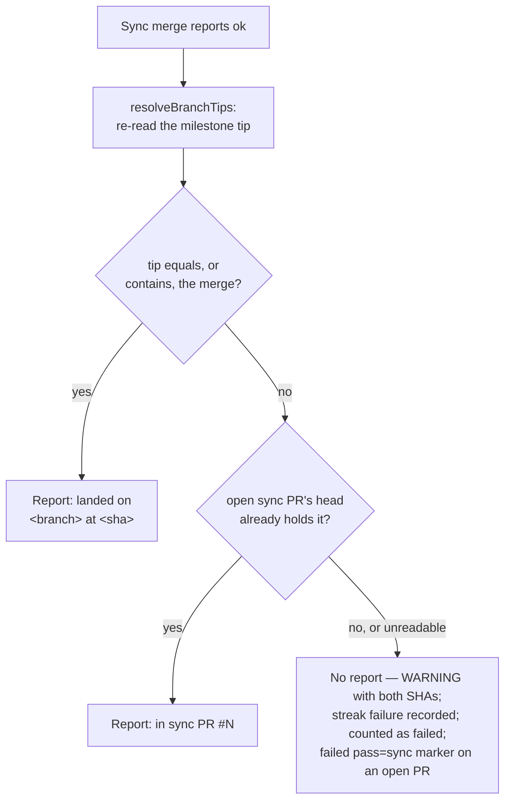

## Summary

Milestone sync now reports a conflict resolution only after it has confirmed
that the merge landed, and it charges each attempt to the milestone branch's
open PR budget. Closes #2998.

Before `escalateSyncConflict` posts anything, `confirmSyncLanding` (new,
`worker/deno/lib/milestone_sync_landing.ts`) re-reads the milestone tip with
`resolveBranchTips`. It accepts the landing only when the tip equals or
contains the merge commit, or an open sync PR's head holds it. Anything else
posts no report: a tip before the merge, no recorded merge SHA, or a tip that
could not be read. In that case the sync logs a `WARNING` naming the expected
merge SHA and the observed tip SHA, records a failure in
`milestone_sync_failures.json` through `recordSyncFailure`
(`milestone_sync_streak.ts`), and counts the branch as failed. The report now
says the merge `landed on <branch> at <sha>` or `is in sync PR #N`, never
"was pushed".

When the milestone branch heads an open PR, the sync reads its budget from
that PR's trusted markers and posts a `pass="sync"` attempt marker and its
conclusion there (`worker/deno/lib/milestone_sync_pr_budget.ts`). A confirmed
landing posts `resolved`; a charged failure or an unconfirmed landing posts
`failed`. The local ledger stays the fallback for a branch with no open PR
(#2919). Part of #2965.

## Spec

### Intent and Rationale

- GRQ-AutoTrader#1957 got a "pushed" report for a merge that never reached
  the milestone tip. A report now goes out only once the landing is confirmed.
- The shared per-PR budget from #2996 now covers the sync too, so a milestone
  branch and its rollup PR cannot each hold a separate budget.

### Essential Design Decisions

- The landing check fails closed. An unreadable tip, a failed compare, a
  non-array `gh pr list` payload (`parsePrListRows` now throws) or a missing
  merge SHA all return `unconfirmed`, never success.
- With no open PR, an unconfirmed landing concludes the local ledger attempt
  `not-charged`, because the merge itself may have succeeded. The failure
  streak is still incremented. With an open PR, the attempt is charged to the
  PR as `failed`, because every sync attempt spends the PR's tally.
- `syncResult` carries `mergeSha` (read from `HEAD` in `git_pull.ts` right
  after the push), which gives the check a concrete commit to look for.
- With a head PR, a spent PR budget skips the sync, and the PR tally (not the
  local ledger) decides the roll-back.

### Undiscoverable Facts

- The symptom was seen on GRQ-AutoTrader#1957. A repository rule can refuse
  a push that `pushSyncedMilestoneBranch` already reported as a success.

## Evidence

Backend-only change with no UI. `./quality.sh` passes (deno tests, lint, type
check, fmt, semgrep, markdownlint, mermaid, manifests).

**Docs sweep**: grepped for `escalateSyncConflict`, "was pushed", "pushed",
`milestone_sync_failures.json`, `pass="sync"`, "unconfirmed" and "post
nothing". Updated `docs/INTERNALS.md`, `docs/MERGE.md`,
`docs/workflows/merge-conflicts.md` and `docs/workflows/milestones.md`. The
two new lib modules are claimed in `docs/audits/lib-sweep-coverage.json`
(`top-up-2998`).

## Reproduction

- **symptom**: milestone sync posted a conflict report saying the merge
  "was pushed" although the merge never reached the milestone tip
  (GRQ-AutoTrader#1957).
- **status**: `partial`. reason: red was observed against the current lib
  with the landing check disabled (the base behaviour). The three
  unconfirmed-path tests failed, then passed once the check was restored. The
  open-PR unconfirmed case was also seen red before its fix and green after.
  A literal base-branch run fails to type-check (the tests import
  `milestone_sync_landing.ts`, which does not exist on the base) rather than
  failing on the assertion.
- **regression test**:
  `worker/deno/tests/milestone_sync_conflict_report_test.ts::milestone sync - a merge the tip does not contain posts no report, logs both SHAs and counts a failure (Issue #2998)`

## Acceptance Criteria

<!-- vibe-spec-review inputs="diff+issue-body" -->

- **met** — A test where the tip does not contain the merge posts no report, logs both SHAs and increments the failure streak — evidence: `worker/deno/tests/milestone_sync_conflict_report_test.ts::milestone sync - a merge the tip does not contain posts no report, logs both SHAs and counts a failure (Issue #2998)` — reviewer: met
- **met** — A test where the tip contains the merge posts `landed on <branch> at <sha>`; a test where the merge is in an open sync PR posts `in sync PR #N` — evidence: `worker/deno/tests/milestone_sync_conflict_report_test.ts::milestone sync - a merge on the tip reports it landed on the branch at its sha (Issue #2998)`, `::milestone sync - a merge the tip has moved ahead of still reports it landed on the branch (Issue #2998)`, `::milestone sync - a merge held by an open sync PR reports in sync PR #N (Issue #2998)` — reviewer: met
- **met** — A test where the tip read throws posts no report and records a failure — evidence: `worker/deno/tests/milestone_sync_conflict_report_test.ts::milestone sync - an unreadable tip posts no report and records a failure (Issue #2998)` — reviewer: met
- **met** — With an open PR on the milestone branch, a sync attempt adds a `pass="sync"` marker, and two prior failed markers on the PR cap sync at one more attempt — evidence: `worker/deno/tests/milestone_sync_pr_budget_test.ts::milestone sync - two prior failed markers on the PR allow exactly one more sync attempt (Issue #2998)`, `::milestone sync - an unconfirmed landing with an open PR is charged to that PR as a failed pass="sync" attempt (Issue #2998)` — reviewer: partial — reason: the reviewer found that an unconfirmed landing with an open PR posted no PR marker; fixed after review in `worker/deno/lib/milestone_branch_sync.ts` (unconfirmed branch now calls `recordSyncAttemptOnPr`), with the second test above seen red before the fix and green after
- **met** — The word "pushed" no longer appears in the sync conflict report builder — evidence: `worker/deno/lib/milestone_sync_conflict.ts` (`buildConflictEscalationComment` uses `describeSyncLanding`), `worker/deno/tests/milestone_sync_conflict_report_test.ts::milestone sync - a merge on the tip reports it landed on the branch at its sha (Issue #2998)` asserts no "pushed" — reviewer: met
- **met** — Tests and quality checks pass — evidence: `./quality.sh` run after the final edit, `Result: PASSED` — reviewer: missing — reason: the reviewer said "unverified", because it could not run commands; the gate was run here and passed
- **unrequested** — docs updates to `docs/INTERNALS.md`, `docs/MERGE.md`, `docs/workflows/merge-conflicts.md`, `docs/workflows/milestones.md` and the `top-up-2998` slice in `docs/audits/lib-sweep-coverage.json` — reviewer: unrequested — reason: "A Code Change Owes a Docs Change" and the lib-sweep manifest gate require them
- **unrequested** — the new modules `milestone_sync_landing.ts` and `milestone_sync_pr_budget.ts` rather than inline code in the three named files — reviewer: unrequested — reason: keeps the files small; all their behaviour maps to stated requirements
- **unrequested** — `parsePrListRows` throws on a non-array `gh pr list` payload — reviewer: unrequested — reason: Never Fail Silently; a misshapen listing must not read as "no PR", and both callers already warn and fail closed

## Standards Review

<!-- vibe-standards-review inputs="diff+CODING-STANDARDS.md" -->

- **violation** — PR Summary and Evidence: the summary named test and sweep-registration gaps that later commits had closed — evidence: `docs/archive/pr-summaries/pr-summary-2998.md` — reason: fixed here; this summary was rewritten from the head diff
- **clean** — fail-loud parsing in `parsePrListRows`, test fakes are in-process `GhCommandFn` stubs with no cross-repo binaries, every doc and anchor names a module or test that exists, Australian English, no hidden or credential files, no workflow files touched. optional: `SyncConflictReport.landing` is returned but read only by tests

## Test Plan

- Added landing tests to `worker/deno/tests/milestone_sync_conflict_report_test.ts`: tip not containing the merge, tip equals the merge, tip ahead of the merge, open sync PR, unreadable tip, and `escalateSyncConflict` confirming the landing itself.
- Added `worker/deno/tests/milestone_sync_pr_budget_test.ts`: a failed `pass="sync"` marker, a cap at one more attempt after two failures, a resolved marker on a confirmed landing, an unconfirmed landing charged to the PR, the ledger fallback with no PR, and untrusted markers that do not spend the budget.
- Updated fixtures for `landing`, `mergeSha` and the `SyncConflictReport` return type in `milestone_sync_conflict_test.ts`, `milestone_sync_conflict_escalation_test.ts`, `milestone_sync_success_notice_2214_test.ts`, `milestone_sync_escalation_author_2231_test.ts` and `milestone_sync_agent_judgement_test.ts`.

🤖 Generated with [Claude Code](https://claude.com/claude-code)
