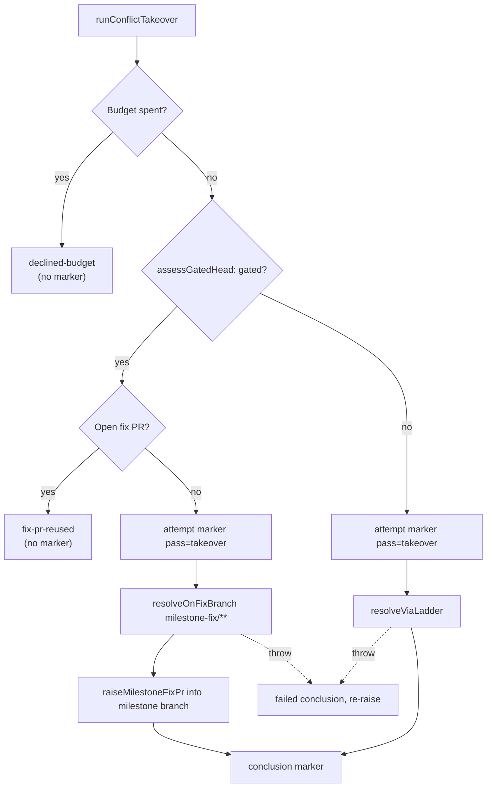

# PR Summary — Issue #2999

## Summary

Adds the conflict takeover pass, `runConflictTakeover(pr, deps)` in
`worker/deno/lib/conflict_takeover.ts`. It resolves a stalled conflicted PR
itself rather than waiting for another owner. On a ruleset-gated
`milestone/**` head it resolves on a `milestone-fix/**` branch and opens a PR
into the milestone branch, using the Issue #2907 helpers. On any other head it
uses the ordinary resolve path. Closes #2999.

## Spec

### Intent and Rationale

- #1957 stalled because every pass stood down on a gated milestone head and
  nothing took the conflict back. This pass is the rung that does.
- The gated route reuses `milestoneFixBranchFor`, `findOpenMilestoneFixPr` and
  `raiseMilestoneFixPr` instead of adding a second side-branch mechanism.

### Essential Design Decisions

- **Both resolvers are injected seams that post no markers.** The takeover
  owns the `pass="takeover"` attempt and conclusion pair. `processMergeConflict`
  already posts its own `pass="ladder"` attempt and conclusion markers, so
  binding it directly would charge two units of the shared budget for one
  takeover. The production bindings land with the stall-watchdog sub-issue that
  calls this pass.
- **Read-only checks run before the attempt marker.** These are the budget
  tally, `assessGatedHead` and `findOpenMilestoneFixPr`. A declined or reused
  run therefore leaves no marker that needs a conclusion. Every exit after the
  marker posts one: `resolved`, `failed`, or `failed` followed by re-raising a
  throw.
- **Label provenance (#2951).** `merge-conflict` is added only when it is
  absent. It is removed only when this call added it *and* the ordinary route
  resolved the conflict. On the gated route it stays until the fix PR lands.
- When the fix-PR listing cannot be read, or `trustedAuthors` is empty, the
  pass fails loudly before posting anything.

### Undiscoverable Facts

- The stall-watchdog sub-issue of #2965 calls this pass, so this PR adds no
  production caller yet (stated in the issue's Context).

## Evidence

Backend-only change, with no UI to screenshot. Verified by
`worker/deno/tests/conflict_takeover_test.ts`, which has 10 tests, all
passing. `./quality.sh` passes; the config integration check was skipped as on
every local run.

**Docs sweep**: searched for `takeover`, "Only the ladder writes attempt
markers" and `fetchPrLabels`. Updated `docs/workflows/merge-conflicts.md`, which
gets a corrected budget paragraph and a new takeover subsection. Registered
the module in `docs/audits/lib-sweep-coverage.json`.

## Acceptance Criteria

<!-- vibe-spec-review inputs="diff+issue-body" -->

- **met**: A test with a gated milestone head opens exactly one
  `milestone-fix/**` PR into the milestone branch and pushes nothing to the
  head branch. Evidence:
  `worker/deno/tests/conflict_takeover_test.ts::runConflictTakeover - gated milestone head raises a fix PR, never touches the head`.
  Reviewer: met.
- **met**: A test where an open fix PR already exists reuses it and opens no
  second PR. Evidence:
  `worker/deno/tests/conflict_takeover_test.ts::runConflictTakeover - an already-open fix PR is reused, nothing attempted`.
  Reviewer: met.
- **met**: A test with a non-gated head uses the ordinary resolve path.
  Evidence:
  `worker/deno/tests/conflict_takeover_test.ts::runConflictTakeover - non-gated head resolves via the ladder`.
  Reviewer: partial. Reason for departing from the reviewer: the criterion
  asks for a test on the routing, and that test exists. The reviewer's concern
  is that `resolveViaLadder` is a seam rather than a direct call to
  `processMergeConflict`. That is deliberate: the processor posts its own
  `pass="ladder"` attempt and conclusion markers, so calling it directly would
  charge the shared budget twice per takeover. The binding lands with the
  stall-watchdog sub-issue that calls this pass.
- **met**: With 3 failed markers on the PR, the takeover declines and posts no
  new attempt marker. Evidence:
  `worker/deno/tests/conflict_takeover_test.ts::runConflictTakeover - three trusted failed attempts decline the budget, posting nothing`.
  Reviewer: met.
- **met**: When the resolver throws, a failed conclusion marker is posted and
  the error propagates. Evidence:
  `worker/deno/tests/conflict_takeover_test.ts::runConflictTakeover - resolver throwing propagates, failed conclusion posted after the attempt marker`.
  Reviewer: met.
- **met**: A label this pass did not apply is left in place. Evidence:
  `worker/deno/tests/conflict_takeover_test.ts::runConflictTakeover - label already present before is never removed after a resolve`.
  Reviewer: met.
- **met**: Tests and quality checks pass. Evidence: `./quality.sh` was run
  after the final code change and returned `Result: PASSED (with skipped
  checks)`. Reviewer: missing. Reason: the reviewer had no shell and could not
  run the gate; it was run here and passed.

## Standards Review

<!-- vibe-standards-review inputs="diff+CODING-STANDARDS.md" -->

- **clean**: The reviewer checked these areas and found them compliant:
  - Fail-loud handling: the failed conclusion is posted before the error is
    re-raised.
  - Label provenance (#2951), tested both when the label was already present
    and when it was absent.
  - The shared-budget tally is read from trusted markers before anything is
    posted.
  - The tests call the real function against a fake `gh`.
  - Australian English is used throughout.
  - The docs were updated in the same change.
  - The `Result` values from `findOpenMilestoneFixPr` and
    `raiseMilestoneFixPr` are unwrapped and re-thrown.
  - Optional only: the nested try/catch could be factored out, and the
    `fetchPrLabels` export widens that function's surface.

## Test Plan

- New `worker/deno/tests/conflict_takeover_test.ts` (10 tests) covers:
  - raising a fix PR on a gated head;
  - reusing an open fix PR;
  - the ordinary route;
  - declining on a trusted spent budget, and not declining on untrusted
    markers;
  - the resolver throwing;
  - the resolver failing to resolve;
  - label provenance both ways;
  - an empty `trustedAuthors`.
- Re-ran `tests/pr_merge_conflict_scan_test.ts` (after the `fetchPrLabels`
  export), `tests/milestone_fix_pr_test.ts` and
  `tests/lib_sweep_coverage_test.ts`. All pass.
- `./quality.sh < /dev/null` passes.

🤖 Generated with [Claude Code](https://claude.com/claude-code)
