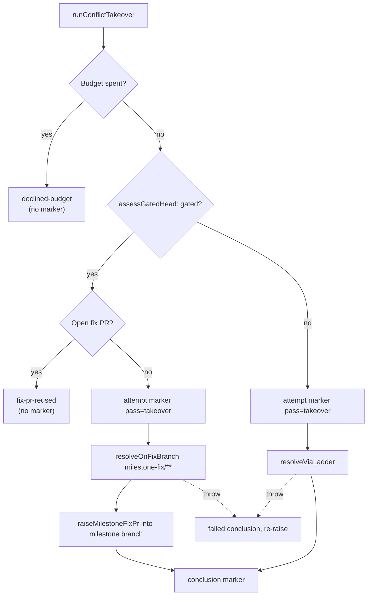

# PR Summary — Issue #2999

## Summary

Adds the conflict takeover pass, `runConflictTakeover(pr, deps)` in
`worker/deno/lib/conflict_takeover.ts`. It resolves a stalled conflicted PR
itself rather than waiting for another owner. On a ruleset-gated
`milestone/**` head it resolves on a `milestone-fix/**` branch and opens a PR
into the milestone branch, using the Issue #2907 helpers. On any other head it
uses the ordinary resolve path. Closes #2999.

## Spec

### Intent and Rationale

- #1957 stalled because every pass stood down on a gated milestone head and
  nothing took the conflict back. This pass is the rung that does.
- The gated route reuses `milestoneFixBranchFor`, `findOpenMilestoneFixPr` and
  `raiseMilestoneFixPr` instead of adding a second side-branch mechanism.

### Essential Design Decisions

- **Both resolvers are injected seams that post no markers.** The takeover
  owns the `pass="takeover"` attempt and conclusion pair. `processMergeConflict`
  already posts its own `pass="ladder"` attempt and conclusion markers, so
  binding it directly would charge two units of the shared budget for one
  takeover. The production bindings land with the stall-watchdog sub-issue that
  calls this pass.
- **Read-only checks run before the attempt marker.** These are the budget
  tally, `assessGatedHead` and `findOpenMilestoneFixPr`. A declined or reused
  run therefore leaves no marker that needs a conclusion. Every exit after the
  marker posts one: `resolved`, `failed`, or `failed` followed by re-raising a
  throw.
- **Label provenance (#2951).** `merge-conflict` is added only when it is
  absent. It is removed only when this call added it *and* the ordinary route
  resolved the conflict. On the gated route it stays until the fix PR lands.
- When the fix-PR listing cannot be read, or `trustedAuthors` is empty, the
  pass fails loudly before posting anything.

### Undiscoverable Facts

- The stall-watchdog sub-issue of #2965 calls this pass, so this PR adds no
  production caller yet (stated in the issue's Context).

## Evidence

Backend-only change, with no UI to screenshot. Verified by
`worker/deno/tests/conflict_takeover_test.ts`, which has 10 tests, all
passing. `./quality.sh` passes; the config integration check was skipped as on
every local run.

**Docs sweep**: searched for `takeover`, "Only the ladder writes attempt
markers" and `fetchPrLabels`. Updated `docs/workflows/merge-conflicts.md`, which
gets a corrected budget paragraph and a new takeover subsection. Registered
the module in `docs/audits/lib-sweep-coverage.json`.

## Acceptance Criteria

<!-- vibe-spec-review inputs="diff+issue-body" -->

- **met** — A test with a gated milestone head opens exactly one `milestone-fix/**` PR into the milestone branch and pushes nothing to the head branch — evidence: `worker/deno/tests/conflict_takeover_test.ts::runConflictTakeover - gated milestone head raises a fix PR, never touches the head` — reviewer: met — reason: exactly one `pr create` with `--base` the milestone branch and a `milestone-fix/` head; the "no push to head" guarantee rests on the `resolveOnFixBranch` contract rather than that test's gh-call filter
- **met** — A test where an open fix PR already exists reuses it and opens no second PR — evidence: `worker/deno/tests/conflict_takeover_test.ts::runConflictTakeover - an already-open fix PR is reused, nothing attempted` — reviewer: met
- **partial** — A test with a non-gated head uses the ordinary resolve path — evidence: `worker/deno/tests/conflict_takeover_test.ts::runConflictTakeover - non-gated head resolves via the ladder` — reviewer: partial — reason: the test proves routing to the injected `resolveViaLadder` seam, but nothing binds that seam (or `resolveOnFixBranch`) to production code yet; a direct `processMergeConflict` call would post its own `pass="ladder"` markers and charge the shared budget twice, so the binding is left to the stall-watchdog sub-issue that calls this pass
- **met** — With 3 failed markers on the PR, the takeover declines and posts no new attempt marker — evidence: `worker/deno/tests/conflict_takeover_test.ts::runConflictTakeover - three trusted failed attempts decline the budget, posting nothing` — reviewer: met
- **met** — When the resolver throws, a failed conclusion marker is posted and the error propagates — evidence: `worker/deno/tests/conflict_takeover_test.ts::runConflictTakeover - resolver throwing propagates, failed conclusion posted after the attempt marker` — reviewer: met — reason: only the ordinary route's throw is tested; the gated route shares the same catch block
- **met** — A label this pass did not apply is left in place — evidence: `worker/deno/tests/conflict_takeover_test.ts::runConflictTakeover - label already present before is never removed after a resolve` — reviewer: met
- **met** — Tests and quality checks pass — evidence: `worker/deno/tests/conflict_takeover_test.ts` (10 passed) and `./quality.sh` returning `Result: PASSED (with skipped checks)` — reviewer: partial — reason: departing from the reviewer, who ran nothing and marked it "partial (cannot verify)"; the test file and `./quality.sh` were run locally on this branch and pass
- **unrequested** — `fetchPrLabels` exported from `worker/deno/lib/pr_merge_conflict_scan.ts` — reviewer: unrequested — reason: the takeover reads the PR's labels to track label provenance (#2951) and reuses this reader rather than duplicating it
- **unrequested** — The pass adds the `merge-conflict` label itself when absent — reviewer: unrequested — reason: adding it is what lets the pass prove it applied the label, so it may remove only what it added (#2951)
- **unrequested** — Input validation: an empty `trustedAuthors` or unusable head SHA throws before anything is posted — reviewer: unrequested — reason: fail-loud guard so the trusted-marker budget tally can never be read with no trusted authors
- **unrequested** — `docs/workflows/merge-conflicts.md` takeover section and `docs/audits/lib-sweep-coverage.json` registration — reviewer: unrequested — reason: the docs-change and lib-sweep-coverage rules require both for a new lib module
- **unrequested** — Test that three failed markers from an untrusted login do not decline — reviewer: unrequested — reason: guards the "trusted marker" rule the issue relies on

## Standards Review

<!-- vibe-standards-review inputs="diff+CODING-STANDARDS.md" -->

- **violation** — Secret redaction on every outbound sink — evidence: `worker/deno/lib/conflict_takeover.ts:329` (also `:165`, `:178`, `:185`) — reason: stands in this PR; the conclusion comments carry error and resolver `detail` text without an explicit `redactSecrets()` pass in this module, and this run is limited to the summary, so it is raised as a follow-up rather than fixed here
- **violation** — Fake the external service, do not assert the request — evidence: `worker/deno/tests/conflict_takeover_test.ts:209` (also `:147`, `:211`) — reason: stands; the gated-route test asserts the `--base`/`--head` it built and the fake `gh` returns `""` for unrecognised calls, left for follow-up
- **violation** — Test coverage of error paths (borderline) — evidence: `worker/deno/lib/conflict_takeover.ts:265` — reason: stands; an unreadable fix-PR listing, `raiseMilestoneFixPr` returning `!ok`, a gated resolver reporting unresolved and a failing failed-conclusion post are untested, left for follow-up
- **clean** — fail-loud handling (failed conclusion posted before re-raise; empty `trustedAuthors` and bad head SHA throw), label provenance (#2951) tested both ways, log levels, `Result` unwrapping, Australian English, tests calling real code with no greps or sleeps, docs updated in the same change, PR summary structure; optional only: the "never touches the head" filter cannot fail, the catch block's failed body repeats `buildFailedComment`, `as unknown as Logger` in the test, `new Date()` in the test fake, and the resolver seams have only test implementations so far

## Test Plan

- New `worker/deno/tests/conflict_takeover_test.ts` (10 tests) covers:
  - raising a fix PR on a gated head;
  - reusing an open fix PR;
  - the ordinary route;
  - declining on a trusted spent budget, and not declining on untrusted
    markers;
  - the resolver throwing;
  - the resolver failing to resolve;
  - label provenance both ways;
  - an empty `trustedAuthors`.
- Re-ran `tests/pr_merge_conflict_scan_test.ts` (after the `fetchPrLabels`
  export), `tests/milestone_fix_pr_test.ts` and
  `tests/lib_sweep_coverage_test.ts`. All pass.
- `./quality.sh < /dev/null` passes.

🤖 Generated with [Claude Code](https://claude.com/claude-code)
