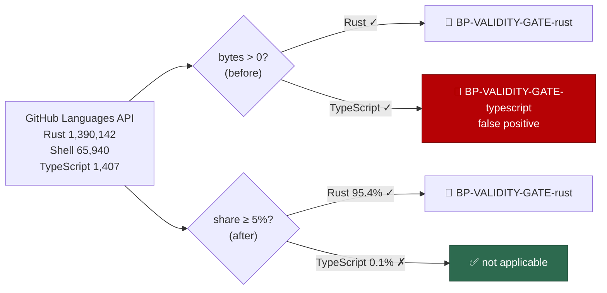

# PR Summary — Issue #3

## Summary

The bash-syntax audit's language-validity detector demanded a CI type-check gate
for a language a repository barely contains. `detectValidityGateLanguages()`
treated **any** non-zero byte count from the GitHub Languages API as a *main*
language, so `stSoftwareAU/NEAT-AI-Lamarck` — a Rust repo whose only TypeScript
is one fixture-generation script — was filed a `severity:high`
`BP-VALIDITY-GATE-typescript` issue
([NEAT-AI-Lamarck#167](https://github.com/stSoftwareAU/NEAT-AI-Lamarck/issues/167))
asking for a `deno check` gate over 1,407 of 1,457,489 bytes (0.1% of the repo).

A language is now *main* only when it holds at least `MAIN_LANGUAGE_MIN_SHARE`
(5%) of the repo's measured bytes. Genuine polyglot repos stay in scope;
incidental helper scripts no longer trigger a gate for something that does not
exist. Closes #3.



## Evidence

Backend/CLI change with no web interface, so no screenshot applies. The
behaviour is verified by unit tests that call the real detector with the
offending repo's actual byte counts:

```text
detectValidityGateLanguages — incidental TypeScript in a Rust repo is not a main language ... ok
detectValidityGateLanguages — language exactly on the share threshold is a main language ... ok
detectValidityGateLanguages — language just under the share threshold is ignored ... ok
detectValidityGateLanguages — incidental TypeScript with React markers is still ignored ... ok
detectValidityGateLanguages — repo with no measured bytes yields no languages ... ok
Rust repo with an incidental .ts script yields no TypeScript finding ... ok

ok | 24 passed | 0 failed (16ms)
```

`./quality.sh` reports every check PASSED except `deno tests`, which fails on 7
assertions in `fleet_health_test.ts`, `optional_feature_env_test.ts` and
`setup_workdir_reminder_test.ts`. Those failures are **pre-existing on the
branch base** — confirmed by re-running the same three files with this change
stashed (`FAILED | 49 passed | 7 failed`, the identical seven). They are
unrelated to the language-validity detector and out of scope for this issue.

The false-positive issue NEAT-AI-Lamarck#167 is still open. Closing it from this
run was refused by the write-repo allowlist
(`[WRITE_REPO_BLOCKED] … not on run allowlist [stsoftwareau/vibecoder]`), and
the audit only files findings — it never closes them — so #167 needs closing by
hand or from a run whose allowlist covers that repo.

## Test Plan

Added to `worker/deno/tests/language_validity_gate_test.ts`:

- `detectValidityGateLanguages — incidental TypeScript in a Rust repo is not a
  main language` — regression test using NEAT-AI-Lamarck's real byte counts;
  fails against the unfixed code (returns `["rust", "typescript"]`).
- `detectValidityGateLanguages — language exactly on the share threshold is a
  main language` — boundary: 5% counts.
- `detectValidityGateLanguages — language just under the share threshold is
  ignored` — boundary: one byte under 5% does not.
- `detectValidityGateLanguages — incidental TypeScript with React markers is
  still ignored` — the React branch honours the threshold too.
- `detectValidityGateLanguages — repo with no measured bytes yields no
  languages` — edge case: empty and all-zero byte maps.
- `Rust repo with an incidental .ts script yields no TypeScript finding` —
  end-to-end through `checkLanguageValidityGates()` against a temp repo.

All pre-existing tests in that file are unchanged and still pass.
