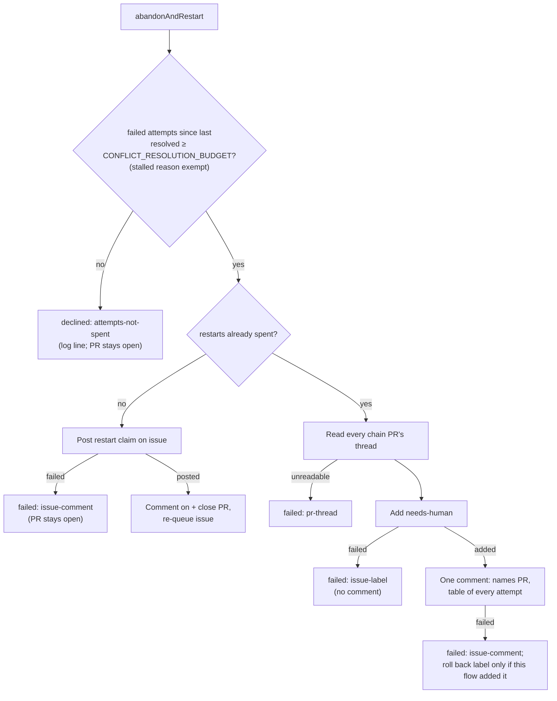

## Summary

Abandon-and-redo now runs only after the shared conflict budget is spent.
`abandonAndRestart` declines as `attempts-not-spent`, with an INFO log line,
while `readResolutionAttempts` (#2996) shows fewer than
`CONFLICT_RESOLUTION_BUDGET` (3) failed attempts on the PR since its last
resolved marker. Nothing is closed or posted. When restarts are spent, the
hand-off to a human now lists every attempt across the whole restart chain in
a table (PR, attempt, pass, UTC time, outcome), and applies `needs-human` and
that one comment together, exactly once. Closes #3000.

## Spec

### Intent and Rationale

- GRQ-AutoTrader#1957 reached abandon-and-redo without a fair run of
  resolution attempts. The guard runs first in `abandonAndRestart`
  (precondition 0) and counts the same PR-side tally that
  `spentConflictAttempts` uses, so abandon never runs ahead of the budget.
- The restart claim is posted on the originating issue before the PR is
  closed, and a failed post stops the abandon at `issue-comment` with the PR
  still open. That order already existed before this branch; this branch adds
  a test pinning the call order.
- `handOffSpentRestarts` no longer goes through `escalateToHuman`. The
  chokepoint's steps are independently best-effort. This flow needs the label
  and the comment to land together, so it runs an explicit sequence instead:
  build the chain, add the label, post the comment, and roll the label back
  only when this flow added it (#2951).

### Essential Design Decisions

- The guard lives in `worker/deno/lib/conflict_abandon_restart.ts`, where
  `abandonAndRestart` and its builders already were, rather than in
  `pr_merge_conflict_scan.ts` as the issue named.
- `spentConflictAttempts` moved to `merge_conflict_markers.ts` so the abandon
  module can use it without an import cycle. It is re-exported from
  `pr_merge_conflict_scan.ts`, so existing imports are unchanged.
- A `stalled` reason (stall-repair second trip, #2802) is exempt from the
  guard: it is not a conflict-resolution outcome and has its own two-trip
  bound.
- The PR thread is now read once at the top of `abandonAndRestart` and reused,
  not re-fetched later.
- Idempotency checks only for the fleet's own hand-off comment. If a human
  removed `needs-human` afterwards, it is not re-added.

### Undiscoverable Facts

- `summariseFailedAttempts` gained `resolutionAttempts` and a `trustedAuthors`
  parameter, but still parses its older `attempts` field the old way. The
  table is built from `readResolutionAttempts`.
- The guard sits before the originating-issue lookup. A PR with fewer than 3
  failures whose issue has spent its restarts therefore declines rather than
  being handed off. No test covers this case.
- If the hand-off comment fails and the label rollback also fails, the label
  stays on with no comment. That case is reported in the error and logged at
  ERROR, but has no test.

## Evidence

This is a backend-only change with no UI, and it is covered by unit tests in
`worker/deno/tests/conflict_abandon_restart_test.ts`. **The quality gate does
not pass on this branch as it stands.** Running `deno fmt --check` and
`deno lint` here (see the Standards Review below) shows that test file is
unformatted and has an unused import.

**Docs sweep**: searched for `abandonAndRestart`, `attempts-not-spent`,
`escalateToHuman`, `needs-human` and "restarts spent"; updated
`docs/workflows/merge-conflicts.md`.

## Acceptance Criteria

<!-- vibe-spec-review inputs="diff+issue-body" -->

- **met** — With 2 failed attempts, `abandonAndRestart` declines and the PR stays open — evidence: `worker/deno/tests/conflict_abandon_restart_test.ts::abandonAndRestart - two failed attempts of three declines, not abandons`, `::abandonAndRestart - a resolved marker resets the tally, so two failures after it decline` — reviewer: met
- **met** — With 3 failed attempts, the issue comment is posted before the PR close call, as the test's call order shows — evidence: `worker/deno/tests/conflict_abandon_restart_test.ts::abandonAndRestart - a full budget claims the restart before closing the PR` — reviewer: met
- **met** — A failed issue-comment post leaves the PR open and fails loud — evidence: `worker/deno/tests/conflict_abandon_restart_test.ts::abandonAndRestart - a failed issue-comment post with a full budget does not close the PR` — reviewer: met
- **met** — The restarts-spent hand-off names the PR and lists every attempt across the restart chain, with its pass, UTC time and outcome — evidence: `worker/deno/tests/conflict_abandon_restart_test.ts::abandonAndRestart - a spent restart budget adds needs-human and one comment to the issue`, `::renderAttemptTable - rows, unknown time, and a zero-attempt PR`, `::abandonAndRestart - a chain PR whose thread cannot be read fails pr-thread, before any label or comment` — reviewer: met
- **met** — `needs-human` and the hand-off comment are applied together exactly once — evidence: `worker/deno/tests/conflict_abandon_restart_test.ts::abandonAndRestart - needs-human and the hand-off comment are applied together, exactly once`, `::abandonAndRestart - a failed label add posts no comment, outcome failed issue-label`, `::abandonAndRestart - a comment that fails after this flow added the label rolls the label back`, `::abandonAndRestart - a human-applied needs-human is not rolled back when the comment fails` — reviewer: met
- **missing** — Tests and quality checks pass — reviewer: missing — reason: `deno fmt --check` fails on `worker/deno/tests/conflict_abandon_restart_test.ts` (over-long lines) and `deno lint` reports `no-unused-vars` for `buildRestartsSpentHandOff` at line 36; the test suite itself was not run in this review
- **unrequested** — the restarts-spent hand-off bypasses `escalateToHuman` (explicit `ensureLabelExists`, `addLabelToIssue`, `gh issue comment`, `--remove-label` sequence) — reviewer: unrequested — reason: the chokepoint's best-effort steps cannot guarantee "together, exactly once"; note that this moves `needs-human` off the #2689 single chokepoint without updating `needs_human_direct_label_check.ts`
- **unrequested** — a `stalled` reason is exempt from the budget guard — reviewer: unrequested — reason: a stall-repair trip is not a conflict-resolution outcome and has its own two-trip bound (#2802); covered by `::abandonAndRestart - a stalled request with no failures is not declined by the budget guard`
- **unrequested** — the restart-claim comment (`buildRestartIssueComment`) also carries this PR's attempt table — reviewer: unrequested — reason: makes the re-queued issue's history readable without reopening the closed PR
- **unrequested** — `spentConflictAttempts` moved to `merge_conflict_markers.ts` and re-exported — reviewer: unrequested — reason: avoids an import cycle between the abandon module and the scan
- **unrequested** — existing tests changed: `failedComments` defaults to 3 failures, the budget-based count assertions changed, the forgery test adds trusted failures, and the "comment failed after the label is retried" test was replaced — reviewer: unrequested — reason: these follow from the new guard and the exactly-once hand-off
- **unrequested** — docs update to `docs/workflows/merge-conflicts.md` (new precondition, decline, table, label-then-comment order, flowchart) — reviewer: unrequested — reason: required by "A Code Change Owes a Docs Change"

## Standards Review

<!-- vibe-standards-review inputs="diff+CODING-STANDARDS.md" -->

- **violation** — Quality Gates: `deno lint` fails (`no-unused-vars`, unused `buildRestartsSpentHandOff` import) — evidence: `worker/deno/tests/conflict_abandon_restart_test.ts:36` — reason: stands; this run was limited to the PR summary and did not change code
- **violation** — Quality Gates: `deno fmt --check` fails (unwrapped `renderAttemptTable` fixture rows and `conflictFailedMarker(...)` calls) — evidence: `worker/deno/tests/conflict_abandon_restart_test.ts` — reason: stands; this run was limited to the PR summary and did not change code
- **violation** — A Code Change Owes a Docs Change: the doc comment above `handOffSpentRestarts` still describes the old label-and-comment dedup and label-only retry — evidence: `worker/deno/lib/conflict_abandon_restart.ts:1439` — reason: stands; contradicts the new comment-only idempotency and the operator manual
- **violation** — DRY (minor): the steps fetch thread → `partitionConflictComments(...).trusted` → `readResolutionAttempts` with an `isFleetAuthor` closure are repeated, and `readResolutionAttempts` runs twice over the same thread — evidence: `worker/deno/lib/conflict_abandon_restart.ts` — reason: stands; low severity
- **clean** — Australian English, scope maps to the issue, fail-loud outcomes and log levels, removing only labels this flow can prove it applied (#2951), tests calling real functions with a fake `gh`, the operator manual kept in sync, Deno/TypeScript conventions (`deno check` passes), no hidden or secret files

## Test Plan

- `worker/deno/tests/conflict_abandon_restart_test.ts`:
  - budget guard: declines at 2, a resolved marker resets the tally, stalled is exempt
  - claim-before-close order, and a failed claim leaves the PR open
  - `renderAttemptTable` rows
  - `attempts-not-spent` route detail
  - restarts-spent hand-off: chain table, exactly once, label-add failure, rollback only when this flow added the label, unreadable chain thread
- `worker/deno/tests/pr_merge_conflict_scan_test.ts` and related tests: `summariseFailedAttempts` callers pass `trustedAuthors`.

🤖 Generated with [Claude Code](https://claude.com/claude-code)
