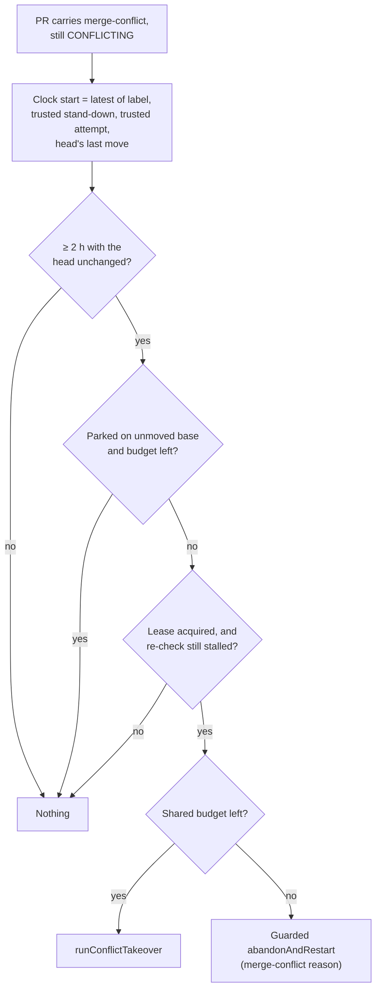

## Summary

The merge-conflict stall watchdog is now the single owner check for every
conflicted PR. The 8-hour threshold (`DEFAULT_CONFLICT_STALL_THRESHOLD_HOURS`)
and the two-trip design are gone. The clock starts at the latest of four
events:

- the `merge-conflict` label being applied;
- the latest trusted stand-down (`readLatestStandDownAtMs`, #2997);
- the last trusted resolution attempt (`readResolutionAttempts`, #2996);
- the head commit's last move (`headChangedAtMs`).

The PR trips once `CONFLICT_OWNER_CHECK_HOURS` (2 hours) have passed since
that event with the head unchanged. A trip fixes the PR forward:

- while the shared budget remains, it runs `runConflictTakeover` (#2999);
- once the budget is spent, it calls the guarded `abandonAndRestart` (#3000)
  with the ordinary merge-conflict reason.

A parked PR with the budget spent still trips. The maintenance lease is kept,
and the watchdog never applies `needs-human`. Closes #3001.

## Spec

### Intent and Rationale

- An 8-hour, label-age-only watchdog left conflicted PRs idle for hours after
  a stand-down or a failed attempt. Keying on "head unchanged since the latest
  owner event" makes the watchdog the one place that guarantees a conflicted
  PR moves within 2 hours.
- Fixing forward replaces the old two trips (rerun the ladder, then abandon
  with a `stalled` reason). The takeover posts its own `pass="takeover"`
  attempt marker, and that marker restarts the clock.

### Essential Design Decisions

- `conflictStallClockStart` computes the clock start, and both
  `detectConflictQueueStall` and the re-check under the lease use it.
- The head-change time is the head commit's committer date, read once per
  labelled PR (`gh api repos/{repo}/commits/{sha}`). A future-dated or
  unreadable date is ignored, so the watchdog errs towards acting.
- Under the lease, the repair re-reads the live head and the PR thread. It
  stands down if the head has moved or another host's attempt has landed.
  This replaces the removed `vibe-conflict-stall-repair` trip marker.
- `#2999` never bound the takeover's two resolvers in production. The new
  `worker/deno/lib/conflict_takeover_resolvers.ts` binds them, and
  `run_core_production_deps.ts` passes them in through `setupRepo`. A trip
  with budget left and no resolvers injected fails loudly.

### Undiscoverable Facts

- `resolveViaLadder` is a mechanical merge only, marked `SIMPLE-ON-PURPOSE`.
  A genuine conflict comes back unresolved, and the takeover records that as
  a failed attempt.
- The `stalled` abandon reason is now used only by the blocking-PR stall
  repair (`stall_repair.ts`, #2802).

## Evidence

This is a backend-only change with no UI. It is covered by unit tests in
`worker/deno/tests/merge_conflict_stall_watchdog_test.ts` and
`worker/deno/tests/conflict_takeover_resolvers_test.ts`, with 49 passed and 0
failed in the reviewers' runs. `deno lint`, `deno check` and `deno fmt --check`
are clean on the changed `.ts` files. **`deno task check:manifests` fails**: the
new lib module is not yet claimed by a sweep slice (see the Standards Review
below).

**Docs sweep**: searched for `DEFAULT_CONFLICT_STALL_THRESHOLD_HOURS`,
`8-hour`, `CONFLICT_STALL_REPAIR_MARKER` and `stalled`; updated
`docs/workflows/merge-conflicts.md`. One stale file-map entry remains (see
the Standards Review below).

## Acceptance Criteria

<!-- vibe-spec-review inputs="diff+issue-body" -->

- **met** — `grep -rn DEFAULT_CONFLICT_STALL_THRESHOLD_HOURS worker/` returns nothing — evidence: grep run by the reviewer, no output; the constant's declaration is removed in `worker/deno/lib/merge_conflict_stall_watchdog.ts` — reviewer: met
- **met** — A PR whose head is unchanged for 1 h 59 m after a stand-down does not trip; at 2 h it trips and runs the takeover — evidence: `worker/deno/tests/merge_conflict_stall_watchdog_test.ts::detectConflictQueueStall - head unchanged 1h59m after a trusted stand-down is not a stall; at 2h it is`, `::repairConflictQueueStall - budget remains: takeover is called once, abandon is not`, `::scanConflictQueueStalls - reads headRefOid from the listing and the commit date, trips on takeover` — reviewer: met
- **met** — A head SHA change resets the clock — evidence: `worker/deno/tests/merge_conflict_stall_watchdog_test.ts::detectConflictQueueStall - a head change after a stand-down resets the clock`, `::conflictStallClockStart - the latest of label, stand-down, attempt and head-change wins`, `::repairConflictQueueStall - under-lease re-check: a different live head means no-longer-stalled` — reviewer: met
- **met** — A trip with the budget spent calls the guarded abandon and does not call the takeover; a parked PR with the budget spent still trips — evidence: `worker/deno/tests/merge_conflict_stall_watchdog_test.ts::repairConflictQueueStall - budget spent: abandon is called with reason merge-conflict, takeover is not`, `::detectConflictQueueStall - a parked PR with the budget spent still trips`, `::repairConflictQueueStall - a parked PR with budget spent reaches abandon end-to-end through the scan` — reviewer: met
- **met** — No watchdog code path adds `needs-human` — evidence: `worker/deno/tests/merge_conflict_stall_watchdog_test.ts::scanConflictQueueStalls - files no issue and never names needs-human on either repair path` (plus `assertNoNeedsHuman` in both repair-path tests) — reviewer: met
- **met** — The lease prevents a second concurrent trip — evidence: `worker/deno/tests/merge_conflict_stall_watchdog_test.ts::repairConflictQueueStall - a held maintenance lease defers the repair`, `::repairConflictQueueStall - under-lease re-check: a newer trusted attempt marker means no-longer-stalled` — reviewer: met
- **partial** — Tests and quality checks pass — evidence: both test files 49 passed / 0 failed; `deno lint`, `deno check` and `deno fmt --check` clean on the changed `.ts` files — reviewer: partial — reason: `deno task check:manifests` fails (`lib_sweep_coverage_test.ts`: `worker/deno/lib/conflict_takeover_resolvers.ts` is claimed by no sweep slice), and `deno fmt --check` fails on `docs/workflows/merge-conflicts.md`, as it already did on the base branch
- **unrequested** — new `worker/deno/lib/conflict_takeover_resolvers.ts` (`bindConflictTakeoverResolvers`) and its tests in `worker/deno/tests/conflict_takeover_resolvers_test.ts` — reviewer: unrequested — reason: #2999 never bound the takeover's resolvers in production, so the takeover could not run outside tests; this adds new git-pushing behaviour the issue did not scope
- **unrequested** — `worker/deno/lib/run_core_production_deps.ts` passes `takeoverResolvers` (a `setupRepo`-based checkout) to `scanConflictQueueStalls` and rewrites the watchdog comment — reviewer: unrequested — reason: production wiring for the resolvers; without it every stall with budget left would end as `failed`
- **unrequested** — removed the old two-trip, `rung="abandon"`-clearing and `stalled`-reason code and its tests (`CONFLICT_STALL_REPAIR_MARKER`, `buildConflictStallComment`, `buildConflictStallReason`, `buildConflictStallDetail`); added stall-record fields (`clockStart`, `attemptsSpent`, `budgetSpent`, `standDownAtMs`, `lastAttemptAtMs`) — reviewer: unrequested — reason: these follow from replacing the 8-hour two-trip design with fixing forward
- **unrequested** — doc edits beyond L55 and the stall Mermaid: the `runConflictTakeover` paragraph, the `stalled` exemption paragraph, the abandon flowchart's top node, the park paragraph, the "Six details" list and the "reading the queue" bullet in `docs/workflows/merge-conflicts.md` — reviewer: unrequested — reason: these keep the operator manual consistent with the new behaviour

## Standards Review

<!-- vibe-standards-review inputs="diff+CODING-STANDARDS.md" -->

- **violation** — Quality Gates: `deno task check:manifests` fails because the new module is not claimed by any sweep slice — evidence: `docs/audits/lib-sweep-coverage.json:197` (lists `conflict_takeover.ts`, not `conflict_takeover_resolvers.ts`) — reason: stands; this run was limited to the PR summary and did not change code
- **violation** — A Code Change Owes a Docs Change: the file-map entry still describes "the 8-hour watchdog … It reruns the ladder once, then abandons"; L584 and L618 still call the watchdog "the backstop" — evidence: `docs/workflows/merge-conflicts.md:1413` — reason: stands; this run was limited to the PR summary and did not change code
- **violation** — A Code Change Owes a Docs Change: the docs say the takeover always posts an attempt marker that restarts the clock, but the `fix-pr-reused` outcome posts nothing, so a gated head with an open fix PR would trip again on the next cycle — evidence: `docs/workflows/merge-conflicts.md:913` against `worker/deno/lib/conflict_takeover.ts:266` — reason: stands; this run was limited to the PR summary and did not change code
- **violation** — Fail loud / log levels: every takeover outcome except `declined-budget`, including `kind: "failed"`, is logged at INFO as "took the conflict over" and returned as `taken-over` — evidence: `worker/deno/lib/merge_conflict_stall_watchdog.ts:634` — reason: stands; the failure is visible only in the structured `outcome` field
- **violation** — KISS `SIMPLE-ON-PURPOSE` convention (one comment line): the marker spans five lines, so a grep truncates the `upgrade when` condition — evidence: `worker/deno/lib/conflict_takeover_resolvers.ts:173` — reason: stands; low severity
- **clean** — Australian English; the `needs-human` single chokepoint (read only, never added); tests call real code (the resolver tests use real temporary git repos); fail loud on missing resolvers, unreadable commit dates and a failed `merge --abort`; git-ref safety (`assertSafeGitRef`, `--end-of-options`); DRY (one shared `conflictStallClockStart`); Deno/TypeScript conventions; no hidden files or secrets

## Test Plan

- `worker/deno/tests/merge_conflict_stall_watchdog_test.ts`:
  - 2-hour boundary after a stand-down, head-change reset, latest-of-four
    clock, future and unreadable head dates, untrusted markers ignored
  - park suppression only while budget remains; a parked PR with the budget
    spent trips end to end
  - takeover while budget remains, guarded abandon once it is spent, missing
    resolvers fail loudly, declined and failed outcomes reported
  - lease held defers the repair; the re-check under the lease stands down
  - no issue filed and no `needs-human` on either path
- `worker/deno/tests/conflict_takeover_resolvers_test.ts`: ladder and
  fix-branch bindings against real temporary git repos.

🤖 Generated with [Claude Code](https://claude.com/claude-code)
