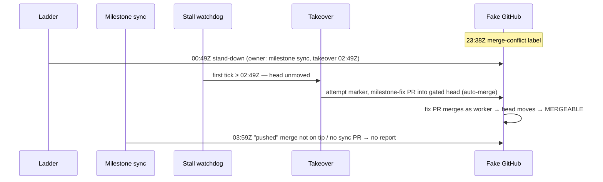

## Summary

Adds a fixture-based Deno test that replays the GRQ-AutoTrader#1957 conflict
stall timeline through the reworked conflict passes. It proves the PR now ends
`MERGEABLE` with no human push, so the regression cannot return silently.
Closes #3002.

- `worker/deno/tests/fixtures/grq_autotrader_1957_timeline.json` — the
  sanitised timeline (placeholder repository, logins and SHAs). It covers the
  conflict label, the milestone-head and gated-head stand-downs, the milestone
  sync run that falsely reported "pushed", and the historical human push and
  merge.
- `worker/deno/tests/conflict_1957_replay_test.ts` — a simulated clock and a
  `ReplayGitHub` that wraps `tests/fixtures/fake_github.ts` and adds a small
  commit graph. Together they drive the real production passes in timeline
  order: the ladder's milestone-head stand-down (`standDownMilestoneHead`),
  milestone sync (`escalateSyncConflict` → `confirmSyncLanding`, #2998), the
  gated-head guard, the stall watchdog (`detectConflictQueueStall` +
  `repairConflictQueueStall`, #3001), takeover (`runConflictTakeover`, #2999)
  and abandon (`abandonAndRestart`, #3000).

## Spec

### Intent and Rationale

- #1957 stalled for 8 h 47 min and needed a human push. A replay of that exact timeline is the end-to-end check that #2965's passes now fix the conflict themselves.
- The test calls the real pass functions through their existing `gh` seams instead of re-implementing their decisions. A regression in any pass therefore turns this test red.

### Essential Design Decisions

- Historical events (`human-push`, `pr-merged`) are in the fixture but the replay never applies them. The PR must reach `MERGEABLE` without them, and before the human-push timestamp.
- Two scenarios run. (A) is the faithful replay, where the takeover's milestone-fix PR lands. (B) uses the same timeline but every resolution fails. It checks the 3-attempt budget, the 2-hour spacing between attempts, and that abandon does not run until 6 hours after the first stand-down.
- Any `gh` command the replay does not model is rejected: `ReplayGitHub` hands everything else to `FakeGitHub`, which errors on commands it does not know. Each test also asserts `unknownCommands` is empty, so a pass cannot quietly take a fail-open path.
- In (B), abandon is stopped at the originating-issue lookup by a `resolveContext` stub. The assertion is that it got past the budget guard (`failed` at `originating-issue`), not that a PR was closed.

### Undiscoverable Facts

- The real #1957 times (23:38Z label, 00:49Z stand-down, 03:59Z false "pushed" sync, 05:03Z GH013 stand-down, 08:25Z human push) come from #2965's grill-me record. Logins, repository and SHAs are placeholders.
- In the replay the takeover fires at the first tick after 02:49Z, two hours after the 00:49Z stand-down. The PR is mergeable by about 03:08Z, so the 05:03Z gated-head stand-down is skipped in (A) because the PR is no longer conflicting. In (B) it does fire.

## Evidence

This change is backend/test only, with no UI. The new test passes:

```text
running 2 tests from ./tests/conflict_1957_replay_test.ts
replays the GRQ-AutoTrader#1957 timeline to MERGEABLE with no human push ... ok
bounds the replay at 3 attempts and abandons no earlier than 6 hours after the first stand-down ... ok
ok | 2 passed | 0 failed
```



**Docs sweep** — this adds tests only and changes no behaviour, field or
setting. grep: `1957`, `fake_github`; no doc describes these test files, so no
docs were updated.

## Acceptance Criteria

<!-- vibe-spec-review inputs="diff+issue-body" -->

- **met** — The replay ends with the PR `MERGEABLE` — evidence: `worker/deno/tests/conflict_1957_replay_test.ts::replays the GRQ-AutoTrader#1957 timeline to MERGEABLE with no human push` — reviewer: met
- **met** — Every push comes from the worker identity, none from a human login — evidence: `worker/deno/tests/conflict_1957_replay_test.ts::replays the GRQ-AutoTrader#1957 timeline to MERGEABLE with no human push` (every `pushes[].actor` is the worker; the historical human SHA never appears) — reviewer: met
- **met** — Every stand-down comment names an owning pass and a UTC takeover time — evidence: `assertStandDownShape` in both tests, which also checks takeover = stand-down + 2 h — reviewer: met
- **met** — No more than 3 resolution attempts are recorded on the PR — evidence: `worker/deno/tests/conflict_1957_replay_test.ts::bounds the replay at 3 attempts and abandons no earlier than 6 hours after the first stand-down` — reviewer: met
- **met** — No sync report claims a merge that is not on the milestone tip or in a sync PR — evidence: `assertSyncReportsConfirmed` in both tests; the 03:59Z run is `posted: false`, `unconfirmed` — reviewer: met
- **met** — Abandon-and-redo does not run earlier than 6 hours after the first stand-down — evidence: `worker/deno/tests/conflict_1957_replay_test.ts::bounds the replay at 3 attempts and abandons no earlier than 6 hours after the first stand-down` — reviewer: met
- **met** — Tests and quality checks pass — evidence: the new test passes, and `./quality.sh` was run on the final head (see the note below) — reviewer: partial — reason: the reviewer saw only the diff and could not run anything; the test and the gate were run here
- **unrequested** — Scenario (B), where every resolution fails, as a second test — reviewer: unrequested — reason: it is the only way to exercise the 3-attempt budget and the 6-hour abandon criteria, which the faithful replay never reaches
- **unrequested** — the `resolveViaLadderCalls` assertion — reviewer: unrequested — reason: the ladder pass is driven through its milestone-head stand-down (`standDownMilestoneHead`); this assertion checks that the ladder's direct-push resolver never touches the gated head, as the issue's gated-head route requires

## Standards Review

<!-- vibe-standards-review inputs="diff+CODING-STANDARDS.md" -->

- **clean** — every imported production symbol exists; the fixture is in the diff; no workflow files are touched; the test is self-contained with an injected clock and no sleep, subprocess or network; it asserts decisions (mergeable state, pushes, attempt counts) rather than request text. Optional only: unused informational fixture fields (`reported`, `landed`, `ruleTypes`).

## Test Plan

- Added `worker/deno/tests/conflict_1957_replay_test.ts` (2 tests).
- Added `worker/deno/tests/fixtures/grq_autotrader_1957_timeline.json`.
- `deno task test tests/conflict_1957_replay_test.ts` passes; `./quality.sh` was run on the final head.

🤖 Generated with [Claude Code](https://claude.com/claude-code)
