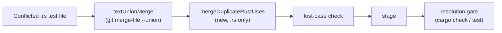

# PR Summary — Issue #3007: fold duplicate Rust `use` lines a test-union leaves

## Summary

Closes #3007

The milestone sync settled a conflicted Rust test file
(`crates/api/tests/target_portfolio.rs`) by a textual union
(`git merge-file --union`). Both sides had edited the same `use grq_policy::{…}`
line, so the union kept both lines. `cargo check` then rejected the tree with
`error[E0252]`, and the resolution gate refused the same union on every sync.
For `.rs` files, the union step now folds overlapping top-level `use`
declarations back into one before the result is checked and staged.



- [x] `worker/deno/lib/rust_use_union.ts`: `mergeDuplicateRustUses`
- [x] Hook it into the textual-union path of `unionMergeConflictedFile`
- [x] Tests: the regression test from the logged input, negative cases, and a
  real-git integration test
- [x] Docs: the `docs/INTERNALS.md` union paragraph and module table, and the
  sweep ledger entry

## Spec

### Intent and Rationale

- The issue says to "fix the gate, not the conflict". The gate's refusal was
  correct: the tree really did not compile. The defect is that the
  deterministic union produced a tree that could not compile, so the fix
  belongs in the union step.
- A fold that is wrong could silently drop an import. The fold is therefore
  conservative, and anything it cannot parse with confidence is left alone.

### Essential Design Decisions

- **What is folded:** only top-level `use` declarations at column 0
  (optionally `pub`/`pub(...)`) that share the visibility and the path prefix
  and whose item sets overlap.
- **What is skipped:**
  - non-overlapping groups;
  - nested braces and glob imports;
  - imports gated by an attribute (`#[cfg]` and the like);
  - indented imports inside a `mod`.
- **No-change guarantee:** when nothing is folded, the input is returned
  byte for byte, so the call is safe on every `.rs` union.
- **Output format:** the folded line uses rustfmt order (`self` first, then
  sorted) only when every input group was already sorted. A line over 100
  characters becomes a rustfmt-style block. CRLF line endings and the trailing
  newline are preserved.
- **Placement:** the fold runs only on the textual-union path, before the
  lost-case check, so that check still guards the result.

### Undiscoverable Facts

- `verifyResolvedTree` (`milestone_resolution_gate.ts`) is correct as it
  stands, and this PR does not change it.
- The issue says "No repair was attempted (Issue #1965)". That happens because
  `repairGatedResolution` needs an `agentFn`. `bindMilestoneConflictAgent`
  leaves `agentFn` undefined when the sync has no budget grant (Issue #2309).
  Without an agent, nothing breaks the loop, so the deterministic union must
  produce a tree that compiles by itself.
- TypeScript duplicate `import` lines are the same class of problem. They are
  out of scope here and are a candidate for a follow-up.

## Reproduction

- **Symptom:** the gate output logged in the issue:

  ```text
  error[E0252]: the name `StrategyConfig` is defined multiple times
  28 | use grq_policy::{AccountId, Industry, IndustryOf, StrategyConfig, Symbol, TradingDate};
  29 | use grq_reporting::{EvaluationAlertKind, ExceptionKind, timed_out_after};
  30 | use grq_policy::{Industry, IndustryOf, ScreenLimits, StrategyConfig, Symbol};
  ```

- **Status:** `verified`.
- **Regression test:** in `worker/deno/tests/rust_use_union_test.ts`:
  - It starts from those exact lines 28 to 30. Lines 28 and 30 fold into one
    sorted `use grq_policy::{…}` line, and line 29 is untouched.
  - The integration test builds a real git conflict on one `use` line and calls
    `unionMergeConflictedFile`.
  - With the `.rs` hook removed, the integration test **failed**: the staged
    file still had two `use grq_policy` lines. It passes with the hook in place.

## Evidence

- `./quality.sh`: **PASSED** (config integration skipped: no `.config.json` in
  the container).
- The targeted tests pass: `deno task test:unit tests/rust_use_union_test.ts
  tests/milestone_sync_conflict_test.ts tests/milestone_gate_wedge_test.ts`
  ran 47 tests, all passed.
- **Docs sweep:** I grepped the non-archive Markdown for `merge-file --union`,
  `test-union` and `test-file union`. Only `docs/INTERNALS.md` matched, and it
  is updated (the union paragraph and the module table).
  `docs/audits/lib-sweep-coverage.json` now registers the new module.

## Test Plan

- [x] Regression test from the logged E0252 input
- [x] Exact duplicates, a simple-path fold, a multi-line render, and
  unsorted-order preservation
- [x] Negative cases: the same leaf under different prefixes, `#[cfg]`-gated,
  indented, non-overlapping, nested braces, and no duplicates (identical
  output)
- [x] Real-git integration test through `unionMergeConflictedFile`
- [x] Full `./quality.sh`
