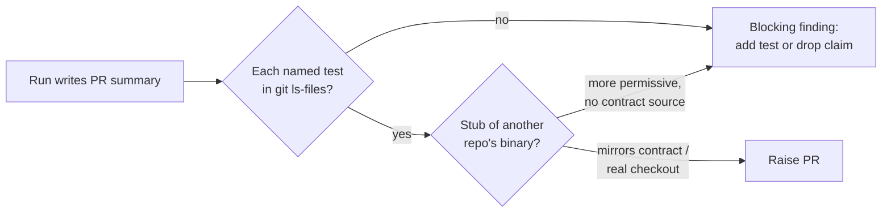

# PR Summary — Issue #3011

Closes #3011

## Summary

Worker PRs shipped a regression test that was named but never existed
(GRQ#5135), and a stub that was more permissive than the binary it stood in
for (GRQ#5137). This PR adds two rules to every surface a run or reviewer reads:

- **A named test must exist.** Every test named in Evidence or Test Plan, and
  every code anchor or comment that points at a test, must exist at the head.
  The run checks this with `git ls-files <path>`. A named-but-absent test is a
  blocking self-review finding.
- **A stub mirrors the real callee's contract.** A stub of another repo's
  binary must read the same inputs and fail with the same exit codes. A stub
  more permissive than the real callee is a finding. The fix is to run against a
  real checkout, or to name the contract with a source link.

Checklist:

- [x] `CODING-STANDARDS.md` and its injected twin
      `prompts/coding_guidelines/prompt.md`: both rules, word for word
- [x] `prompts/issue/prompt.md`: Test Plan item 7 (named tests must exist) and
      the Bugs/Enhancements bullet (stub contract)
- [x] Standards reviewer sub-agent brief (`issue_executor_agents.ts`): both
      departures are always a `violation`
- [x] `docs/workflows/issue-processing.md`: the Standards reviewer bullet
- [x] Pin test `phantom_test_and_stub_contract_3011_test.ts`

## Spec

### Intent and Rationale

- The PR summary and code anchors should only claim coverage that is really in
  the tree.
- A stub that accepts what the real callee rejects hides the contract the test
  exists to check.

### Essential Design Decisions

- The rule is a self-review step in the issue prompt as well as a reviewer
  check. The reviewer sub-agents only run on criteria-bearing issues, and they
  run before the summary is written. So the run itself must check every path it
  names.
- Both rules go into the twin files word for word, which keeps the twin-drift
  test green.
- No deterministic PR-body gate was added (scope). A follow-up could parse
  Evidence and Test Plan paths and reject absent ones at PR creation.

### Undiscoverable Facts

- In GRQ#5137 the real callee paired files through `docs/scores/index.json` and
  exited 1 on an unpaired tree. The stub scanned the tree and exited 0.

## Evidence

- Base check: none of the four surfaces contained `named-but-absent` or
  `more permissive than the` at base 3bad99d5 (`git show 3bad99d5:<file> | grep -c` → 0).
  The new test therefore fails on base and passes with this change.
- **Docs sweep:** grepped `standards-reviewer`, `Standards reviewer`,
  `Test Plan`, `named test` and `test stub` across `README.md`, `docs/`
  (excluding `docs/archive/`) and `*/README.md`.
  `docs/workflows/issue-processing.md` was updated. `docs/PROMPTS.md`,
  `docs/CONFIGURATION.md`, `docs/MODEL-AND-CACHING.md` and `docs/REFERENCES.md`
  mention the reviewer without restating its checks, so they are unaffected.

## Test Plan

- `worker/deno/tests/phantom_test_and_stub_contract_3011_test.ts` (new) pins
  both rules in `CODING-STANDARDS.md`, the `coding_guidelines` prompt, the
  `issue` prompt and the standards-reviewer brief.
- Existing tests that still pass:
  - `coding_guidelines_twin_drift_test.ts`
  - `issue_executor_agents_test.ts`
  - `issue_reviewer_agents_2575_test.ts`
  - `pr_summary_final_state_2879_test.ts`
- Full `./quality.sh`.
