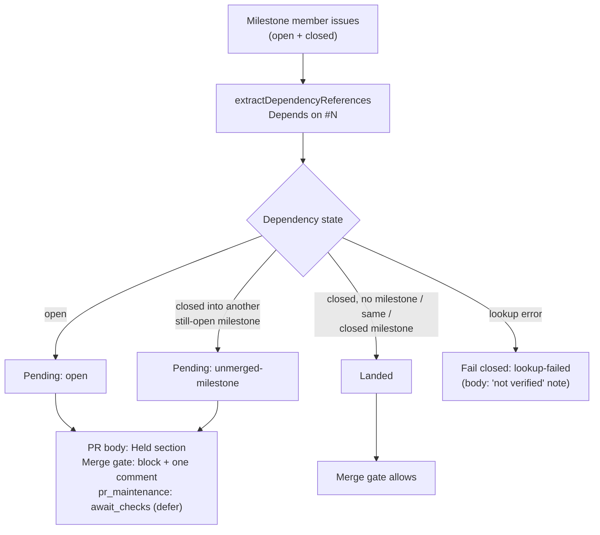

# PR Summary — Issue #3014: hold milestone merges on pending declared dependencies

## Summary

Closes #3014

Before this change, a milestone summary PR could merge, or be raised as ready
to merge, while one of its sub-issues declared `Depends on #N` on work that had
not landed. Now every member issue's declared dependencies are checked:

- At **creation**, `createMilestoneSummaryPr()` adds a
  "⏸️ Held: pending dependencies" section to the PR body that lists each
  `#A depends on #B` pair.
- At **merge**, `decideSummaryPrMerge()` re-checks on every scan.
  - If any dependency is pending, the PR is blocked
    (`pending-dependencies`) and one marker-deduplicated comment explains the
    hold.
  - A failed lookup fails closed (`lookup-failed`).
- The hold is a deferral, not an escalation. The PR stays open, merges
  automatically once the dependencies land, and a human can still merge it by
  hand.

- [x] `milestone_dependency_hold.ts` adds the finder, the renderers and the
  comment marker
- [x] `createMilestoneSummaryPr()` adds the hold section, or a "not verified"
  note when the lookup fails
- [x] `decideSummaryPrMerge()` adds the `pending-dependencies` block and a
  deduplicated comment
- [x] `AutoMergeResult.BlockedPendingDependencies` is mapped to
  `milestone_dependencies_pending`, which defers as `await_checks`
- [x] Docs updated: INTERNALS (Mermaid), MERGE, milestones,
  projects-and-dependencies, and lib-sweep coverage
- [x] Tests added

## Spec

### Intent and Rationale

- A milestone PR assembles its sub-issues' work onto the default branch. If a
  sub-issue depends on work that has not landed, the assembled code is
  incomplete. GRQ-AutoTrader#2045 and #2049 merged in that state.
- PR creation is never blocked: the PR body explains the hold, and the merge
  gate enforces it. This keeps the work visible and reviewable.

### Essential Design Decisions

- **Reuse the existing parser.** Dependencies are read with
  `extractDependencyReferences()`, so they match the `Depends on` grammar the
  pickup dependency gate already uses.
- **What counts as pending.** A dependency is pending when it is still open,
  or when it was closed into a *different* milestone that is still open
  (its code sits on an unmerged milestone branch).
- **What counts as landed.** A dependency counts as landed when it is closed
  with no milestone, closed in the same milestone, or closed in a closed
  milestone.
- **Fail closed at merge, fail loud at creation.** A lookup error blocks the
  merge (`lookup-failed`) and adds an explicit "Declared dependencies not
  verified" note to the PR body. Both paths log a WARNING.
- **Deferral, not escalation.** `classifyMergeAttempt` treats
  `milestone_dependencies_pending` as `await_checks`, so no `needs-human`
  label is applied and no failure is counted.
- **One comment per PR.** The block comment is deduplicated by
  `<!-- milestone-pending-dependencies-merge-block -->` through
  `postMarkerDedupedBlockComment`. That helper is shared with the existing
  open-children comment.
- **Untrusted titles are scrubbed.** Milestone titles go through
  `scrubUntrustedText` before they are written into the comment, the PR body
  or the log.

### Undiscoverable Facts

- A closed issue normally means its PR merged to the default branch, which
  milestone branches are synced from.
- A cross-milestone dependency cycle holds both PRs. The comment says a human
  may merge by hand.

### Known limitation

The landed check uses issue and milestone state, not the dependency's own PR
merge record. A dependency closed without code (for example, won't-fix) counts
as satisfied. This matches how the existing pickup dependency gate treats a
closed dependency.

## Evidence

- `tests/milestone_dependency_hold_test.ts` (14 tests) covers:
  - an open dependency;
  - a dependency closed into another milestone that is still open;
  - a dependency closed with no milestone, in the same milestone, or in a
    closed milestone;
  - lookup errors;
  - rendering, including title scrubbing.
- `tests/milestone_children_gate_test.ts`: a pending dependency blocks with
  `pending-dependencies`, a landed dependency allows, a lookup failure fails
  closed, and the comment is posted once.
- `tests/pr_auto_merge_test.ts`: a summary PR is not merged
  (`merges === 0`) while a dependency is pending, and the comment is not
  reposted on later cycles.
- `tests/merge_block_escalation_test.ts`: `milestone_dependencies_pending`
  maps to `await_checks`.
- `tests/milestone_completion_test.ts`: the PR body contains the Held
  section and `#10 depends on #20`, or the "not verified" note when the lookup
  fails.
- **Docs sweep:** searched the docs for `decideSummaryPrMerge`,
  `createMilestoneSummaryPr`, `open-children` and `Depends on`. Updated
  `docs/INTERNALS.md`, `docs/MERGE.md`, `docs/workflows/milestones.md` and
  `docs/workflows/projects-and-dependencies.md`.

## Spec Review

<!-- vibe-spec-review inputs="diff+issue-body" -->

- Detect each sub-issue's declared `Depends on #N`
  - reviewer: met
- An open dependency blocks the merge
  - reviewer: met
- A dependency whose PR is not merged into the same target branch blocks the
  merge
  - reviewer: partial
  - The check infers this from issue and milestone state (see Known
    limitation). It covers the reported cases: a dependency still open, or
    closed into a different milestone that is still open.
- The milestone PR is not raised for merge while a dependency is pending
  - reviewer: met
- The PR body states which dependencies are pending
  - reviewer: met
- Verification: the PR merges once the dependencies land, or explicitly
  explains the hold
  - reviewer: met
- Lookup failure is handled
  - reviewer: met (fails closed at merge; "not verified" note at creation)
- The shared `postMarkerDedupedBlockComment` helper
  - reviewer: unrequested
  - reason: needed to reuse the existing marker-dedup logic for the new
    comment without copying it; behaviour of the open-children path is
    unchanged.
- The cross-milestone cycle note in the comment and docs
  - reviewer: unrequested
  - reason: a direct consequence of the hold that operators need in order to
    resolve a cycle; it is documentation only.

## Standards Review

<!-- vibe-standards-review inputs="diff+CODING-STANDARDS.md" -->

- TDD coverage for the new behaviour
  - reviewer: met
- Failing loud with the Result convention
  - reviewer: met
- WARNING log levels
  - reviewer: met
- A code change owes a docs change
  - reviewer: met
- Australian English
  - reviewer: met
- Untrusted text is scrubbed
  - reviewer: met
- DRY: shared dedup helper
  - reviewer: met

No material departures. The optional style notes (spread-merge construction,
and a positional `dependencyNote` argument) are left as they are.

## Follow-up note

The existing `renderBlockWarning` (open children) does not scrub
`milestoneTitle`, while the new warning does. This is out of scope here; it is
worth a separate small fix.

## Test Plan

- `deno task test:unit` on the five touched test files: 205 passed,
  0 failed. Sibling sweeps of `pr_maintenance` and `issue_worker` also passed.
- `deno task check` is clean.
- `./quality.sh < /dev/null`: PASSED. The only skip is config integration.

## Pre-PR Security Self-Check

- [x] Input validation: issue numbers come from the existing
  `extractDependencyReferences` parser, and API responses are type-checked
  before use.
- [x] Secrets: no hidden or credential files are staged.
- [x] Injection surface: `gh api` paths are built from a validated repo slug
  and numeric issue numbers, and untrusted titles are scrubbed before
  rendering.
- [x] Authorisation: only the existing comment write path is used, on the
  claim repo.
- [x] Error handling: lookup errors are logged as a WARNING and fail closed,
  with no stack traces in comments.
- [x] Dependencies: none added.
- [x] Path confinement: not applicable.
