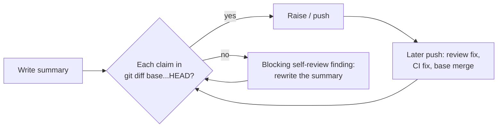

# PR Summary — Issue #3015

## Summary

Closes #3015

PR bodies were written mid-run. When the branch later moved on, the body was
not re-derived. Either a merge from the base branch superseded the fix
(GRQ-validation#904), or an abandoned design iteration's description survived
(GRQ-www#103). The #2879 rule only asked that every claim *exist at the head*.
This PR ties the summary to the PR's own diff on every surface that writes or
refreshes it:

- **`prompts/issue/prompt.md`**:
  - Re-derive the Summary, Evidence and Acceptance Criteria sections from
    `git diff <base>...HEAD`. Every claimed file or behaviour must appear in
    that diff.
  - Replace an abandoned iteration's description with the one that shipped.
  - A body that contradicts the diff is a blocking self-review finding.
  - A merge from the base branch is now one of the triggers for a rewrite.
- **`prompts/pr_feedback/prompt.md`, `prompts/ci_fix/prompt.md`**: one added
  sentence in "Keep the PR summary true to the head". After the push, re-derive
  the summary from the diff, and remove any claim the diff no longer carries.
- **`prompts/merge_conflict/prompt.md`**: new step 5. When the base side already
  carries part of the PR's change, rewrite the committed summary so it claims
  only what the merged diff still carries. Stage it with the resolutions and
  name the refresh in `.pr_response_message`.
- **`CODING-STANDARDS.md`**: the "PR Summary and Evidence" final-state paragraph
  carries the same diff rule. It also lists merge-conflict runs among the
  commits that refresh the summary.
- **Docs**:
  - `docs/USAGE.md` restates the rule.
  - `docs/workflows/merge-conflicts.md` lists the new merge-agent duty.

## Spec

### Intent and Rationale

- "Exists at the head" is weaker than "is in this PR's diff". A base merge can
  carry the same change and empty the PR's own diff of it.
- Each surface that pushes to a PR branch (issue, pr_feedback, ci_fix,
  merge_conflict) needs the rule, because any of them can make the body stale.

### Essential Design Decisions

- I extended the existing #2879 paragraphs rather than adding new sections, so
  each rule still has one home per surface.
- The merge_conflict agent stages the refreshed summary and does not commit it.
  The worker's final-mile commit stays the only writer of the merge commit.

### Undiscoverable Facts

- Before the merge commit exists, `git diff --cached <base>` is the merged diff.
  That is why the merge_conflict step names it instead of `<base>...HEAD`.

## Evidence

- New pin test `worker/deno/tests/pr_body_matches_final_diff_3015_test.ts`. It
  asserts the rule's wording in each of the four templates and in
  `CODING-STANDARDS.md` (whitespace-normalised for the standards file).
- Docs sweep: grepped `docs/`, `README.md` and `DESIGN-PRINCIPLES.md` for "true
  to the head" and "final state of the branch". I updated `docs/USAGE.md` and
  `docs/workflows/merge-conflicts.md`. `docs/workflows/pr-feedback.md:188` only
  references the existing rule by name, so it is unchanged.
- `coding_guidelines` twins do not carry this paragraph, so no twin edit was
  needed. `coding_guidelines_twin_drift_test.ts` passes.

## Test Plan

1. `deno task test:unit tests/pr_body_matches_final_diff_3015_test.ts tests/pr_summary_final_state_2879_test.ts tests/phantom_test_and_stub_contract_3011_test.ts tests/coding_guidelines_twin_drift_test.ts`
2. `deno task test:unit` over the prompt tests that load `pr_feedback`,
   `ci_fix` and `merge_conflict`, including
   `tests/merge_conflict_prompt_v2_test.ts` and
   `tests/prompt_docs_sweep_2952_test.ts`.
3. `./quality.sh`
