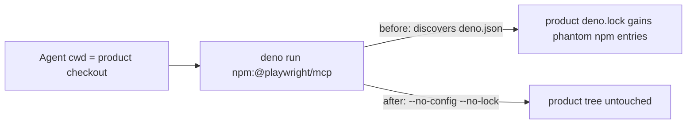

## Summary

The worker's Playwright MCP server no longer writes its own npm entries into the product's `deno.lock`. `generateMcpConfig` now launches it as `deno run --no-config --no-lock … npm:@playwright/mcp@<pin>`. The coding guidelines also gain a rule: a `deno.lock` change must trace to a source change. Closes #3020.

## Spec

### Intent and Rationale

- The MCP client starts the server with the product checkout as its working directory. Deno therefore found that repo's `deno.json` and wrote `@playwright/mcp`, `playwright`, `playwright-core` (alpha) and `fsevents` into its `deno.lock`. These are exactly the phantom entries in GRQ-www#102 and GRQ-validation#901.
- Fixing the launch flags removes the cause at its source and costs less than running the browser from a scratch checkout. The two flags give the same isolation without moving where `docs/evidence/` screenshots resolve.
- The new guidance paragraph is defence in depth for other in-checkout tooling. It covers the issue's "state which source change pulls each entry in" request.

### Essential Design Decisions

- Both flags are needed, and both must come before the npm specifier (anything after it is passed to the script). `--no-lock` stops the lockfile write. `--no-config` also stops a product `nodeModulesDir: "auto"` from creating `node_modules/` in the clone.
- The guard shims (`gh_guard_shim.ts`, `git_guard_shim.ts`) already launch with the same two flags, so this follows existing practice.

### Undiscoverable Facts

- Reproduced locally on Deno 2.9.6 by running `deno run -A npm:@playwright/mcp@0.0.75 --help` in a temp dir that holds a `deno.json`. It created a `deno.lock` with the four leaked entries. With `--no-config --no-lock`, no file was written.
- The issue's proposed `deno install --lock=deno.lock` does **not** prune leaked entries: `deno install`, with or without `--entrypoint`, left all seven `playwright` lines in place. The guidance therefore says to restore the base branch's lockfile instead.
- Without a lockfile, offline resolution from the seeded Deno cache works the same as before. The CI probe already ran the server from a `/tmp/mcp-cwd` with no `deno.json`.

## Evidence

Backend/CLI change; there is no UI to screenshot.

- `worker/deno/tests/setup_screenshot_test.ts::generateMcpConfig - runs the server with neither the checkout's deno.json nor its deno.lock (Issue #3020)` failed with the two flags removed and passes with them.
- `./quality.sh` passed (config integration skipped, as on every local run).

**Docs sweep** — grep: `npm:@playwright/mcp`, `deno run`, `deny-env` across `README.md`, `docs/` (excluding archive) and `*/README.md`. Updated `docs/DEPLOYMENT.md` (manual test command and hardening note) and `docs/CONTAINER-IMAGE.md` (launch command).

## Test Plan

- Added `generateMcpConfig - runs the server with neither the checkout's deno.json nor its deno.lock (Issue #3020)` in `worker/deno/tests/setup_screenshot_test.ts`.
- Ran `tests/setup_screenshot_test.ts`, `tests/agent_mcp_config_test.ts`, `tests/container_manifest_test.ts` and the `coding_guidelines_*` tests: all pass.
- Out of scope, untouched: `installPlaywrightBrowsers` runs the browser installer at setup time in the VibeCoder checkout, not the product tree.

🤖 Generated with [Claude Code](https://claude.com/claude-code)
