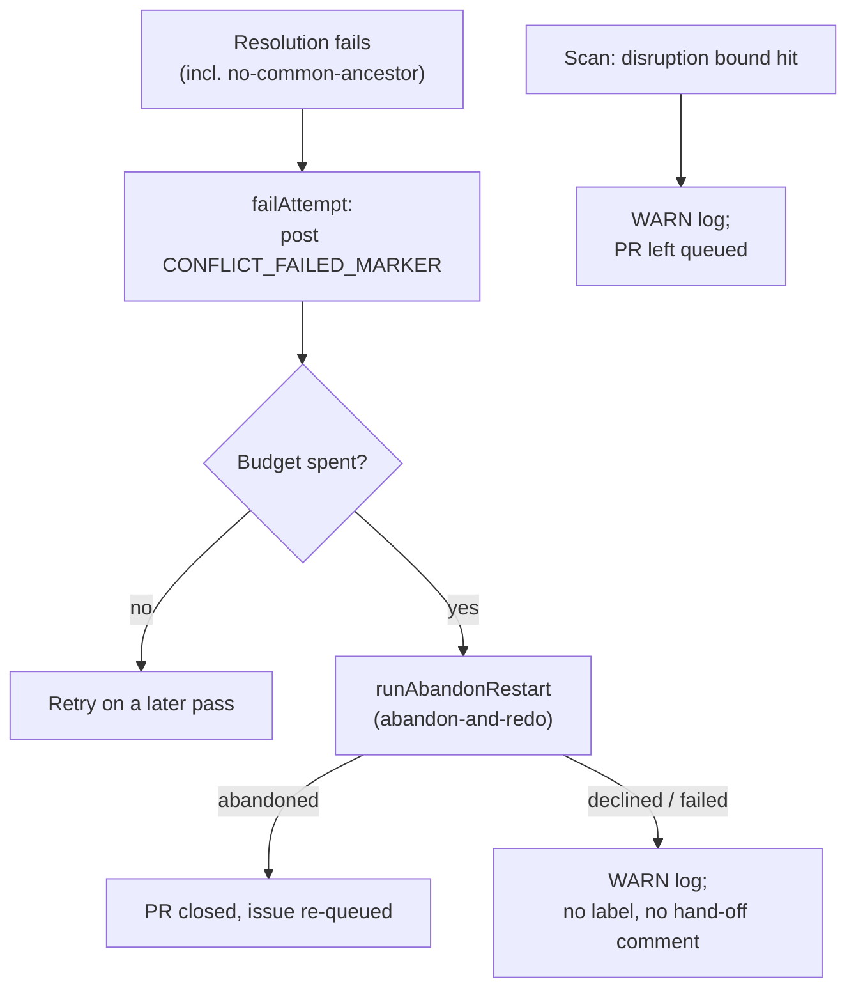

# PR Summary — Issue #3032

## Summary

Closes #3032

Merge-conflict code no longer applies `needs-human`. A failed resolution is
recorded and retried. Once the attempt budget is spent, the processor runs
abandon-and-redo. A no-common-ancestor result is now an ordinary failed attempt.
The scan's disruption bound logs a WARN and leaves the PR queued. The read-only
gate that respects an existing `needs-human` label is unchanged.

## Spec

### Intent and Rationale

- Part of #3013: the fleet lands its own conflicted PRs. A merge-conflict
  failure must never hand the PR to a human.
- Every failure path (normal, no-common-ancestor, disruption bound) ends in a
  retry, abandon-and-redo, or a loud WARN. None of them adds a label or posts a
  hand-off comment.

### Essential Design Decisions

- `escalateNoCommonAncestor` is now `failNoCommonAncestor`. It routes through
  `failAttempt`, so it spends an attempt and reaches the abandon rung at the
  cap. At the unrelated-histories site, the attempt marker is now kept rather
  than deleted.
- If abandon-and-redo is declined or fails at the cap, the processor logs a WARN
  naming the route kind, returns `escalated: false`, and leaves the PR open.
  Nothing is labelled and no human is asked.
- `escalateConflictingPr` is removed. The disruption-bound branch logs a WARN
  and keeps returning its `disrupted-bound` skip, so the PR stays queued.
- `needsHumanLabel` is removed from the processor deps and the scan options.
  The read-only gate uses `NEEDS_HUMAN_LABEL` directly.

### Undiscoverable Facts

- `CONFLICT_RESOLUTION_BUDGET` (3), named in the issue, does not exist on this
  branch. The budget is still the `maxAttempts` dep (`DEFAULT_MAX_CONFLICT_ATTEMPTS`
  = 2), and this PR does not change it.
- `parseConflictAttempts` counts every `CONFLICT_FAILED_MARKER` as a spent
  attempt, even without an opening attempt marker. So a no-common-ancestor
  failure before the marker still spends budget.

## Evidence

- `worker/deno/lib/pr_merge_conflict_processor.ts` drops the `escalateToHuman`
  import, `needsHumanLabel`, `CONFLICT_ESCALATION_NEXT_STEP` and
  `buildConflictEscalationReason`.
- `worker/deno/lib/pr_merge_conflict_scan.ts` drops `escalateConflictingPr`,
  `buildDisruptionEscalationReason` and `DISRUPTED_CONFLICT_NEXT_STEP`.
- `worker/deno/lib/run_core_production_deps.ts` no longer passes
  `needsHumanLabel` to the processor or the scan.
- Tests: 171 passed across `tests/pr_merge_conflict_processor_test.ts`,
  `tests/pr_merge_conflict_scan_test.ts` and
  `tests/run_core_merge_conflict_dispatch_test.ts`.
- **Docs sweep:** I grepped `README.md`, `docs/` (excluding `docs/archive/`) and
  `*/README.md` for the removed names and the hand-off wording. I updated
  `README.md`, `docs/MERGE.md` and `docs/workflows/merge-conflicts.md`, including
  its Mermaid node. `docs/workflows/ci-fix.md` describes the CI-fix hand-off and
  was left unchanged. No removed name remains outside `docs/archive/`.

## Acceptance Criteria

<!-- vibe-spec-review inputs="diff+issue-body" -->

- **With the budget spent, the processor applies no `needs-human`, posts no
  hand-off comment, and calls abandon-and-redo** — met. reviewer: met.
  Evidence: `failAttempt` calls `runAbandonRestart`. Covered by the tests "the
  final failed attempt never escalates to a human (Issue #3032)", "an abandon
  that fails still asks no human (Issue #3032)" and "a declined abandon (not
  already-restarted) still asks no human (Issue #3032)".
- **A no-common-ancestor result records a failed attempt and applies no
  `needs-human`** — met. reviewer: met. Evidence: `failNoCommonAncestor` routes
  through `failAttempt`. Covered by the tests "no common ancestor even after
  unshallow fails the attempt, asking no human (Issue #3032)", "'refusing to
  merge unrelated histories' fails the attempt, not escalating (Issue #3032)"
  and "a no-common-ancestor failure at the cap runs the abandon rung (Issue
  #3032)".
- **`escalateConflictingPr` no longer adds `needs-human`** — met. reviewer: met.
  Evidence: the function is removed. Covered by the scan test "repeated
  disruption is logged and left queued, not escalated" using
  `assertNoNeedsHumanWrites`.
- **A budget-spent test asserts zero `needs-human` label calls and zero hand-off
  comments across the processor and the scan** — met. reviewer: met. Evidence:
  the processor tests above, plus the scan test "the budget-spent record carries
  the attempts and the cap" (`assertNoNeedsHumanWrites` and no
  `needs-human-escalation` comment).
- **Tests and quality checks pass** — met. reviewer: met. Evidence:
  `deno task test:unit tests/pr_merge_conflict_processor_test.ts
  tests/pr_merge_conflict_scan_test.ts tests/run_core_merge_conflict_dispatch_test.ts`
  gives 171 passed, 0 failed. `deno fmt --check`, `deno lint` and `deno check`
  are clean on the touched files. No merge-conflict processor or scan test still
  expects a `needs-human` write. The worker runs the full `./quality.sh` before
  it raises the PR.
- **Docs updates in `README.md`, `docs/MERGE.md` and
  `docs/workflows/merge-conflicts.md`** — unrequested. reviewer: unrequested
  but plausibly necessary. reason: "A Code Change Owes a Docs Change". These
  pages promised a `needs-human` hand-off that no longer happens.

## Standards Review

<!-- vibe-standards-review inputs="diff+CODING-STANDARDS.md" -->

Violations: none.

Optional notes, not acted on:

- `worker/deno/lib/conflict_abandon_restart.ts:650` — `exhaustedEscalationDedupKey`
  no longer has a production caller. It belongs to the `handOffSpentRestarts`
  sub-issue's file, so it is left for that sub-issue.
- `worker/deno/lib/pr_merge_conflict_processor.ts` — the `failNoCommonAncestor`
  doc comment partly repeats the call-site comment. This is minor.

Clean areas: log levels (WARN for degraded-but-continuing), label provenance (no
label writes added), tests rewritten for a deliberate contract change, tests
exercising real code, the docs-change rule, dead-import hygiene, and commit
safety.

## Test Plan

- [x] `deno fmt --check`, `deno lint` and `deno check` on the touched files.
- [x] `deno task test:unit tests/pr_merge_conflict_processor_test.ts tests/pr_merge_conflict_scan_test.ts tests/run_core_merge_conflict_dispatch_test.ts`
      — 171 passed.
- [x] markdownlint and the Mermaid check on the edited docs.
- [ ] `./quality.sh` — the worker runs it before it raises the PR.
