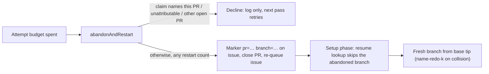

## Summary

Abandon-and-redo is now the last merge-conflict strategy and has no cap.
`abandonAndRestart` closes the exhausted PR and re-queues its originating
issue however many restarts the issue already has. It never applies
`needs-human` and never posts a hand-off comment. Each redo starts on a fresh
branch cut from the base branch's current tip, never from the abandoned head.
Closes #3033.

- Removed `MAX_RESTARTS_PER_ISSUE`, `handOffSpentRestarts`,
  `buildRestartsSpentHandOff`, `RESTARTS_SPENT_LABEL`,
  `restartsSpentDedupKey` and the `escalateToHuman` import from
  `conflict_abandon_restart.ts`. Restart comments now say "restart **N**".
- Three guards are kept. A claim naming this PR (`samePr`) declines. An
  unattributable claim declines (`restart-claim-unverifiable`). An outsider's
  claim is ignored. Declines are logged only, and the next pass retries.
- The restart marker now records the abandoned branch
  (`branch="…"`). The new `lib/conflict_redo_branch.ts` reads it from
  fleet-authored issue comments. `resumeIssueBranch` skips that branch, and
  `setup_branch_phase.ts` cuts the redo from the base tip. When the
  title-derived branch name collides with an abandoned branch, the redo uses
  `<name>-redo-<k>`.

## Spec

### Intent and Rationale

- Under #3013 the fleet lands its own conflicted PRs: a redo starts clean, so
  capping it only produces a human hand-off that the milestone forbids.
- Removing the cap was not enough on its own to meet "redo from base tip".
  The abandoned `issue-<N>-…` branch stays on origin, and resume-on-reclaim
  (#220) would have picked it up again as prior progress.

### Essential Design Decisions

- The abandoned branch is recorded in the existing restart marker, which is
  already trust-attributed. Branch names are allow-listed
  (`[A-Za-z0-9._/-]`, no `..`) on both write and read.
- The abandoned-branch lookup runs only when remote candidates exist, so an
  ordinary pickup makes no extra API call. A failed lookup reports
  `lookup-failed` rather than an empty list.
- The abandoned branch is still never deleted or force-pushed. The redo takes
  a distinct name instead.
- The `already-restarted` decline type keeps its `samePr`/`restartCount`
  fields, because the scan and processor park paths (and their tests) still
  construct it. Only `samePr: true` is produced by the rung.

### Undiscoverable Facts

- PR #3026 (#3000) is not on this branch, so there was no "3-failed-attempts
  guard" to preserve here. The existing attempt budget is untouched.
- Restart markers written before this change carry no `branch` attribute, so
  those older abandoned branches are not excluded from resume.

## Evidence

Backend-only change; no UI to screenshot. `./quality.sh` passed in full
(`Result: PASSED (with skipped checks)`; only the config-integration check was
skipped, as it is by default).

**Docs sweep** — grep: `MAX_RESTARTS_PER_ISSUE`, `handOffSpentRestarts`,
`RESTARTS_SPENT`, "third redo", "both restarts", "two restarts",
"twice per issue", "spent its restarts", "#2804"; updated: `README.md`,
`DESIGN-PRINCIPLES.md`, `docs/CONFIGURATION.md`, `docs/MERGE.md`,
`docs/workflows/merge-conflicts.md`, `docs/audits/lib-sweep-coverage.json`

## Acceptance Criteria

<!-- vibe-spec-review inputs="diff+issue-body" -->

- **met** — A test with 3+ prior trusted restart claims for other PRs asserts the next `abandonAndRestart` still closes the PR and re-queues the issue — evidence: `worker/deno/tests/conflict_abandon_restart_test.ts::abandonAndRestart - three or more prior trusted restart claims for other PRs still close the PR and re-queue the issue` — reviewer: met
- **met** — No code path in `conflict_abandon_restart.ts` applies `needs-human` or posts a hand-off comment; a test with both budgets spent asserts it — evidence: `worker/deno/tests/conflict_abandon_restart_test.ts::abandonAndRestart - spent attempt and restart budgets never apply needs-human or post a hand-off` — reviewer: met
- **met** — The redo branch is created from the base branch's current tip — evidence: `worker/deno/tests/setup_branch_resume_test.ts::#3033 - a re-queued redo starts on a fresh branch from the base tip, not the abandoned head` — reviewer: met
- **met** — Tests and quality checks pass — evidence: full `./quality.sh` run after the final edit, `Result: PASSED` — reviewer: missing — reason: the reviewer could not run anything from a static diff ("not verifiable from the diff"); the gate was run here and passed
- **unrequested** — New `lib/conflict_redo_branch.ts`, the `branch="…"` marker attribute, and the `issue_branch_resume.ts` / `setup_branch_phase.ts` wiring — reviewer: unrequested — reason: the reviewer called this "justified-but-untraceable-to-issue-text"; without it, resume-on-reclaim reopens the abandoned head and criterion 3 cannot hold
- **unrequested** — Docs rewritten beyond the module header (`README.md`, `DESIGN-PRINCIPLES.md`, `docs/CONFIGURATION.md`, `docs/MERGE.md`, `docs/workflows/merge-conflicts.md`) — reviewer: unrequested — reason: they described the removed two-restart cap and `needs-human` hand-off; "a code change owes a docs change"
- **unrequested** — Wording-only edits in `pr_merge_conflict_scan.ts` and `merge_conflict_stall_watchdog.ts`, plus updated scan, processor and stall tests — reviewer: unrequested — reason: these used the removed constant or asserted the removed hand-off, so the build and the gate required the change

## Standards Review

<!-- vibe-standards-review inputs="diff+CODING-STANDARDS.md" -->

- **clean** — docs swept for every removed symbol; tests call real functions; branch-name allow-list with negative tests (`..`, shell metacharacters); restart-marker trust boundary preserved; Australian English; `Result` used for the fallible lookup. Optional notes, not chased: the `already-restarted`/`samePr: false` shape kept for injected outcomes, and the no-cap explanation repeated across sections of `merge-conflicts.md`.

## Test Plan

- `worker/deno/tests/conflict_abandon_restart_test.ts` — removed the cap and hand-off tests; added the no-cap test (3–5 prior claims), the both-budgets-spent no-`needs-human` test, the "restart **N**" wording test and the marker `branch` attribute tests.
- `worker/deno/tests/conflict_redo_branch_test.ts` (new) — marker branch parsing, trusted-only loading, fail-loud lookup, `freshRedoBranchName`.
- `worker/deno/tests/issue_branch_resume_test.ts` — an abandoned candidate is never resumed; the redo branch is still resumed; no lookup when there are no candidates; a failed lookup reports `lookup-failed`.
- `worker/deno/tests/setup_branch_resume_test.ts` — the redo is cut from base as `<name>-redo-1`.
- `worker/deno/tests/pr_merge_conflict_scan_test.ts`, `pr_merge_conflict_processor_test.ts`, `stall_repair_test.ts`, `merge_conflict_stall_watchdog_test.ts` — updated to the uncapped, no-hand-off contract.

🤖 Generated with [Claude Code](https://claude.com/claude-code)
