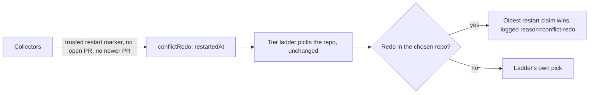

## Summary

An issue re-queued by merge-conflict abandon-and-redo is now the next pickup
in its own repo, ahead of every other candidate there, `top-priority`
included. This is done through pickup ordering, not by applying a label,
because `label_security` strips a worker-applied `top-priority`.
Closes #3034.

- New `lib/conflict_redo_candidate.ts`. `classifyConflictRedo` reads the
  issue's comment thread and finds its latest trusted restart marker. Trust
  comes from `partitionConflictComments`, so an outsider's marker is ignored.
  The issue counts as a pending redo only when it has no open PR referencing
  it and no closed PR referencing it was raised after the abandoned one. The
  comment lookup is cached, keyed on the issue's `updatedAt`. A failed lookup
  is logged and the issue is ordered as an ordinary candidate.
- All four candidate collectors (`work-on`, configured-label, `low-priority`,
  `idle-task`) set `conflictRedo: { restartedAt }` on `IssueCandidate`.
- `issue_priority.ts`: the tier ladder still picks the repo, unchanged. Once
  a repo is chosen, its redo with the oldest restart claim is returned
  instead of the ladder's own pick. Redos are exempt from the
  `reposWithOpenWorkOn` / `reposWithOpenLowPriority` suppression.
  `selectFairWithinTier` and `orderCandidatesByNiceTier` apply the same lift.
- `find_oldest_issue.ts` logs the selection through the new
  `logConflictRedoSelection`, which logs even when debug is off:
  `[issue-finder] selected repo=… issue=#… reason=conflict-redo source=… restarted-at=…`.

## Spec

### Intent and Rationale

- Under #3013 the fleet lands its own conflicted PRs. Every pass a redo waits
  lets the base move further and makes the next attempt likelier to conflict,
  so the redo must not queue behind older work.

### Essential Design Decisions

- The lift is applied after the ladder chooses a repo, not before it. A redo
  is first within its repo but never makes its repo beat another repo's
  candidate. The issue's goal is "the next pickup in its repo", so a redo
  should not reach across repos.
- Week-pace (#1885) still blocks `low-priority` / `idle-task` redos, as it
  blocks every other candidate in those tiers.
- The flag only re-orders candidates; it never admits or blocks one. Every
  failure therefore falls back to "not a redo".
- The field is `conflictRedo: { restartedAt }` rather than the issue's
  example `isConflictRedo: true`, so several redos can be ordered by oldest
  restart claim.

### Undiscoverable Facts

- `collect_low_priority_candidates.ts` is a fourth collector the issue did
  not name. Without it a redo re-queued as `low-priority` would never be
  flagged.

## Evidence

Backend-only change; no UI to screenshot. The worker's quality gate passed
on this branch before this summary was written.

**Docs sweep** — grep: `conflict-redo`, `conflictRedo`, "Conflict redo",
`planRequeueLabel`; updated: `DESIGN-PRINCIPLES.md`,
`docs/workflows/issue-processing.md`, `docs/workflows/merge-conflicts.md`

## Acceptance Criteria

<!-- vibe-spec-review inputs="diff+issue-body" -->

- **met** — A test asserts the selector returns a redo issue over an older `top-priority` candidate in the same repo — evidence: `worker/deno/tests/issue_priority_conflict_redo_test.ts::selectHighestPriority - redo work-on beats an older top-priority in the same repo (Issue #3034)` — reviewer: met
- **met** — A redo re-queued as `idle-task` or `low-priority` still beats `work-on` candidates in its repo — evidence: `worker/deno/tests/issue_priority_conflict_redo_test.ts::selectHighestPriority - redo idle-task beats a work-on in the same repo (Issue #3034)`, `::selectHighestPriority - redo low-priority beats a work-on in the same repo (Issue #3034)`, `::selectHighestPriority - redo idle-task is selected despite reposWithOpenWorkOn/LowPriority suppression (Issue #3034)` — reviewer: met
- **met** — An issue whose restart marker was written by an outsider is not treated as a redo — evidence: `worker/deno/tests/conflict_redo_candidate_test.ts::outsider's restart marker is not treated as a redo`, `worker/deno/tests/collect_idle_task_candidates_test.ts::collect_idle_task_candidates - an outsider-authored restart marker does not flag conflictRedo` — reviewer: met
- **met** — Ordering is unchanged for repos with no redo candidate (existing selector tests pass untouched) — evidence: test diff is additions only; existing `issue_priority*_test.ts`, `collect_*candidates*_test.ts`, `find_oldest_issue*_test.ts` pass (282 passed, 0 failed); `worker/deno/tests/issue_priority_conflict_redo_test.ts::selectHighestPriority - without any conflictRedo, selection matches today's behaviour (Issue #3034)` — reviewer: met
- **met** — Tests and quality checks pass — evidence: the worker's quality gate passed on this branch; the reviewer's targeted runs passed (84 + 282 tests), with `deno check`, `deno lint` and `deno fmt --check` clean — reviewer: partial — reason: the reviewer stopped the full `deno task test` run at about 580s, so it could not confirm the whole suite itself
- **unrequested** — `conflictRedo` wired into `collect_low_priority_candidates.ts`, a collector the issue did not name — reviewer: unrequested — reason: without it a `low-priority` redo (criterion 2) is never flagged in production
- **unrequested** — `IssueCache` entry `conflict_redo_claim_v1_<n>` keyed on the issue's `updatedAt` — reviewer: unrequested — reason: avoids one comment-thread fetch per eligible candidate on every scan; tested
- **unrequested** — "closed PR numbered above the abandoned PR" rule in `isPendingConflictRedo` — reviewer: unrequested — reason: a stricter reading of "newer than the latest fleet PR" that stops lifting an issue whose redo PR has already come and gone; tested
- **unrequested** — The lift is applied after the ladder chooses a repo rather than "before the tier ladder", and week-pace still blocks `low-priority` / `idle-task` redos — reviewer: unrequested — reason: a redo is first within its repo but does not reach across repos; the reviewer asks that the issue author confirm this is intended
- **unrequested** — Docs (`DESIGN-PRINCIPLES.md`, `docs/workflows/issue-processing.md`, `docs/workflows/merge-conflicts.md`) — reviewer: unrequested — reason: a code change owes a docs change

## Standards Review

<!-- vibe-standards-review inputs="diff+CODING-STANDARDS.md" -->

- **violation** — A Code Change Owes a Docs Change: stale doc comments on `selectFairWithinTier` still say it returns `sorted[0]`, the same as `selectOldestCandidate` — evidence: `worker/deno/lib/issue_priority.ts:446` — reason: stands; this run was limited to the summary file, so it is left for a follow-up (medium, not blocking)
- **violation** — A Code Change Owes a Docs Change: the suppression section still says a repo with a suppressing `work-on` contributes no `low-priority` / `idle-task` candidate, without the redo exemption — evidence: `docs/workflows/issue-processing.md:412` — reason: stands; the exemption is documented in the new subsection at line 74, but the canonical section was not updated (medium, not blocking)
- **violation** — Log levels: the lookup-failure line goes to `console.error` although the run continues degraded — evidence: `worker/deno/lib/conflict_redo_candidate.ts:164` — reason: stands (low, not blocking)
- **violation** — DRY: the same `classifyConflictRedo({...})` call is repeated in four collectors — evidence: `worker/deno/lib/collect_work_on_candidates.ts:669` — reason: stands; it matches the existing per-collector structure (low, not blocking)
- **violation** — Docs accuracy: the "Conflict redo first in its repo" link targets the parent section's anchor, and the new subsection sits between the parent's prose and its flowchart — evidence: `docs/workflows/merge-conflicts.md:34`, `docs/workflows/issue-processing.md:74` — reason: stands (low, not blocking)
- **clean** — Australian English; restart-marker trust boundary through `partitionConflictComments`, with outsider tests; log fields sanitised; no label mutation; failures logged, never swallowed; tests call real code with injected `ghFn` and a temporary-directory cache; logic in Deno, no shell; focused new module; docs updated with the code.

## Test Plan

- `worker/deno/tests/conflict_redo_candidate_test.ts` (new): trusted and outsider markers, a comment with no login, an open PR disqualifying the redo, a newer closed PR, latest-marker selection, a fetch failure logged once, and cache reuse/refetch on `updatedAt`.
- `worker/deno/tests/issue_priority_conflict_redo_test.ts` (new): redo over an older `top-priority`; `idle-task` / `low-priority` redo over `work-on`; the suppression exemption; oldest restart claim wins; no cross-repo displacement; week-pace still applies; `selectFairWithinTier` / `orderCandidatesByNiceTier` lift; no-redo parity.
- `worker/deno/tests/collect_idle_task_candidates_test.ts`: a fleet marker flags `conflictRedo`; an outsider marker does not.
- `worker/deno/tests/issue_finder_logger_test.ts`: `logConflictRedoSelection` logs even when debug is off.

🤖 Generated with [Claude Code](https://claude.com/claude-code)
