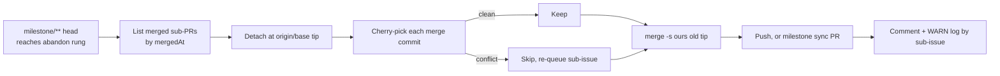

## Summary

A conflicted `milestone/**` PR now has its own abandon route. Before, the
abandon rung could only re-queue one originating issue. The new route
rebuilds the milestone branch from the base tip, replays its merged sub-PRs
in merge order, and re-queues the sub-issue of every sub-PR that will not
replay. Closes #3035.

- New `worker/deno/lib/conflict_milestone_rebuild.ts`:
  - `listMergedSubPrs` lists the PRs merged into the milestone branch,
    ordered by `mergedAt`. Sync PRs are left out, and a full 200-entry page
    fails loud rather than being treated as complete.
  - `abandonAndRebuildMilestone` cuts the rebuild detached at the
    `origin/<base>` tip and cherry-picks each sub-PR's merge commit in order.
    A sub-PR that will not replay is skipped and the replay continues. The
    old milestone tip is then merged in with `git merge -s ours`, so the
    result is a fast-forward of the milestone branch.
  - Delivery is a plain push. When the ruleset refuses it (GH013), the
    rebuild goes through the milestone sync PR instead, armed as a merge
    commit. The milestone branch is never force-pushed.
  - Each skipped sub-PR's sub-issue is re-queued through `planRequeueLabel`.
    It gets a fleet-authored restart marker naming the sub-PR, plus a
    milestone roll-back marker.
  - One comment on the milestone PR, and the WARN log line, list every
    replayed and every skipped sub-PR by sub-issue number.
  - No `needs-human` is applied on any outcome, and there is no restart cap.
- `pr_merge_conflict_processor.ts`: `runAbandonRestart` sends
  `milestone/**` heads (`isMilestoneHead`) to the new route through an
  injectable `milestoneRebuildFn` seam. Every other head keeps
  `abandonAndRestart`. Both callers handle the new `milestone-rebuilt`
  outcome.
- `conflict_abandon_restart.ts`:
  - exports `IssueSnapshot` and `fetchIssueSnapshot` so the new module can
    reuse them;
  - adds four named failure steps: `milestone-sub-prs`, `milestone-rebuild`,
    `milestone-push`, `sub-issue-requeue`.
- `docs/workflows/merge-conflicts.md` documents the route and adds a
  flowchart and a module-index entry.

**Known gaps, found by both reviewers in this run and not fixed here:**

- **Two routing tests break the type check.** Both new `runAbandonRestart`
  tests in `worker/deno/tests/pr_merge_conflict_processor_test.ts` pass their
  overrides as the `captured` argument of `makeProcessorDeps`. `deno check`
  fails with 4 errors at `:3206` and `:3238`, and `deno lint` flags the unused
  `makeEmptyCaptured`.
- **The new module is in no sweep slice.**
  `worker/deno/lib/conflict_milestone_rebuild.ts` is missing from
  `docs/audits/lib-sweep-coverage.json`, so `check:manifests` fails.
- **Production never reaches the route.** `processMergeConflict` still stands
  down on `milestone/**` heads before it reaches any rung (Issue #1772).

## Spec

### Intent and Rationale

- A milestone PR's head holds the merged work of many sub-PRs. Closing it
  and re-queuing one issue would lose all the others, and no single issue
  stands for the whole branch. So the thing to redo is the branch.

### Essential Design Decisions

- **Replay in merge order**, not by PR number. A cherry-pick can depend on an
  earlier one, so the replay follows the order the history was actually made
  in.
- **`git merge -s ours` of the old tip.** It makes the rebuild a descendant of
  the old tip, so it can be delivered without a force-push.
- **Sync PR as the gated path.** When the ruleset refuses the plain push, the
  existing milestone sync PR (merge commit) is the route the ruleset allows.

### Undiscoverable Facts

- The merge-conflict pass still stands down on `milestone/**` heads before it
  spends an attempt (Issue #1772). This route is what the rung does once a
  milestone head reaches it.

## Evidence

Backend-only change; no UI to screenshot. Targeted test run, as reported by
the spec reviewer: 152 passed, 2 failed (the two routing tests named above);
the full suite was not run.

**Docs sweep**: grepped for `abandonAndRestart`, `isMilestoneHead`,
`abandon-and-redo`, "milestone redo"; updated
`docs/workflows/merge-conflicts.md`. `README.md:560` was not updated (see
Standards Review).

## Acceptance Criteria

<!-- vibe-spec-review inputs="diff+issue-body" -->

- **met** — A test with 3 merged sub-PRs, one of which conflicts on replay, asserts: the rebuilt branch starts at the base tip; the 2 clean sub-PRs are replayed in merge order; the conflicting sub-PR's sub-issue is re-queued with a restart marker; the log names that sub-issue — evidence: `worker/deno/tests/conflict_abandon_restart_test.ts::abandonAndRebuildMilestone - replays sub-PRs in merge order, skips and re-queues the rest` — reviewer: met — note: the assertions are weak in two places. The fake answers any `rev-parse --verify` with the base sha, and the log check matches `"#2"` rather than `"sub-issue #2"`.
- **met** — No `needs-human` is applied on any outcome — evidence: `worker/deno/tests/conflict_abandon_restart_test.ts::abandonAndRebuildMilestone - replays sub-PRs in merge order, skips and re-queues the rest` (no gh/git call mentions `needs-human`), `::abandonAndRebuildMilestone - a non-gated push failure fails loud, no sub-issue comments`; the label is never used in `worker/deno/lib/conflict_milestone_rebuild.ts` — reviewer: met
- **partial** — A non-milestone head still takes the existing single-issue route — evidence: `worker/deno/lib/pr_merge_conflict_processor.ts:1913`, `worker/deno/tests/pr_merge_conflict_processor_test.ts::runAbandonRestart - a non-milestone head calls abandonRestartFn, never milestoneRebuildFn` — reviewer: partial — reason: the routing code is correct, but the test that should prove it fails type-check and run. Its overrides are passed as the `captured` argument of `makeProcessorDeps`, so the seams are never injected. The fix is `makeProcessorDeps(makeEmptyCaptured(), {...})`.
- **missing** — Tests and quality checks pass — evidence: `deno check` fails with 4 errors at `worker/deno/tests/pr_merge_conflict_processor_test.ts:3206` and `:3238`; `deno lint` reports unused `makeEmptyCaptured` at `:3159`; with `--no-check`, the targeted run is 152 passed and 2 failed; `check:manifests` fails because `worker/deno/lib/conflict_milestone_rebuild.ts` is in no slice of `docs/audits/lib-sweep-coverage.json` — reviewer: missing — reason: the two routing tests and the sweep-ledger entry must be fixed before the gate can pass.
- **unrequested** — `docs/workflows/merge-conflicts.md` section, flowchart and module-index entry — reviewer: unrequested — reason: a code change owes a docs change.
- **unrequested** — `IssueSnapshot` / `fetchIssueSnapshot` exported, four new `AbandonStep` names, `runAbandonRestart` exported, `milestoneRebuildFn` seam, and `milestone-rebuilt` handling in both callers — reviewer: unrequested — reason: plumbing the routing and named failures need.
- **unrequested** — A milestone roll-back marker on re-queued sub-issues — reviewer: unrequested — reason: stops the merged-PR closers from closing the re-queued sub-issue again.
- **unrequested** — Hardening: sync PRs are excluded, a full 200-entry listing fails loud, an empty listing fails loud, refs are checked with `assertSafeGitRef`, and fetch/push go through the `git_ref_args` builders — reviewer: unrequested — reason: fail loud rather than rebuild an incomplete branch, and keep git arguments safe.
- **unrequested** — The route lives in a new module, `conflict_milestone_rebuild.ts`, rather than inside `conflict_abandon_restart.ts`, and its ruleset-refused delivery goes through the milestone sync PR rather than a `milestone-fix/**` PR — reviewer: unrequested — reason: the issue's "e.g." allowed either. The sync PR is the existing gated path, but the reviewer notes it departs from the `milestone-fix/**` route (#2999) that #3013 names.

## Standards Review

<!-- vibe-standards-review inputs="diff+CODING-STANDARDS.md" -->

- **violation** — Quality gates: the new module is claimed by no sweep slice — evidence: `docs/audits/lib-sweep-coverage.json:198` (`worker/deno/tests/lib_sweep_coverage_test.ts:473` fails) — reason: stands; this run was limited to the summary file. Blocking: add the entry next to `conflict_redo_branch.ts`.
- **violation** — Quality gates / TDD: both new `runAbandonRestart` routing tests pass overrides as the `captured` argument, so type-check, lint and the tests themselves fail — evidence: `worker/deno/tests/pr_merge_conflict_processor_test.ts:3206`, `:3238`, `:3159` — reason: stands; this run was limited to the summary file. Blocking: use `makeProcessorDeps(makeEmptyCaptured(), {...})`.
- **violation** — Design honesty: the route is unreachable in production, because `processMergeConflict` stands down on `milestone/**` heads first, and the scan's spent-budget path calls `abandonAndRestart` directly — evidence: `worker/deno/lib/pr_merge_conflict_processor.ts:887`, `worker/deno/lib/pr_merge_conflict_scan.ts:1393` — reason: stands; the docs state it openly, and the issue asked only for the `runAbandonRestart` routing (medium, not blocking).
- **violation** — Correctness: a sub-issue whose redo PR already replayed cleanly can be re-queued again on a later rebuild, because skipped entries are not cross-checked against replayed ones — evidence: `worker/deno/lib/conflict_milestone_rebuild.ts:607` — reason: stands (medium, not blocking).
- **violation** — Fail loud / no data loss: the first re-queue failure after the push returns early, so later skipped sub-issues are never re-queued and the milestone PR comment is never posted — evidence: `worker/deno/lib/conflict_milestone_rebuild.ts:614` — reason: stands; collect failures per issue, or re-queue before delivery (medium, not blocking).
- **violation** — A code change owes a docs change: a rebuild drops the skipped sub-PRs' work but files no `merge-fallback` issue, contrary to "Every fallback is flagged" — evidence: `DESIGN-PRINCIPLES.md:304`, `docs/workflows/merge-conflicts.md:644` — reason: stands; either flag the fallback or document the exception (medium, not blocking).
- **violation** — Fail loud: `listMergedSubPrs` silently skips malformed rows, and an unparseable `mergedAt` sorts first — evidence: `worker/deno/lib/conflict_milestone_rebuild.ts:145`, `:179` — reason: stands (low).
- **violation** — Test coverage: the `-m 1` merge-commit pick path is untested, the `"#2"` log assertion would also match `#20`, and no test covers a sub-issue that keeps its pickup label — evidence: `worker/deno/lib/conflict_milestone_rebuild.ts:516` — reason: stands (low).
- **violation** — DRY: the two `milestone-rebuilt` handlers duplicate the `requeuedText` building, and each outcome is logged twice (WARN in the module, INFO in the processor) — evidence: `worker/deno/lib/pr_merge_conflict_processor.ts:1975`, `:2452` — reason: stands (low).
- **violation** — A code change owes a docs change: the README still says the worker always closes the PR and re-queues its originating issue, with no milestone exception — evidence: `README.md:560` — reason: stands (low).
- **violation** — Focused modules: the milestone tests live in `conflict_abandon_restart_test.ts`, and `runAbandonRestart` is exported only for tests — evidence: `worker/deno/tests/conflict_abandon_restart_test.ts` — reason: stands; the issue named that test file (low).
- **clean** — Australian English; git ref and argument-injection safety (`git_ref_args` builders, sha pattern, `refs/` prefixes); no force-push of the milestone branch; restart and roll-back markers fleet-authored and sanitised; no `needs-human` and no cap; failures returned with step names at matching log levels; `deno fmt` clean; merge-conflicts docs updated; `SIMPLE-ON-PURPOSE` correctly marked.

## Test Plan

- `worker/deno/tests/conflict_abandon_restart_test.ts`: 3 sub-PRs with one conflict (base-tip start, merge order, re-queue, log); ruleset-refused push through the sync PR; non-gated push failure fails loud; empty listing fails loud; `listMergedSubPrs` sorting, sync exclusion and the truncation throw; a failing reset after a failed pick; a non-milestone head refused.
- `worker/deno/tests/pr_merge_conflict_processor_test.ts`: `runAbandonRestart` routing for milestone and non-milestone heads. Both tests currently fail; see Acceptance Criteria.

🤖 Generated with [Claude Code](https://claude.com/claude-code)
