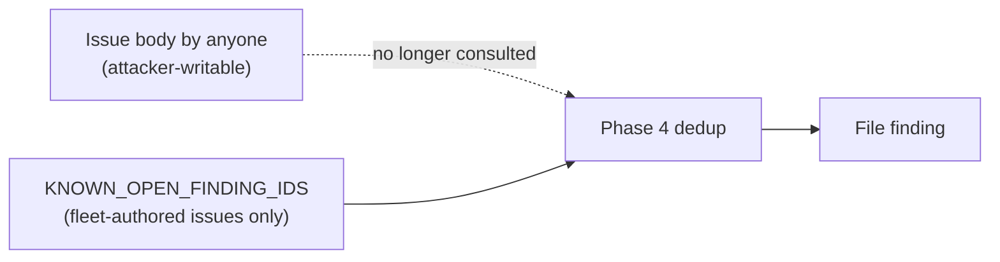

# PR Summary — Issue #3045

## Summary

Closes #3045.

Each idle-task prompt's Phase 4 "for each surviving finding" step used to
re-check dedup against a live `gh issue list ... --json number,body` call. It
skipped a finding whenever any open issue's body held its
`<!-- finding-id: … -->` marker. Anyone who can open an issue controls that
body, so a planted marker could suppress a real finding, including a security
finding. The step now dedups only on `{{KNOWN_OPEN_FINDING_IDS}}`. The worker
builds that list in code from open issues the fleet account authored.



- [x] Regression test that fails on base and passes after the fix
- [x] Removed the live re-check from all 14 idle-task prompts
- [x] Docs: `docs/SECURITY-SCAN.md` dedup section
- [x] Fixed a gap this removal exposed: `security_scan_template.ts::runTask`
      and `security_tree_sweep.ts`'s `runWorkerScanFn` always passed
      `knownOpenFindingIds: []` to the scanner, so with the live re-check
      gone `security_scan` had **no** finding-id dedup at all. Both now call
      `listKnownOpenFindingIds(..., "SEC-", ...)`, the same call the 12
      best-practices-family templates already make.
- [x] Reworded the dedup step in all 14 prompts from "the only dedup
      source" to "the only **finding-id** dedup source" — the blanket
      phrasing read as overriding the separate, still-active
      `{{OPEN_ISSUE_TITLES}}` semantic check. Also fixed six Phase 4 intros
      (`dead_code`, `deprecated_api`, `duplicated_knowledge`, `orphan_deps`,
      `format_drift`, `best_practices`) that still described "the dedup
      lookup(s)" as part of the `gh` calls the agent issues — that call no
      longer exists; the dedup is now a comparison against the lists above.

## Spec

### Intent and Rationale

The author of an issue is trustworthy. Its body is not. Dedup must key on
what the fleet itself filed.

### Essential Design Decisions

- The live re-check was dropped instead of being given an author filter. The
  known-open list already holds that author filter in code, so a second,
  prompt-side copy would only duplicate it and could drift.
- `security_scan` no longer lists Phase 4 dedup among its permitted
  `gh issue list` uses.
- The new prompt wording names no issue number: cross-repo-filed prompt
  bodies must not carry a bare `#NNN`, because it would mislink in the target
  repo.

### Undiscoverable Facts

None.

## Evidence

- **Regression test:**
  `worker/deno/tests/idle_task_live_recheck_dedup_3045_test.ts::idle-task prompts dedup only on the fleet-filtered known-open list (Issue #3045)`.
  It loads each of the 14 idle-task prompts and asserts three things for
  each: there is no unfiltered `--json number,body` lookup, there is no
  "Re-check the live open-issue list" step, and the prompt states that the
  known-open list is "the only finding-id dedup source".
- **security_scan finding-id dedup gap (found on review):**
  `worker/deno/tests/security_scan_template_summary_test.ts` adds two
  `runTask` tests — a fleet-authored `SEC-` marker reaches the scanner's
  `knownOpenFindingIds`, an outsider-authored one does not. Both fail
  against the unfixed `security_scan_template.ts` (confirmed by stashing
  just that file and re-running: `AssertionError` expected `["SEC-abc123"]`,
  got `[]`), and pass after wiring `runTask` to call
  `listKnownOpenFindingIds(opts.repo, "security", ghCommandFn, "SEC-",
  deps)` before invoking the scanner. `security_tree_sweep.ts`'s
  `runWorkerScanFn` got the same fix. `runWorkerScan` is covered by
  `security_tree_sweep_worker_scan_3045_test.ts`: a fleet-authored `SEC-`
  id reaches the scanner, and an outsider-authored one does not. The
  sweep suite still stubs `runWorkerScanFn`, so it does not cover this
  call. `run-security-scan` unions `--known-open-finding-ids` with the
  same list, covered by `run_security_scan_known_open_3045_test.ts`.
- **Fails before:** the regression test fails against the unfixed code. With
  `prompts/` restored from `main`, it reports:

  ```text
  error: AssertionError: best_practices must not look up issue bodies without filtering by author
  FAILED | 0 passed | 1 failed
  ```

- **Passes after:** after the fix, `deno task test:unit
  tests/idle_task_live_recheck_dedup_3045_test.ts` gives `ok | 1 passed |
  0 failed`.
- **Trigger closed, no trivial bypass:** the original attack plants
  `<!-- finding-id: X -->` in an issue someone else filed. The prompts no
  longer read any issue body for dedup. `grep -rn "number,body\|in:body"
  prompts/` finds no remaining unfiltered lookup. The only dedup source is
  `{{KNOWN_OPEN_FINDING_IDS}}`, which the worker builds in code from
  fleet-authored issues, so the prompt gives the agent no path that consults
  an issue body written by someone else.
- **Docs sweep:** grep: `KNOWN_OPEN_FINDING_IDS`, `live dedup`,
  `gh issue list`; updated: `docs/SECURITY-SCAN.md`,
  `docs/GITHUB-ACTIONS-AUDIT-SCAN.md`,
  `docs/SUPPLY-CHAIN-READINESS-SCAN.md`, `docs/TEST-AUDIT-SCAN.md`.

## Reproduction

- **Symptom:** an idle-task prompt told the agent to skip any finding whose
  `<!-- finding-id: … -->` marker appeared in any open issue body, whoever
  wrote it, so a planted marker suppressed a real finding.
- **Status:** verified. The regression test reproduces the unfiltered
  re-check on `main`'s prompts and passes on this branch.
- **Regression test:**
  `worker/deno/tests/idle_task_live_recheck_dedup_3045_test.ts::idle-task prompts dedup only on the fleet-filtered known-open list (Issue #3045)`.

## Test Plan

- [x] `deno task test:unit tests/idle_task_live_recheck_dedup_3045_test.ts`
      passes; it fails with `main`'s `prompts/`.
- [x] `./quality.sh` passes.

🤖 Generated with [Claude Code](https://claude.com/claude-code)
