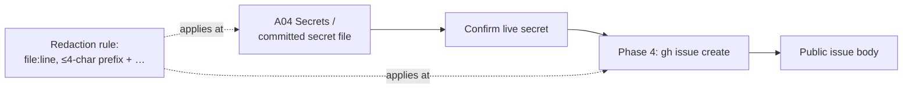

# PR Summary — Issue #3047

## Summary

Closes #3047

The `security_scan` prompt asked the model to find and confirm **live**
secrets, and to describe "the concrete input and path that fires it", but
nothing told it to redact the value. The model files each finding itself with
`gh issue create`; the gh guard shim's `redactGhBodyArgs` pass
(`gh_guard_cli.ts`) backstops that title and body, but only for recognised
credential shapes, so a password or unrecognised key could still be
published verbatim in a public issue. The prompt now carries an explicit
redaction rule at all three points where a secret reaches an issue.

- [x] Regression test written first and confirmed failing against the unchanged prompt
- [x] Redaction rule added to the A04 **Secrets** bullet
- [x] Redaction rule added to the **Committed secret files** bullet
- [x] Redaction paragraph added to the Phase 4 filing step; `## Trigger` placeholder marked "secret values redacted"
- [x] `docs/SECURITY-SCAN.md` documents the rule
- [x] `./quality.sh` passes

## Spec

### Intent and Rationale

A security scan must not become the leak it reports. A secret quoted in a
filed issue is exposed to everyone who can read the repo's issues, and it
lingers in issue history and notification emails after the source file is
fixed.

### Essential Design Decisions

- **The prompt instruction is the primary control.** The model runs
  `gh issue create` itself; the gh guard shim's `redactGhBodyArgs` pass
  (`worker/deno/lib/gh_guard_cli.ts`) backstops the title and body of every
  agent `gh` call, but it is shape-based — it masks recognised credential
  formats (API keys, tokens) and not an arbitrary password or an
  unrecognised key — so the Phase 4 instruction is still load-bearing rather
  than redundant. The SARIF builder's separate `redactSecrets()` pass only
  covers what is published to code scanning.
- **Cite by `file:line`, with at most a four-character prefix plus `…`.** A
  reviewer can still recognise the credential type (`AKIA…`, `ghp_…`)
  without the value being usable.
- **The rule is stated at each of the three points.** The detection classes
  and the filing step are far apart in a long prompt, and the filing step is
  where the body is written.

### Undiscoverable Facts

- Prompt text is filed cross-repo, so it carries no bare issue references.
  The issue number appears only in the test and in the docs.

## Evidence

- **Regression test:**
  `worker/deno/tests/security_scan_secret_redaction_3047_test.ts::security_scan prompt tells the model to redact secret values in filed issue bodies (Issue #3047)`
- **Fails before the fix.** Run against the unchanged prompt, it fails with
  `FAILED | 0 passed | 1 failed`. The assertion message is: "the A04
  **Secrets** bullet must tell the model never to quote a secret's live
  value…".
- **Passes after the fix:** `ok | 19 passed | 0 failed`, covering this test,
  `security_scan_house_vocabulary_test.ts` and
  `idle_task_cross_repo_body_refs_test.ts`.
- **`check:manifests`:** `ok | 687 passed | 0 failed | 1 ignored`.
- **Original trigger closed, no trivial bypass.** The trigger was a
  confirmed live secret being described in the filed body. The test checks
  three scoped slices of the loaded prompt: the A04 Secrets bullet, the
  Committed secret files bullet, and the Phase 4 filing step. Each must
  carry both "never its value" and the four-character-prefix-plus-`…`
  convention. Dropping the rule from any one of the three fails the test.
  The Phase 4 text explicitly covers the title, the body, comments, and the
  `## Trigger` and `## Exploit sketch` sections.
- **Docs sweep:** searched `docs/` and `README.md` for the `security_scan`
  body shape and for secret-handling prose. `docs/SECURITY-SCAN.md` →
  "Reading a filed finding issue" now documents the rule. No other surface
  describes the Phase 4 body contents.

## Test Plan

- `deno task test:unit tests/security_scan_secret_redaction_3047_test.ts tests/security_scan_house_vocabulary_test.ts tests/idle_task_cross_repo_body_refs_test.ts`
- `deno task check:manifests`
- `./quality.sh` → `Result: PASSED (with skipped checks)`

🤖 Generated with [Claude Code](https://claude.com/claude-code)
