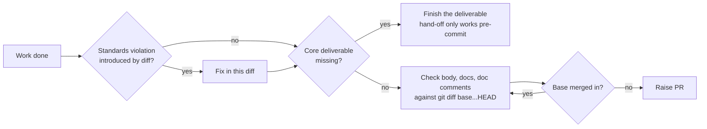

## Summary

Adds the rules from issue #3058's four proposals that Issue #3015 had not
already covered. The issue prompt and `CODING-STANDARDS.md` now say:

- every claim in a doc or doc comment that the diff adds or edits must match
  the head code;
- every claim is checked again after any merge of the base branch into the
  branch;
- a Standards violation the diff introduced is fixed before the PR is raised,
  never listed as standing;
- a test cited as evidence must have run on the final head;
- a coverage claim names the branches its tests actually exercise;
- a PR is not raised over a missing core deliverable.

Closes #3058.

## Spec

### Intent and Rationale

- Six fleet PRs claimed things the final diff did not contain. Issue #3015 had
  already tied the PR summary to `git diff <base>...HEAD`. It did not cover
  docs or doc comments the diff edited (VibeCoder#3054), standing violations
  (VibeCoder#3049, #3054), cited tests that were never run (GRQ#5135), or
  overstated coverage claims (GRQ-AutoTrader#2185). This change adds those
  rules beside the #3015 wording instead of rewriting it.

### Essential Design Decisions

- The prompt says plainly which new rules no gate parses. The paragraphs they
  sit beside describe gate-enforced rules, so claiming the gate checks them
  would itself be a false claim.
- No new Markdown headings, because `coding_guidelines_layers_2574_test.ts`
  pins the set of headings.

### Undiscoverable Facts

- The issue asks for edits to `prompts/pr/prompt.md`. That file does not
  exist; the PR-body guidance lives in `prompts/issue/prompt.md`, so the edits
  went there.
- Proposal 3 says "do not claim the issue closes". It was not taken literally:
  a PR without a closing keyword loops forever (Issue #520, see
  `worker/deno/lib/degraded_delivery.ts`). Instead, a missing core deliverable
  means finishing the work. In an issue run, the planning marker and the
  blocked-outcome deferral are acted on in `handle_no_changes_phase.ts`, and
  that phase runs only when `execute_phase.ts` finds no commits in
  `git log <base>..HEAD` and no uncommitted change. `detectBlockedOutcome`
  also serves the CI-fix base-branch deferral in `pr_ci_processor.ts`, so the
  no-changes phase is not its only caller. An unmet lesser criterion is named
  beside the keyword.

## Evidence

Prompt and docs change only (no UI, no runtime code).
`worker/deno/tests/pr_claims_verified_3058_test.ts` loads the rendered issue
prompt and `CODING-STANDARDS.md` and checks that each new rule is present,
including the change-detection wording `git log <base>..HEAD` and
`git diff --stat HEAD`.
`./quality.sh` passed after the final edit; the config-integration stage was
skipped by the gate.

**Docs sweep** — grep: `git diff <base>...HEAD`, `named test must exist`,
"blocking self-review finding"; updated: `CODING-STANDARDS.md`,
`docs/USAGE.md`, `docs/workflows/issue-processing.md`.

**Docs sweep (review round)** — grep: `must match the head code and appear`,
"every doc the diff adds or edits", `finish the work or hand it off`,
"missing core deliverable"; updated: `prompts/issue/prompt.md`,
`docs/USAGE.md`, `CODING-STANDARDS.md`.

## Test Plan

- Added `worker/deno/tests/pr_claims_verified_3058_test.ts` (4 tests).
- Ran `deno task test:unit tests/pr_claims_verified_3058_test.ts tests/pr_body_matches_final_diff_3015_test.ts tests/coding_guidelines_layers_2574_test.ts`:
  21 passed.
- `./quality.sh` passed.

🤖 Generated with [Claude Code](https://claude.com/claude-code)
