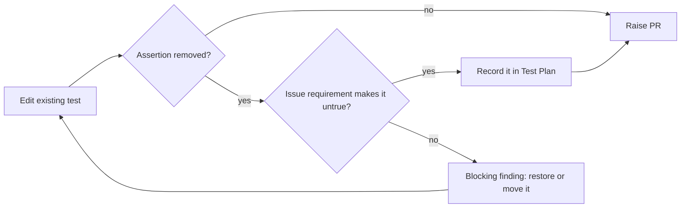

## Summary

Adds a **"Change only what the issue changes"** rule to `CODING-STANDARDS.md` (TDD rule 3) and to the
issue prompt, in two places: Instructions step 2 and the Test Plan self-review item. When an issue
changes part of what an existing test expects, the run edits that expectation and keeps every other
assertion. Before raising the PR, it lists each assertion the diff removes and names the issue
requirement that makes it untrue. An assertion removed without such a requirement is a blocking
self-review finding: restore it, or move it to another test and name that test. Closes #3061.

## Spec

### Intent and Rationale

- Two fleet PRs (GRQ-AutoTrader#1835, GRQ-AutoTrader#2210) rewrote a whole test when the issue
  changed only one expectation. Both silently dropped still-true assertions while the gate stayed green.
- Rule 3 and step 2 only cover weakening a test to pass a gate. This rule covers collateral loss
  during a deliberate edit, and puts the check before the PR is raised rather than at review.

### Essential Design Decisions

- The rule sits inside the existing rule 3 and step 2 list items, not as a new numbered rule, so
  the rest of the numbering in both documents is unchanged.
- The record of each removed assertion and its requirement goes in the PR summary's Test Plan,
  where the reviewer already looks for test changes.

### Undiscoverable Facts

- The issue confirms the gate was green both before and after each lossy rewrite. That is why the
  rule says a green gate does not prove nothing was lost.

## Evidence

Documentation and prompt change only, with nothing in a browser to check. The new section-scoped
documentation-drift test pins the rule on all three surfaces:

- `deno task test:unit tests/kept_assertions_3061_docs_test.ts tests/issue_prompt_base_branch_red_2924_test.ts tests/phantom_test_and_stub_contract_3011_test.ts tests/issue_prompt_spec_section_docs_test.ts`: 14 passed, 0 failed.
- `./quality.sh`: see the Quality gate line below.

**Docs sweep** — grep: "Do not remove, skip, or weaken", "Do not skip or weaken existing tests",
"named-but-absent test"; updated: `CODING-STANDARDS.md`, `prompts/issue/prompt.md`. The
`coding_guidelines` prompt has no weaken-tests rule (it defers to `CODING-STANDARDS.md`), so
it needed no change.

## Test Plan

- Added `worker/deno/tests/kept_assertions_3061_docs_test.ts`, a section-scoped
  documentation-drift test for the TDD section of `CODING-STANDARDS.md` and for the issue prompt's
  `Instructions` and `PR Summary File` sections.
- This PR edits no existing test, so it removes no assertions.

🤖 Generated with [Claude Code](https://claude.com/claude-code)
