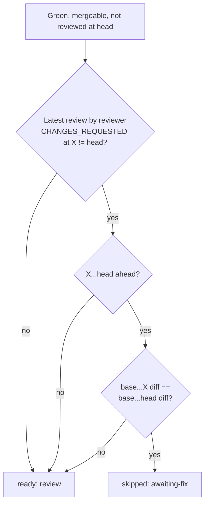

## Summary

The `review-fleet-prs` gate no longer re-reviews a PR it sent back when the
only commits since then are base-branch merges that leave the PR's own diff
unchanged. It now counts such a PR as `awaiting-fix` until the fleet pushes
its fix, which saves a 55–90k-token xhigh review that could only repeat "still
not fixed". Closes #3063.

## Spec

### Intent and Rationale

- After a send-back, an "Update branch" or a `Merge branch 'Develop'` moved the
  head, so `reviewedAtHead` reported the PR ready, even though the earlier
  findings were bound to still stand
- The gate compares the PR's merge-base diff (`compare/{base}...{X}` against
  `compare/{base}...{head}`) rather than trusting commit messages. A merge that
  resolved a conflict therefore still gets a fresh review

### Essential Design Decisions

- `awaiting-fix` needs two things: the reviewer's latest counted review is
  `CHANGES_REQUESTED` at a commit `X` that is not the head; `X...head` is
  `ahead`; and both merge-base diffs hold the same files, statuses and
  patches. Hunk-header line numbers are ignored in the patch comparison. An
  earlier per-commit "two or more parents" check was dropped (PR #3079
  review): `compare/{X}...{head}` also lists the single-parent base-branch
  commits a merge brought in, not just the merge commit, so the check
  rejected every real base-branch merge. The merge-base diff equality already
  proves the PR's own change is unchanged; any fix or conflict-resolution
  edit changes that diff
- If any check cannot be confirmed (a compare error such as a 404 after a
  force-push, a modified binary or any other file with no patch and no
  matching added-blob sha, a truncated list of 250+ commits or 300+ files),
  `ownDiffUnchanged` logs one line to stderr and returns `false`. An added
  binary is unchanged when both merge-base diffs list it as `added` with the
  same blob sha (PR #3079 review). The PR then gets a fresh review when the
  check fails, as it did before, and the pass is never blocked
- A latest review in state `DISMISSED` triggers `awaiting-fix` only when the
  skill's own `log.jsonl` has a record for that exact head commit with
  `outcome === "changes_requested"` (PR #3079 review). GitHub's `DISMISSED`
  state alone cannot tell a stale-dismissed approval from a change request the
  worker claimed — and so dismissed — before pushing the fix; the worker does
  exactly that dismissal as soon as it claims the feedback
  (`claim_pr_comment.ts`), well before the fix lands, so without this the
  gate's own fix only delayed the repeat review until the claim rather than
  preventing it (GRQ-AutoTrader #2218). A dismissed approval, or a PR with no
  log record, still gets a fresh review
- `skipReason` is now async and takes the checker as a parameter. It calls the
  checker only after every cheap check has passed. The three compare calls
  repeat on each pass while a PR is awaiting its fix; this is marked
  `SIMPLE-ON-PURPOSE`

### Undiscoverable Facts

- The examples in the issue (GRQ-AutoTrader #2213, #2210, #2218) each had a
  single `Merge branch 'Develop'` commit between the send-back and the repeated
  review

## Evidence

Backend/CLI change only (a gate script under `.claude/skills/`). It is covered
by unit tests that call the real `skipReason`, `sentBackAt` and
`ownDiffUnchanged` functions against a fake `gh` returning GitHub-shaped
compare JSON.

`./quality.sh` passed (the config-integration check was skipped, as usual on
this host).

**Docs sweep**: searched for `already-reviewed`, `ci-cancelled`, "A new push
gets a fresh review" and `review-fleet-prs`. Updated
`.claude/skills/review-fleet-prs/SKILL.md` (rule 8). The other hits
(`docs/workflows/ci-fix.md`, `docs/CONFIGURATION.md`, `docs/SETUP.md`,
`docs/THREAT-MODEL.md`) do not describe the re-review rule.

## Acceptance Criteria

<!-- vibe-spec-review inputs="diff+issue-body" -->

- **met** — Add an `awaiting-fix` skip reason — evidence: `.claude/skills/review-fleet-prs/gate.ts` (`Skip`, `skipReason`) — reviewer: met
- **met** — Applies when the latest review is CHANGES_REQUESTED at X and the merge-base diff is unchanged — evidence: `worker/deno/tests/review_fleet_prs_gate_2675_test.ts::skipReason: a merge-only head after a send-back is awaiting-fix (Issue #3063)` — reviewer: met
- **met** — A conflict-resolving merge or any non-merge commit that changes the PR's own diff still gets a fresh review — evidence: `worker/deno/tests/review_fleet_prs_gate_2675_test.ts::skipReason: a merge with conflict-resolution edits is a fresh review (Issue #3063)` and `::skipReason: a fix commit changes the merge-base diff and gets a fresh review (Issue #3079)` — reviewer: met
- **met** — Rule 8 reads "a new push that changes the PR's own diff" — evidence: `.claude/skills/review-fleet-prs/SKILL.md` rule 8 — reviewer: met
- **met** — Unit tests for `skipReason`: merge-only → `awaiting-fix`; conflict edits → null; fix commit → null; approved PR moved by a base merge unaffected — evidence: `worker/deno/tests/review_fleet_prs_gate_2675_test.ts::skipReason: an approved PR whose head moved by a base merge never calls the checker (Issue #3063)` and the three tests above — reviewer: met
- **partial** — Later rounds' `log.jsonl` shows no repeated "not fixed" reviews, and `skipped` counts show `awaiting-fix` — evidence: `pass()` counts every `Skip` in `skipped` — reviewer: partial — reason: this can only be observed in live review rounds after merge, not from the diff
- **unrequested** — `countsAsReview()` extracted from `reviewedAtHead`, and `firstLine()` moved up the file — reviewer: unrequested — reason: lets `sentBackAt` share the counted-review rule (DRY), and defines `firstLine` before its new caller; no change in behaviour
- **unrequested** — 300-file cap on the own-diff comparison — reviewer: unrequested — reason: the compare API truncates at 300 files, so a list at the cap cannot prove the diff unchanged; the PR falls back to a fresh review

## Standards Review

<!-- vibe-standards-review inputs="diff+CODING-STANDARDS.md" -->

- **clean** — tests call real code with injected fakes and no wall-clock waits; every error path of `ownDiffUnchanged` is tested; `SIMPLE-ON-PURPOSE` marker is in the required form; the catch block logs with context and does not hide the error; the docs change ships in the same diff; Australian English throughout. Optional notes (an inline sort comparator, the moved `firstLine`) were not acted on

## Test Plan

- `worker/deno/tests/review_fleet_prs_gate_2675_test.ts`: existing
  `skipReason` tests now `await` the async function. New tests:
  - `sentBackAt: the latest counted review decides the verdict`
  - four `skipReason … (Issue #3063)` cases
  - `ownDiffUnchanged returns false rather than throwing (Issue #3063)`
- PR #3079 review fix (round 1): the merge-only fixture in `skipReason: a
  merge-only head after a send-back is awaiting-fix` now includes a
  single-parent base-branch commit alongside the merge commit, matching
  GitHub's real `compare` response; `skipReason: a fix commit is a fresh
  review and skips the merge-base compares` is renamed to `... changes the
  merge-base diff and gets a fresh review (Issue #3079)` and now asserts the
  merge-base compares are called and differ
- PR #3079 review fix (round 2): `sentBackAt` and `skipReason` take a
  `wasChangeRequest`/`wasChangeRequestSince` lookup, so a `DISMISSED` latest
  review counts as a send-back when the skill's own log recorded
  `changes_requested` at that head — new `wasChangeRequestAt` in
  `review_log.ts`, covered by its own test in
  `review_fleet_prs_log_2678_test.ts`. New/updated tests in
  `review_fleet_prs_gate_2675_test.ts`:
  - `sentBackAt`: a claimed (logged) change request behind a `DISMISSED`
    review now returns the commit; a dismissed approval still returns `null`
  - `skipReason: a claimed (DISMISSED, logged changes_requested) review
    followed by a merge-only head is awaiting-fix; a DISMISSED approval is not
    (Issue #3079)`
  - `ownDiffUnchanged returns false rather than throwing`: the "diverged" and
    "truncated" cases now supply identical merge-base file lists on both
    sides of the compare, so each stays green only because its own guard
    fires — confirmed by removing each guard in turn and seeing the test go
    red
  - a new case covers the file-count guard (`gate.ts`'s `a.length !==
    b.length`): a merge-base diff that adds one file (e.g. a test) past what
    the pre-send-back diff had, with the shared file's patch identical,
    still returns `false`
- Ran `deno test` on `review_fleet_prs_gate_2675_test.ts` and
  `review_fleet_prs_log_2678_test.ts` (29 passed)

🤖 Generated with [Claude Code](https://claude.com/claude-code)
