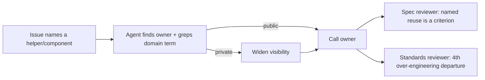

## Summary

Fleet PRs copied logic by hand when an in-repo helper already owned it:
GRQ-AutoTrader#2218 copied `buy_order`'s comparator, and #2210 rebuilt the star
rating instead of using `StarRating`. This PR makes the agent find the existing
owner and call it, and makes both pre-PR reviewers flag a hand-made copy.
Closes #3084.

- `prompts/issue/prompt.md` — new step 1 sub-bullet **Call the existing owner
  — never copy it**. Before writing logic the product already has, the agent
  opens every component or function the issue names and greps for the domain
  term. If the owner is private, it widens the owner's visibility instead of
  copying it. A component the issue says to reuse is a stated requirement. The
  Spec reviewer brief in the same file now treats a named reuse as a criterion.
- `prompts/pr_feedback/prompt.md` — the same rule. A finding that flags a
  hand-made copy is fixed by replacing the copy with a call.
- `CODING-STANDARDS.md` **Avoid over-engineering** — adds a fourth departure
  for reviewers to flag: an in-repo helper, component or policy re-implemented
  by hand instead of called. The Standards reviewer reads this file.
- `worker/deno/lib/issue_executor_agents.ts` — the `spec-reviewer` agent's own
  system prompt carries the same named-reuse sentence.

## Spec

### Intent and Rationale

- DRY and "reuse what the codebase has" were already standards. What was
  missing was a step telling the agent to look for the owner, and a reviewer
  checklist item that names an in-repo copy. Both are added here.

### Essential Design Decisions

- Widening a private owner's visibility is stated to be part of the change, not
  the adjacent refactor that **Change Scope** forbids. Without this, the scope
  rule would push the agent back towards copying.
- The rule goes in step 1 as a sub-bullet, so steps 2–6 keep their numbers.
  Other text refers to them by number ("step 3").

### Undiscoverable Facts

- Both PRs still had the copy after the fleet reviewer's first send-back. That
  is why `pr_feedback` says to replace the copy, not patch it.

## Evidence

The change is to prompts and docs only, so there is no UI. It is covered by
`worker/deno/tests/reuse_existing_owner_3084_test.ts` (5 tests, passing). I
checked that one of its assertions can fail: with the CODING-STANDARDS.md
wording set back to "three departures", the CODING-STANDARDS test went red,
then passed again once the wording was restored. `./quality.sh` passed (config
integration skipped, as it is on every run here).

Related existing rules I checked against the new rule:

- **Change Scope** in the issue and pr_feedback prompts — the new rule says
  widening visibility is part of the change.
- The **smallest-change-first ladder**, "reuse what the codebase has", in
  `CODING-STANDARDS.md` and `prompts/coding_guidelines/prompt.md` — consistent.
- The three existing over-engineering departures — extended to four.
- The Spec reviewer's three questions — unchanged; the named-reuse sentence is
  added alongside them.

**Docs sweep** — grep: "three departures", "Avoid over-engineering", "Spec
reviewer"; updated: `docs/PROMPTS.md` (issue and pr_feedback rows),
`docs/workflows/issue-processing.md` (Spec reviewer bullet).

## Test Plan

- Added `worker/deno/tests/reuse_existing_owner_3084_test.ts`. It pins the
  issue prompt's step 1 rule, the issue prompt's Spec reviewer sentence, the
  pr_feedback rule, the CODING-STANDARDS departure and the `spec-reviewer`
  agent prompt.
- Re-ran `prompt_docs_sweep_2952_test.ts`, `issue_reviewer_agents_2575_test.ts`,
  `issue_executor_agents_test.ts` and `coding_guidelines_twin_drift_test.ts`:
  all pass. No existing assertions were removed.

🤖 Generated with [Claude Code](https://claude.com/claude-code)
