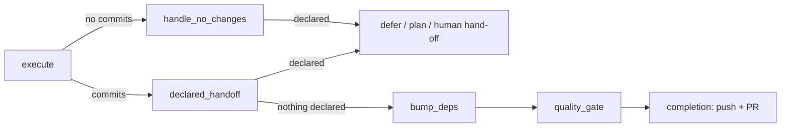

# PR Summary — Issue #3088

Closes #3088

## Summary

A run that commits work *and* declares a structured hand-off (`## Blocked:` /
`Depends on …`, a `vibe-defer-until` marker, or a `vibe-needs-planning`
request) is now honoured: the new `declared_handoff` phase defers or hands off
the issue instead of pushing the commits and raising a PR that closes it. The
free-text escape hatch is documented in the prompts as honoured only before the
first commit.

- [x] Extract the declared-outcome detection from `handle_no_changes_phase.ts`
      into a shared `handOffDeclaredOutcome`
- [x] Add the `declared_handoff` phase (Phase 3.4) after execute, before
      `bump_deps`
- [x] Add the `declared_handoff` trigger to `handOffAnalysisOnly`
- [x] Prompts: state when each hand-off is honoured
- [x] Docs: DESIGN-PRINCIPLES and `docs/workflows/issue-processing.md`
- [x] Sweep ledger: `top-up-3088` slice plus its written record
- [x] Tests: phase unit tests plus a `workOnIssue` wiring test

## Spec

### Intent and Rationale

The hand-off detectors ran only in the no-changes phase, so once the agent
had committed anything, a declared block or planning request was silently
dropped and the worker raised a PR with `Closes #N`, closing an issue the agent
had said was unfinished.

### Essential Design Decisions

- **Option (a) for structured signals.** The machine-readable markers are
  detected after a commit-producing execute phase too, and PR creation is
  skipped. The same `handOffDeclaredOutcome` serves both phases, so the
  behaviour cannot drift.
- **Option (b) for the free-text escape hatch.** Prose such as "out of scope"
  is too ambiguous to override committed work, so the prompts now say it is
  honoured only when the run has made no commit.
- **The phase itself neither pushes nor raises a PR.** The run ends with
  `early_exit`. With session resume on (the default), the execute checkpoint
  has normally already pushed the work to the `issue-<N>-…` branch
  (`execute_phase.ts` calls `checkpoints.runNow()` through
  `wip_checkpoint.ts`), and the next claim resumes from it.
- **Dropping `Closes` was rejected.** A PR without a closing keyword loops
  forever (Issue #520), so the fix stops PR creation rather than editing
  the PR body.
- **A declared signal whose guard refuses it** (a repeat deferral, a planning
  request without the anchor label) still hands off to a human through
  `handOffAnalysisOnly` with the `declared_handoff` trigger. A `## Blocked:`
  heading on a committed run defers only when its `Depends on` / `Blocked by`
  line names a dependency the worker reads as open. A closed or unreadable
  dependency does not defer, and the run raises its PR.

### Undiscoverable Facts

- Every new `worker/deno/lib` module must be claimed by a sweep slice with a
  written record (`deno task check:manifests`); hence `top-up-3088` and
  `docs/audits/security-sweep-3088-declared-handoff.md`.
- An exhausted time-deferral on a committed run hands off with the
  `declared_handoff` trigger, so the comment says the run committed code
  changes. The no-changes path still uses the `no_changes` trigger.

## Evidence

Red runs: flipping `declared` to `false` in `handOffDeclaredOutcome` turns the
phase tests red, and stubbing out the `declared_handoff` wiring in
`issue_worker.ts` turns the `workOnIssue` wiring test red (the run completes
and raises a PR).

**Docs sweep:** `DESIGN-PRINCIPLES.md`, `docs/workflows/issue-processing.md`,
`prompts/issue/prompt.md` and `prompts/coding_guidelines/prompt.md` were
updated. No `*/README.md` describes the phase list, so none changed.

## Test Plan

- `worker/deno/tests/declared_handoff_phase_3088_test.ts`
  - blocked output defers
  - planning marker with anchor hands off to planning (comment names the
    branch; outcome phase is `declared_handoff`)
  - planning marker without anchor hands off to a human
  - plain summary output continues without any writes
  - a repeat blocked deferral hands off to a human
  - a completed summary that mentions a merged dependency continues
  - a Blocked heading without a declaration line continues
  - a closed dependency does not defer a committed run
  - a planning marker inside a code fence continues
  - an exhausted time deferral names the committed hand-off
  - a dependency lookup that fails does not defer a committed run
  - a dependency with no state does not defer a committed run
  - a quoted time-deferral marker continues
  - an over-horizon defer marker hands off, no PR
  - a reasonless planning marker hands off, no PR
  - a valid time deferral names the committed branch
  - a committed deferral pushes the branch before the comment, even with
    session resume off
  - a failed push applies no deferral and names no branch
- `worker/deno/tests/issue_worker_test.ts`: "workOnIssue - a commit-producing
  run that also declares a blocked hand-off defers instead of completing
  (Issue #3088)"
- `worker/deno/tests/github_test.ts`: `parseGhIssueJson` carries `state`
  through, including `MERGED`; `getIssue` asks `gh` for `state`
- `worker/deno/tests/validation_test.ts`: `validateGhIssueJson` accepts
  `OPEN`, `CLOSED`, `MERGED` and an absent state
- `worker/deno/tests/planning_handoff_test.ts`: a marker inside a code fence
  or span is not a request; backtick-quoted identifiers inside the reason
  are kept
- `worker/deno/tests/time_deferral_test.ts`: backtick-quoted identifiers
  inside the reason are kept; a fenced or inline marker is ignored
- `worker/deno/tests/pr_claims_verified_3058_test.ts`: the issue prompt applies
  planning whether or not the branch already has commits, and a committed
  `## Blocked:` heading defers only with a `Depends on` or `Blocked by` line
  naming an issue that is still open
- The existing `handle_no_changes` suites still pass unchanged against the
  refactor.
- `./quality.sh`

## Security Self-Check

- [x] Input validation: the agent output is untrusted and is only matched by
      the existing detectors; nothing from it is executed.
- [x] Secrets: published snippets go through `redactSecrets` before the
      3000-character tail slice, and no secret files are staged.
- [x] Injection surface: no new shell, SQL or filesystem calls.
- [x] Output encoding: comments reuse the existing hand-off helpers.
- [x] Authorisation: the planning hand-off stays gated on the human-applied
      anchor label and the untrusted-image gate.
- [x] Error handling: a guard that refuses a declared signal (a repeat
      deferral, planning without the anchor) hands off to a human. A closed
      or unreadable dependency does not defer; the committed run raises its
      PR.
- [x] Dependencies: none added.
- [x] Path confinement: not applicable.
</content>
