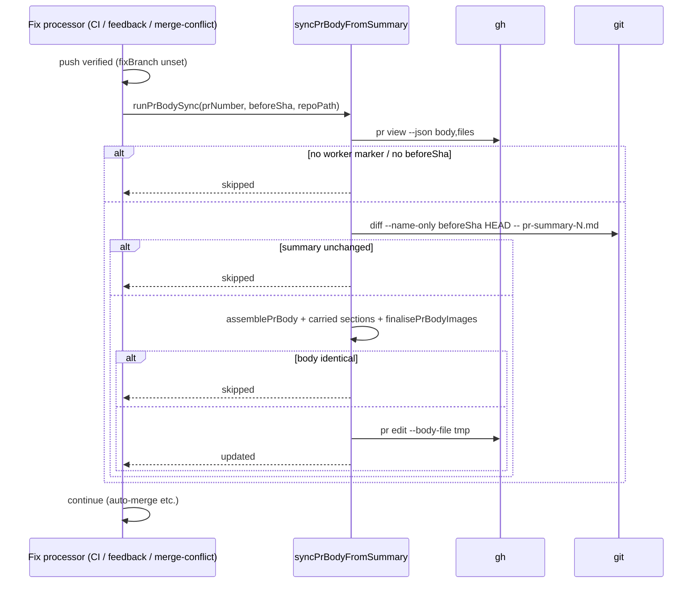

# PR Summary — Issue #3089: re-sync the PR description after a fix run refreshes its summary file

## Summary

Closes #3089

The PR description was only built from
`docs/archive/pr-summaries/pr-summary-N.md` when the PR was created.
PR-feedback, CI-fix and merge-conflict runs rewrite that file, but the
description stayed stale (live example: PR #3075 against `pr-summary-3058.md`).
After a fix run pushes a change to the summary file, the worker now rebuilds the
PR body the same way it does at creation and applies it with
`gh pr edit --body-file`.

- [x] Extract the creation-time body assembly into `lib/pr_body_sync.ts`
      (`assemblePrBody`, `finalisePrBodyImages`) and reuse it in
      `completion_phase.ts`
- [x] `syncPrBodyFromSummary`: the diff-gated, idempotent rebuild and edit
- [x] Wire `runPrBodySync` into the CI-fix, PR-feedback and merge-conflict
      processors after a verified push
- [x] Prompts and docs updated
- [x] Tests, plus the sweep-ledger registration

## Spec

### Intent / Rationale

Reviewers read the PR description, not the archived file. A description that
lags the summary misreports what the PR now does. The summary file stays the
single source of truth, and the description is regenerated from it.

### Essential Design Decisions

- **One assembly path (DRY).** Creation and re-sync both call `assemblePrBody`
  and `finalisePrBodyImages`, so they produce the same body:
  - the footer;
  - the worker idempotency marker;
  - the closing keyword (`ensureReferences`);
  - branch-evidence images pinned to the head SHA.
- **Sync only when the summary changed in this run.** The sync runs
  `git diff --name-only <beforeSha> HEAD -- 
`. With no before-push SHA
  it skips with a warning, rather than guessing.
- **Only worker-created PRs.** If the worker idempotency marker is missing from
  the live body, the sync skips, so a human-authored description is never
  overwritten.
- **Sections that exist only on the live body are kept.** The `## Milestone`
  section and the dependency-bump-skip note are copied from the current body,
  because they come from creation-time state the fix run does not have.
- **No-op when the body is identical.** No edit call is made.
- **Fails loudly but does not block.** The sync returns a `Result`, and
  `runPrBodySync` logs a failure with `logger.error`. A stale description is not
  worth failing a fix that was already pushed, but the fault is never swallowed.
- **Not run on gated-head fix branches** (`fixBranch` set). In that case the
  push goes to a separate branch, not the PR head.

### Undiscoverable Facts

- `buildMilestonePrSection` has three variants. All of them render as
  `\n## Milestone\n<one line>\n`, and the extraction regex relies on that shape.
- The merge-conflict processor's pre-merge head (`headBeforeMerge`) is the
  `beforeSha` there. The CI and feedback processors already capture `beforeSha`
  before the agent runs.

## Evidence

- Full gate: `./quality.sh` → `Result: PASSED (with skipped checks)`. The only
  skip is `config integration` (no `.config.json` in the container).
- The first gate run failed in `tests/lib_sweep_coverage_test.ts`: the new
  `lib/pr_body_sync.ts` was not claimed by any slice. It is now registered in
  `docs/audits/lib-sweep-coverage.json`.
- Revert-red: for each of the three changed call sites, I removed only that
  processor's `runPrBodySync` call. Its "syncs the PR body once after a verified
  push" test went red, and passed again once the call was restored.
- **Docs sweep:** grepped for `pr-summary`, `PR Summary File`, `gh pr edit` and
  `--body-file`:
  - updated `docs/USAGE.md` (PR Summary File section, re-sync behaviour);
  - updated `docs/INTERNALS.md` (module table row);
  - updated the three fix-run prompts (do not hand-edit the description; the
    summary file drives it);
  - no other surface describes the old behaviour.

## Related existing rules checked

- `prompts/coding_guidelines/prompt.md` (**Nor is your own pull request**) and
  `CODING-STANDARDS.md` list `gh pr edit` as allowed for the agent. No conflict:
  this change is a worker-side edit, and the new prompt lines only tell fix-run
  agents to change the summary file instead of the description.
- `prompts/pr_feedback/prompt.md`, `prompts/ci_fix/prompt.md` and
  `prompts/merge_conflict/prompt.md` already told the agent to refresh
  `pr-summary-N.md`. The new sentence agrees with that.

## Test Plan

- `worker/deno/tests/pr_body_sync_test.ts` (12 tests):
  - assembly: summary present, empty fallback, closing keyword appended;
  - sync updated;
  - sync skips: summary unchanged, no marker, no `beforeSha`, summary file
    deleted;
  - errors: `gh pr edit` throws, `git diff` fails, empty `repoPath`;
  - milestone and bump-note carry-over.
- `worker/deno/tests/pr_ci_processor_test.ts` and
  `worker/deno/tests/pr_feedback_processor_test.ts`:
  - syncs once after a verified push;
  - no sync when nothing was pushed;
  - no sync on a gated-head fix branch;
  - a failing sync does not fail the run.
- `worker/deno/tests/pr_merge_conflict_processor_test.ts`:
  - syncs once after a verified push;
  - no sync when nothing was merged;
  - a failing sync does not fail the run.

## Pre-PR Security Self-Check

- [x] Input validation: `prNumber` is validated, and an empty `repoPath` is
      rejected.
- [x] Secrets: none staged.
- [x] Injection surface: `gh` and `git` are called with argv arrays, and the
      body goes through a temp file (`--body-file`), never via the shell.
- [x] Error handling: failures are logged and returned as a `Result`, and the
      temp file is removed in `finally`.
- [x] Dependencies: none added.
