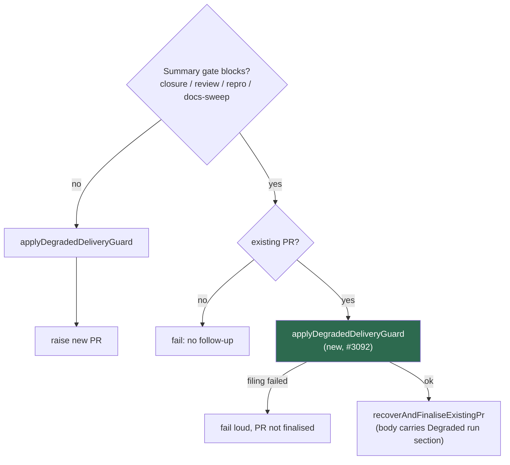

# PR Summary — Issue #3092

Closes #3092

## Summary

A degraded run blocked by the acceptance-closure, independent-review or
reproduction-status gate on a branch that **already has a PR** went straight
to `recoverAndFinaliseExistingPr`. No degraded follow-up was filed, and the
recovered PR body had no "Degraded run" section. This is the #2543 loss
the degraded guard exists to prevent. PR #3085 fixed this only for its own
docs-sweep gate.

The guard body is now one helper, `applyDegradedDeliveryGuard`. It is called
from:

- **The existing-PR branch of `reportSummaryRuleBlock`**, before recovery.
  This covers all four summary gates.
- **The happy path in `completionBody`**, before a new PR is raised.

The no-PR branch still skips the guard, because a follow-up must not promise a
PR that may never be raised (#3085 review).

- [x] Extract `applyDegradedDeliveryGuard`, keeping its logs, failure reason,
      label creation, follow-up filing and body prefix unchanged
- [x] Run it in `reportSummaryRuleBlock`'s existing-PR branch before recovery
- [x] Drop the docs-sweep-specific guard call that this replaces (#3085)
- [x] Regression tests for the review and closure gates, plus a healthy run,
      a failed filing and a no-PR case
- [x] Update `docs/workflows/issue-processing.md`

## Spec

### Intent and Rationale

Every path that finalises an existing PR for a degraded run must first file
the idle-task follow-up and prefix the body with the degraded section.
Otherwise, merging the PR closes the issue and the undelivered scope is lost.

### Essential Design Decisions

- **The first option the issue suggests.** The guard runs inside
  `reportSummaryRuleBlock`, so every current and future summary gate that
  recovers an existing PR inherits it. The alternative was to run it before
  the gates whenever `findExistingPrForBranch` finds a PR. That would add a
  second PR lookup and still leave the no-PR ordering to handle separately.
- **The no-PR branch still files nothing.** This keeps the #3085 review
  decision: no follow-up for a PR that was never raised.
- **Filing fails loud.** When the follow-up cannot be filed, the run fails and
  the PR is not finalised. The existing PR is still named on the run state, so
  the outcome is `pr` + `blocked` rather than `no_pr` over a live PR.

### Undiscoverable Facts

- PR #3085's commit notes that the closure, review and reproduction gates
  had the same latent ordering problem as its docs-sweep gate. This PR
  replaces that per-gate fix with the shared helper.

## Evidence

- **Break-check against base 40a18fcd.** The new tests were run against the
  unfixed `completion_phase.ts`: 12 passed and 3 failed. The failures were
  the review-gate test, the closure-gate test and the filing-failure test. On
  base, each finalised the PR with no follow-up.
- **Flip 1: guard call removed from `reportSummaryRuleBlock`.** 4 tests
  failed: the review-gate test, the closure-gate test, the filing-failure test
  and the #3085 docs-sweep existing-PR test.
- **Flip 2: guard also called on the no-PR branch.** 2 tests failed: the
  #3092 no-PR test and the #3085 docs-sweep no-PR test.
- **Tests and checks.** All `completion_phase*` tests pass (158).
  `deno fmt --check`, `deno lint` and `deno check` are clean. `./quality.sh`
  passes.
- **Docs sweep**: grep: reportSummaryRuleBlock, degraded-run guard,
  assessDegradedDelivery; section:
  docs/workflows/issue-processing.md#️-a-degraded-run-never-closes-an-issue-as-complete
  has its ordering paragraph rewritten. `DESIGN-PRINCIPLES.md` (summary
  shortfall after the PR) names `reportSummaryRuleBlock` but not the degraded
  guard order, and is still accurate.

## Acceptance Criteria

<!-- vibe-spec-review inputs="diff+issue-body" -->

- **met** — The degraded guard runs on every path that finalises an existing PR — evidence: `worker/deno/lib/phases/completion_phase.ts` (`reportSummaryRuleBlock` calls `applyDegradedDeliveryGuard` before `recoverAndFinaliseExistingPr`) — reviewer: met
- **met** — Completion-phase test: degraded partial run, existing PR, an earlier summary gate fails; the follow-up is filed and the recovered body carries the degraded section — evidence: `worker/deno/tests/completion_phase_degraded_delivery_test.ts::completion - an independent-review block on an existing-PR branch still runs the degraded-delivery guard first (Issue #3092)` and `::completion - a closure-gate block on an existing-PR branch still runs the degraded-delivery guard first (Issue #3092)` — reviewer: met
- **met** — A blocked no-PR branch still files no follow-up — evidence: `worker/deno/tests/completion_phase_degraded_delivery_test.ts::completion - a degraded run blocked by the independent-review gate on a branch with no PR files no follow-up` — reviewer: met
- **unrequested** — A healthy-run test and a test where filing fails — reviewer: unrequested — reason: the first shows a healthy run gets no Degraded run section; the second covers the fail-loud outcome of the new branch (#3087 guard rule)
- **unrequested** — Ordering paragraph rewritten in `docs/workflows/issue-processing.md` — reviewer: unrequested — reason: the code change changes the documented gate order

## Standards Review

<!-- vibe-standards-review inputs="diff+CODING-STANDARDS.md" -->

- **clean** — Tests call the real `completionBody` with injected fakes and no
  wall-clock waits. Every outcome of the new branch has a test that goes red
  when that outcome is flipped. Errors fail loud with context. The docs change
  ships in the same diff. Australian English throughout.
- Two optional notes were not acted on: the guard comment at the
  `completionBody` call site partly repeats the helper's JSDoc, and the docs
  paragraph is dense.

## Test Plan

New tests in `worker/deno/tests/completion_phase_degraded_delivery_test.ts`:

- an independent-review block on an existing-PR branch still runs the
  degraded-delivery guard first (Issue #3092)
- a closure-gate block on an existing-PR branch still runs the
  degraded-delivery guard first (Issue #3092)
- a healthy run blocked by the independent-review gate on an existing-PR
  branch carries no Degraded run section
- a degraded run blocked by the independent-review gate whose follow-up cannot
  be filed fails the run without finalising the PR
- a degraded run blocked by the independent-review gate on a branch with no PR
  files no follow-up

**Guards on the new path (#3087).** The new existing-PR path runs before
recovery and keeps every guard the new-PR path applies:

- **Kept:** degraded follow-up filing, with its label creation and the
  "Degraded run" body prefix (review-gate and closure-gate tests).
- **Kept:** the fail-loud failure when filing fails, so the PR is not
  finalised (filing-failure test).
- **Excluded, deliberately:** the no-PR branch skips the guard, because a
  follow-up must not promise a PR that was never raised (no-PR test and the
  #3085 no-PR test).
- **Flip evidence:** Flips 1 and 2 under Evidence.

🤖 Generated with [Claude Code](https://claude.com/claude-code)
