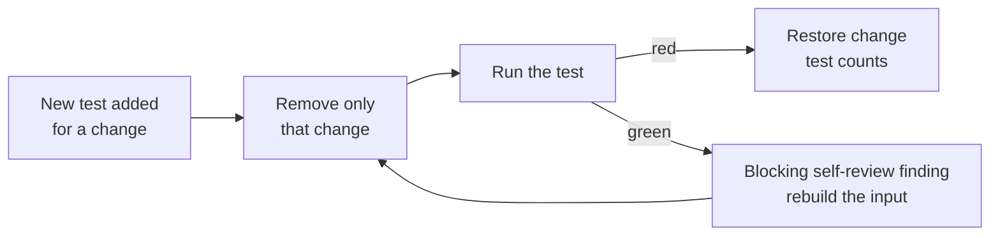

# PR Summary — Issue #3093: a new test must go red without its change

Closes #3093.

Several fleet PRs added the regression test a fix or a review asked for, but the
test passed whether or not the fix was there. Examples are VibeCoder#3091,
#3085 and #3079, and GRQ-AutoTrader#2218. This PR turns the narrower rule "a
negative test must be able to fail" into a general one: a new test must go red
when only its change is removed.

## Checklist

- [x] CODING-STANDARDS.md and `prompts/coding_guidelines/prompt.md`: new rule
      **A new test must go red without its change**, mirrored word for word.
- [x] Documentation-drift tests: a 4th condition. The pinned phrase must occur
      only in the rule being added.
- [x] Guard super-linearity: build the test from the input shape that was slow
      and run it against the unfixed pattern.
- [x] `prompts/pr_feedback/prompt.md`: **A requested red run is shown, not
      claimed.** Revert the fix, run the test, quote the failing line in
      `.pr_response_message`, then restore the fix.
- [x] Issue prompt Test Plan step and the Choosing assertions back-reference.
- [x] Documentation-drift test `worker/deno/tests/new_test_must_go_red_3093_test.ts`.
- [x] `./quality.sh` passed.



## Changes

| File | Change |
| --- | --- |
| `CODING-STANDARDS.md` | Added the new rule in Test coverage expectations. Documentation-drift tests now have four conditions. Added the slow-input clause under super-linearity and a back-reference in Choosing assertions. |
| `prompts/coding_guidelines/prompt.md` | Same new-rule paragraph, word for word. |
| `prompts/issue/prompt.md` | The Test Plan step now counts a new test only once it has been seen red without its change. |
| `prompts/pr_feedback/prompt.md` | When a finding asks for a red run, the reply must show it. |
| `worker/deno/tests/new_test_must_go_red_3093_test.ts` | Six section-scoped drift tests. |

## Related existing rules checked

These rules overlap the new one. All of them agree with it, so none needed changing:

- **A negative test must be able to fail** (#3060). The new paragraph names it as the special case for "does not happen" assertions. The #3060 drift test still passes.
- **A red run counts only against the base branch** (#2924). Its
  pin-current-behaviour clause is the exception to the new red-run rule: a
  test that only pins current behaviour, because the fault was unreproduced
  or already fixed and no production change was made, is expected green on
  base. The guideline paragraph and the issue-prompt Test Plan step both
  name that exception.
- **Every changed call site needs a test that goes red without it** (#3067).
- **Every outcome of a branch you add needs a test** (#3069).
- **Documentation-drift tests**, conditions 1–3.
- **Guard super-linearity**.
- **Choosing assertions**, including its back-references.
- **Every change-request finding ends fixed or rebutted** (pr_feedback).
- **The issue prompt's PR Summary File Test Plan step.**

## Evidence — break-check against the base branch

I copied the new test into a temporary worktree at base `aa441920` and ran it
there. All six tests failed:

```text
FAILED | 0 passed | 6 failed
AssertionError: could not locate the new-test-must-go-red rule in CODING-STANDARDS.md
```

The test follows the condition this PR adds. None of its 13 pinned phrases
occurs in the base versions of the four documents (I counted with `git show
aa441920:<file>`). It also does not pin "blocking self-review finding", which
those sections already contain.

## Test Plan

- `deno task test:unit tests/new_test_must_go_red_3093_test.ts tests/negative_test_must_fail_3060_test.ts tests/issue_prompt_base_branch_red_2924_test.ts tests/changed_call_site_red_3067_test.ts tests/branch_outcome_coverage_3069_test.ts`: 19 passed.
- `./quality.sh < /dev/null`: PASSED. Config integration was skipped.

## Acceptance Criteria

<!-- vibe-spec-review inputs="diff+issue-body" -->

- Widen the negative-test rule into a general one in CODING-STANDARDS.md and
  the coding_guidelines mirror. reviewer: met
- Documentation-drift tests get a fourth condition: the pinned phrase is new
  to the rule. reviewer: met
- Super-linearity: build the test from the slow input shape and run it
  against the unfixed pattern. reviewer: met
- pr_feedback: revert the fix, run the test, quote the failing line in
  `.pr_response_message`, then restore. reviewer: met
- The issue-prompt Test Plan cross-reference was not one of the issue's
  bullets. The spec reviewer judged it in scope as enforcement of the same
  rule. reviewer: unrequested

## Standards Review

<!-- vibe-standards-review inputs="diff+CODING-STANDARDS.md" -->

- No material departures. The reviewer checked that the drift test is scoped
  to sections and that its pinned phrases are new (condition 4). It also
  checked that the mirror is word for word and that the spelling is
  Australian English. reviewer: met

## Security Self-Check

This PR changes documentation and prompts and adds one test. It adds no new
input handling, shell, SQL, HTTP or filesystem calls, and no dependencies. No
secrets or hidden files are staged. `deno.lock` is unchanged.

🤖 Generated with [Claude Code](https://claude.com/claude-code)
