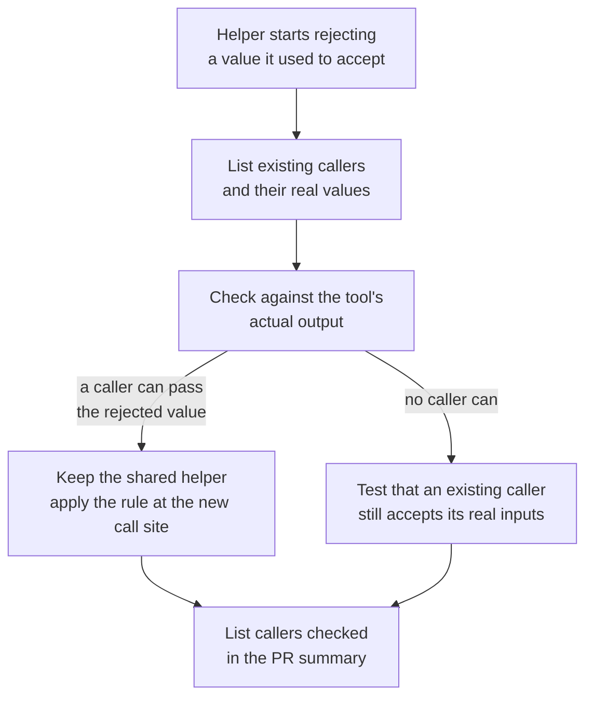

# PR Summary — Issue #3100: narrowing a shared helper changes every caller

Closes #3100.

Two fleet PRs tightened a shared helper for a new call site and broke existing
callers that legitimately pass the newly rejected value:

- VibeCoder#2881 made `assertSafeGitRef` reject `feature/-wip`.
- VibeCoder#3095 made `validateGhIssueJson` reject `MERGED`.

This PR adds a rule to the coding guidelines. Before narrowing a shared helper,
list its callers and the real values each can receive. If any caller can pass a
value the new rule rejects, apply the stricter rule at the new call site only.

## Checklist

- [x] `CODING-STANDARDS.md` § Test coverage expectations: new rule **Narrowing
      a shared helper changes every caller.**, after "Every changed call site
      needs a test that goes red without it".
- [x] `prompts/coding_guidelines/prompt.md`: the same paragraph, word for word.
- [x] `docs/workflows/issue-processing.md`: a background paragraph after the
      #3067 one, as earlier rules have.
- [x] Documentation-drift test
      `worker/deno/tests/narrowing_shared_helper_3100_test.ts`.
- [x] Targeted tests and red runs (see Test Plan).

## Spec

### Intent and Rationale

A validator that is correct for its new caller can still be wrong for the
callers it already had. Testing only the new path misses those callers. Asking
for the callers to be listed puts the check in the PR, where a reviewer can see
it.

### Essential Design Decisions

- The rule sits next to the #3067 call-site rule. That rule covers *threading
  a new argument through* callers; this one covers *removing an accepted value*
  that callers rely on.
- "Real values" means the tool's actual output. The rule links to **Observe
  the real tool before you rely on it** instead of repeating it. In the #3095
  case, the rejected `MERGED` was a value that real `gh` output could contain.
- The fallback is to keep the shared helper as it was and apply the stricter
  rule locally. It is not to "fix every caller", which would widen the change.

### Undiscoverable Facts

- `prompts/coding_guidelines_claude/prompt.md` is only a Working Style
  addendum. It does not mirror Test Coverage Expectations, so it is unchanged.

## Changes

| File | Change |
| --- | --- |
| `CODING-STANDARDS.md` | New rule paragraph in Test coverage expectations. |
| `prompts/coding_guidelines/prompt.md` | Same paragraph, word for word. |
| `docs/workflows/issue-processing.md` | Background paragraph citing VibeCoder#2881 and #3095. |
| `worker/deno/tests/narrowing_shared_helper_3100_test.ts` | Section-scoped drift test. It pins six phrases on both surfaces and checks the paragraph is identical on both. |

## Related existing rules checked

These rules overlap the new one. All of them agree with it, so none needed
changing:

- **Every changed call site needs a test that goes red without it** (#3067).
  It is complementary: that rule covers each changed caller, and this rule
  covers callers the diff does not touch.
- **Observe the real tool before you rely on it.** The new rule
  cross-references it by name.
- **A stub mirrors the real callee's contract.**
- **A new path to an existing outcome keeps that outcome's guards** (#3087).
- **Documentation-drift tests**, conditions 1–4. Condition 4 is why the test
  does not pin "blocking self-review finding": both sections already contain
  that phrase.

## Evidence

**Base-branch break-check.** Each of the six pinned phrases was absent from
`git show 5e81539e:CODING-STANDARDS.md` and from
`git show 5e81539e:prompts/coding_guidelines/prompt.md`, after flattening
whitespace. The count was 0 in both files.

**Docs sweep.**

- Grep terms:
  - "Every changed call site"
  - "Narrowing a shared helper"
  - "callers checked"
- Section: `docs/workflows/issue-processing.md` (the per-rule background
  paragraphs).
- File updated: `docs/workflows/issue-processing.md`.

## Test Plan

- `deno task test:unit tests/narrowing_shared_helper_3100_test.ts tests/changed_call_site_red_3067_test.ts < /dev/null`: 4 passed, 0 failed.
- The doc-reading suites `markdown_anchors_test.ts`,
  `workflow_validator_contract_3021_test.ts` and `docs_sweep_gate_test.ts` all
  passed.
- Red run 1: I removed the paragraph from `CODING-STANDARDS.md`. The test
  failed with `could not locate the narrowing-helper rule in
  CODING-STANDARDS.md`.
- Red run 2: I removed "List the callers checked in the PR summary." from the
  prompt copy. The test failed with the missing-phrase assertion.
- Red run 3: I removed the sentence "A narrowed shared helper with no
  callers-checked list is a blocking self-review finding (Issue #3100)." from
  the prompt copy. The test failed with `coding_guidelines is missing "A
  narrowed shared helper with no callers-checked list"`.
- After each red run I restored the file and confirmed it matched HEAD with
  `git diff`.
- `./quality.sh < /dev/null`: passed

## Acceptance Criteria

<!-- vibe-spec-review inputs="diff+issue-body" -->

- The rule "Narrowing a shared helper changes every caller" is in
  CODING-STANDARDS.md, next to the #3067 call-site rule. reviewer: met
- It is mirrored in `prompts/coding_guidelines/prompt.md`. reviewer: met
- The wording covers the issue's points: list callers and real values, check
  the real output, apply the stricter rule at the new site, test an existing
  caller, and list the callers checked. reviewer: met
- A guidance test in the style of `existing_rule_conflicts_3077_test.ts`.
  reviewer: met
- The `issue-processing.md` background paragraph was not one of the issue's
  bullets. It was added after the review as a docs sweep, following the
  precedent of earlier rules such as #3067. reviewer: unrequested

## Standards Review

<!-- vibe-standards-review inputs="diff+CODING-STANDARDS.md" -->

- No material departures. The reviewer checked four things, all met:
  - The drift test follows the drift-test conventions (section-scoped,
    `readRepoDoc`/`section`/`flat`).
  - The paragraph is identical on both surfaces.
  - The spelling is Australian English.
  - The rule does not conflict with any overlapping rule.

  After the review, the test's sixth pinned phrase was changed to meet
  condition 4. reviewer: met

## Security Self-Check

This PR changes documentation and prompts and adds one test. It adds no input
handling, shell, SQL, HTTP or filesystem calls, and no dependencies. No secrets
or hidden files are staged. `deno.lock` is unchanged.

🤖 Generated with [Claude Code](https://claude.com/claude-code)
